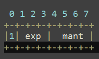
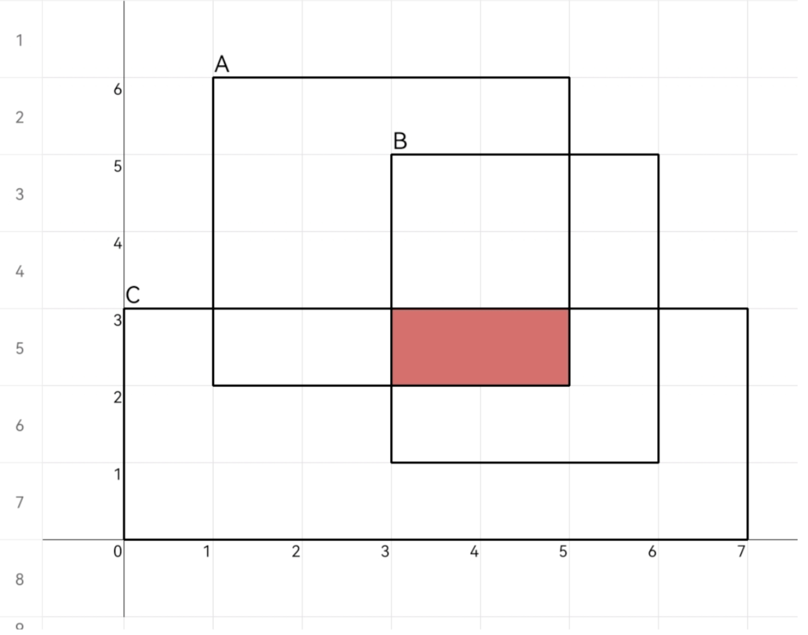

# 2024年E卷100分题

[TOC]

# 1、流浪地球【mid】【标记逻辑】


```go
package main

import (
	"fmt"
)

// 流浪地球
func f(N, E int, nums [][2]int) {
	// 定义一个数组flags，标记当前发动机的起动时间，初始设置为最晚时间N+1.
	// 初始化当前手动发动的时间
	// 遍历时间，然后遍历当前的flags，如果为当前时间发射的，将其标记为-1，表示发射了
	// 并将其没有发射的相邻的标记为下一时刻发射
	// 找出flags中最晚的（可能相等）
	flags := make([]int, N)
	for i := range flags {
		flags[i] = N + 1 // 给个最晚的初始值，有的发动机可能无法启动
	}
	// 设置手动发动机时间
	for _, num := range nums {
		flags[num[1]] = num[0]
	}
	// 遍历时间
	for i := 0; i <= N; i++ {
		for j, t := range flags {
			// t == i表示当前该启动，
			if t == i {
				flags[j] = -1 // 启动过的标记
				// 标记关联访问时间，（j-1+n）%n可以实现循环不越界
				if flags[(j-1+N)%N] != -1 && flags[(j+1+N)%N] != -1 {
					flags[(j-1+N)%N] = i + 1
					flags[(j+1+N)%N] = i + 1
				}
			}
		}
	}
	// 遍历flags，找出时间做大的（可能几个），记录索引
	maxT := -10
	res := make([]int, 0)
	for i, v := range flags {
		if v > maxT {
			maxT = v
			res = make([]int, 0) // 找到到更大的，清空之前大的集合
			res = append(res, i)
		} else if v == maxT {
			res = append(res, i)
		}
	}
	fmt.Println(len(res))
	fmt.Println(res)
}

func main() {
	var N, E int
	fmt.Scan(&N, &E)
	nums := make([][2]int, E)
	for i := 0; i < E; i++ {
		var T, P int
		fmt.Scan(&T, &P)
		nums[i][0] = T
		nums[i][1] = P
	}
	f(N, E, nums)
}
```

# 2、数大雁【mid】【模拟】


这里大眼可以连续叫，但是不能交替着叫。

用不同的颜色表示大雁，以下都是最少两只大雁。


首先考虑返回`-1`的情况，即无法完成一只 大雁叫

- `'quack'`每个字符的次数如果不相等，则不能有完整的大雁叫。
- `'quack'`中如果前一个字符出现的次数小于当前字符次数。

考虑一个长度为`5`的` cnt`数组，用来计数`'quack'`中每个字符出现的次数，使用`map`存储字符与对应`cnt`的索引关系，接着考虑大雁是否可以复用。假设出现了一个新的`q`，表示出现了一声新的`quack`，分为如下情况

- 如果`cnt`中`'k'`字符的次数为0，则表示之前没有大雁完成了叫，或者完成了叫的大雁被复用，无需操作。
- 如果`cnt`中`'k'`的次数大于0，之前有某只大雁叫完了，当前大雁可以复用，对 `cnt`进行整体`-1`。

最后`cnt`中的数如果不相等，则不能有完整的大雁叫，相等，则值即为大雁的个数。

```go
package main

import (
	"fmt"
)

// 数大雁叫
func f(str string) int {
	mp := map[byte]int{'q': 0, 'u': 1, 'a': 2, 'c': 3, 'k': 4}
	var flagErr bool      // 异常标记
	cnt := make([]int, 5) // cnt统计每个字符出现的次数，最后的值应该相等才能有完整大雁
	for i := 0; i < len(str); i++ {
		idx, _ := mp[str[i]]
		cnt[idx] += 1
		// 当前不为‘q’，且前一个字符次数小于当前次数
		if str[i] != 'q' && cnt[idx-1] < cnt[idx] {
			flagErr = true
			break
		}
		if str[i] == 'q' && cnt[4] > 0 {
			// 存在大雁叫完过，这只大雁复用，整体计数值-1
			for j := range cnt {
				cnt[j] -= 1
			}
		}
	}

	// 返回-1的情况，cnt字符不相等，或者前面出现了异常
	if flagErr {
		return -1
	}
	cnteq := cnt[0]
	for i := range cnt {
		if cnteq != cnt[i] {
			return -1
		}
	}
	// cnt值相等，且值就为大雁的个数
	return cnt[0]
}

func main() {
	var str string
	fmt.Scan(&str)
	fmt.Println(f(str))
}
```

# 3、斗地主之顺子【mid】【哈希表+逻辑】

**题目描述：**

- 在斗地主扑克牌游戏中， 扑克牌由小到大的顺序为：3,4,5,6,7,8,9,10,J,Q,K,A,2，
- 玩家可以出的扑克牌阵型有：单张、对子、顺子、飞机、炸弹等。
- 其中顺子的出牌规则为：由 至少 5 张由小到大连续递增 的扑克牌组成，且 不能包含 2 。
- 例如：{3,4,5,6,7}、{3,4,5,6,7,8,9,10,J,Q,K,A}都是有效的顺子；
- 而{J,Q,K,A,2}、 {2,3,4,5,6}、{3,4,5,6}、{3,4,5,6,8}等都不是顺子。
- 给定一个包含13张牌的数组，如果有满足出牌规则的顺子，请输出顺子。
- 如果存在多个顺子，请每行输出一个顺子，且需要按顺子的 第一张牌的大小（必须从小到大） 依次输出。
- 如果没有满足出牌规则的顺子，请 输出 No 。

**输入描述:**

13张任意顺序的扑克牌，每张扑克牌数字用空格隔开，每张扑克牌的数字都是合法的，并且不包括大小王：

```
2 9 J 2 3 4 K A 7 9 A 5 6
```

不需要考虑输入为异常字符的情况

**输出描述:** 组成的顺子，每张扑克牌数字用空格隔开：

```
3 4 5 6 7
```

**示例1：**

**输入**

```
2 9 J 2 3 4 K A 7 9 A 5 6
```

**输出**

```
3 4 5 6 7
```

**说明**

13张牌中，可以组成的顺子只有1组：3 4 5 6 7

**示例2：**

**输入**

```
2 9 J 10 3 4 K A 7 Q A 5 6
```

**输出**

```
3 4 5 6 7
9 10 J Q K A
```

**说明**

13张牌中，可以组成2组顺子，从小到大分别为：3 4 5 6 7 和 9 10 J Q K A

**示例3：**

**输入**

```
2 9 9 9 3 4 K A 10 Q A 5 6
```

**输出**

```
No
```

**说明**

13张牌中，无法组成顺子

**注意：**

**特殊输入**

```
3 3 4 4 5 5 6 6 7 7 8 8 9
```

**对应输出**

```
3 4 5 6 7 8 9
3 4 5 6 7 8
```

**代码：**

`````go
// 斗地主之顺子
func main() {
	scanner := bufio.NewScanner(os.Stdin)
	scanner.Scan()
	str := strings.Split(scanner.Text(), " ")
	nums := make([]int, 0)
	mp := map[string]int{
		"J": 11,
		"Q": 12,
		"K": 13,
		"A": 14,
	}
    // 将字符转为数字
	for _, v := range str {
		if _, ok := mp[v]; ok {
			nums = append(nums, mp[v])
		} else {
			x, _ := strconv.Atoi(v)
			if x != 2 { //  顺子只有3，4，5...J,Q,K,A
				nums = append(nums, x)
			}
		}
	}
	sort.Ints(nums)         //先排序
	res := make([][]int, 0) // 所有顺子
	ans := make([]int, 0)   // 一条顺子

	for len(nums) >= 5 { // 当前轮余下的顺子，顺子至少5张牌
		ans = append(ans, nums[0])
		nums = nums[1:]
		// 每轮找一对顺子
		for i := 0; i < len(nums); i++ {
			if nums[i] == ans[len(ans)-1] {
				continue // 相同的保留，不删除
			}
			if nums[i]-ans[len(ans)-1] == 1 { // 递增加入
				ans = append(ans, nums[i])
				// 删除加入的牌
				if i == len(nums)-1 {
					nums = nums[:i]
				} else {
					nums = append(nums[:i], nums[i+1:]...)
				}
				i-- // 删除了元素，下标要-1
			} else { // 不是递增，也不相等，断层
				if len(ans) >= 5 { // 当前是顺子
					res = append(res, ans) // 加入结果集
				}
				ans = make([]int, 0) // 不管是不是顺子，断层清空当前顺子
				break                // 找下一对顺子
			}
		}
		// 一轮结束，如果还有顺子，也存起来
		if len(ans) >= 5 {
			res = append(res, ans)
		}
		ans = make([]int, 0)
	}
    // 开始转回来并输出
	mpitos := map[int]string{
		11: "J",
		12: "Q",
		13: "K",
		14: "A",
	}
	if len(res) == 0 {
		fmt.Printf("No")
	} else {
		for _, shunzi := range res {
			for i, v := range shunzi {
				var t string
				if v > 10 {
					t, _ = mpitos[v]
				} else {
					t = strconv.Itoa(v)
				}
				if i == len(shunzi)-1 {
					fmt.Print(t)
				} else {
					fmt.Printf("%s ", t)
				}
			}
			fmt.Println()
		}
	}
}
`````

其实也可以用一个`map[int]int`存储数字对应的次数，然后遍历map。

`````go
// 斗地主之顺子
func main() {
	scanner := bufio.NewScanner(os.Stdin)
	scanner.Scan()
	str := strings.Split(scanner.Text(), " ")
	// nums := make([]int, 0)
	mpstoi := map[string]int{
		"J": 11,
		"Q": 12,
		"K": 13,
		"A": 14,
	}
	mp := map[int]int{}
	for _, v := range str {
		if x, ok := mpstoi[v]; ok {
			mp[x]++
		} else {
			x, _ := strconv.Atoi(v)
			if x != 2 { //  顺子只有3，4，5...J,Q,K,A
				mp[x]++
			}
		}
	}
	res := make([][]int, 0)
	flag := true		// 表示还能找得到顺子
	// fyes := false
	for flag {
		flag = false
		for i := 3; i < 11; i++ {
			// 存在数字 3~10，只有以这些开头才能是顺子
			if _, ok := mp[i]; !ok {
				continue
			}
			ans := []int{}
			for j := 0; j < 15; j++ {
				if _, ok := mp[i+j]; ok {
					ans = append(ans, i+j)
					mp[i+j]--
					if mp[i+j] == 0 {
						delete(mp, i+j)
					}
				} else {
					// 当前i找不到递增的，结束
					break
				}
			}
			if len(ans) >= 5 {
				sort.Ints(ans)
				res = append(res, ans)
				flag = true
				i = i + len(ans) - 1
			}
		}
	}
	mpitos := map[int]string{
		11: "J",
		12: "Q",
		13: "K",
		14: "A",
	}
	if len(res) == 0 {
		fmt.Printf("No")
	} else {
		for _, shunzi := range res {
			for i, v := range shunzi {
				var t string
				if v > 10 {
					t, _ = mpitos[v]
				} else {
					t = strconv.Itoa(v)
				}
				if i == len(shunzi)-1 {
					fmt.Print(t)
				} else {
					fmt.Printf("%s ", t)
				}
			}
			fmt.Println()
		}
	}
}
`````

# 4、boss的收入【DFS+Map】

`````
一个XX产品行销总公司，只有一个 boss，其有若干一级分销，一级分销又有若干二级分销，每个分销只有唯一的上级分销。规定每个月，下级分销需要将自己的总收入(自己的+下级上交的)每满100元上交15元给自己的上级.现给出一组分销的关系，和每个分销的收入，请找出 boss并计算出这 boss 的收入。比如:收入100元上交15元,收入199元(9元不够100)上交15元，收入200元，上交30元。
分销关系和收入:分销id 上级分销的ld 收入
分销ID范围0…65535
收入范围:0…65535,单位元
提示: 输入的数据只存在1个 boss，不存在环路
输入描述
第1行输入关系的总数量N
第2行开始，输入关系信息，格式:分销ID 上级分销ID 收入
输出描述
boss的ID 总收入
补充说明
给定的输入数据都是合法的，不存在重复
示例1
输入
5
1 0 100
2 0 200
3 0 300
4 0 200
5 0 200
输出
0 150
示例2:
输入
3
1 0 223
2 0 323
3 2 1203
输出
0 105
说明
2的最终收入等于323+1203/100*15=323+180
0的最终收入等于(323+180+ 223)/100*15=105
`````

**代码**

`````go
package main

import "fmt"

func BossMoney(info [][]int) {
	n := len(info)
	// 创建两个map
	inMap := map[int]int{}   // key:subid , val:money
	reMap := map[int][]int{} // key:subid，val:下级subid集合
	for i := 0; i < n; i++ {
		if _, ok := inMap[info[i][0]]; !ok {
			inMap[info[i][0]] = info[i][2]
		}
		reMap[info[i][1]] = append(reMap[info[i][1]], info[i][0])
	}
	// 寻找boossubid，bossid不在inMap中
	bossid := 0
	for subid, _ := range reMap {
		if _, ok := inMap[subid]; !ok {
			bossid = subid
			break
		}
	}
	inMap[bossid] = 0
	// 深度遍历bossid的内一个下属的收入
	bossMoney := 0
	var dfs func(parentid int) int
	dfs = func(parentid int) int {
		// 终止条件，不在reMap中，没有下一级，返回当前收入
		if _, ok := reMap[parentid]; !ok {
			return inMap[parentid]
		}
		// 当前层收入 += 接收下一层的收入
		for _, subid := range reMap[parentid] {
			inMap[parentid] += dfs(subid) / 100 * 15
		}
		// 全部遍历完，返回最终的收入
		return inMap[parentid]
	}
	bossMoney = dfs(bossid)
	fmt.Println(bossid, bossMoney)
}

func main() {
	var n int
	fmt.Scan(&n)
	Info := make([][]int, n)
	for i := 0; i < n; i++ {
		Info[i] = make([]int, 3)
		fmt.Scan(&Info[i][0], &Info[i][1], &Info[i][2])
	}
	fmt.Println(Info)
	BossMoney(Info)
}
`````

# 5、贪心的商人/最大利润【DP/贪心】

**题目描述**
商人经营一家店铺，有`number`种商品，由于仓库限制每件商品的最大持有数量是`item[index]`,每种商品的价格在每天是`item _price[item_index]`，通过对商品的买进和卖出获取利润，请给出商人在`days`天内能获取到的最大的利润，

 注：同一件商品可以反复买进和卖出： 

**输入描述** 

`````
3 //输入商品的数量number 
3 //输入商人售货天数days 
4 5 6   //输入仓库限制每件商品的最大持有数量是item[index]
1 2 3   //输入第一件商品每天的价格
4 3 2   //输入第二件商品每天的价格
1 5 3   //输入第三件商品每天的价格
`````

**输出描述**

```32
32     //输出商人在这段时间内的最大利润
```

分析，这是买卖股票的最佳时机的改编题，可用「DP」或者「贪心」解题。

- `dp[i]：当前天卖出的利润`
- `dp[i] = max(days[x][i] - days[x][i-1],0)`
- `dp[0] = 0`
- 然后累加`dp`得到商品`x`的利润，实际的时候既然利润要累加，用变量即可 
- 最后得到总商品的利润

```
比如
[1,3,5,2,7,4]
dp[]
[0,2,2,0,2,0]
```

**代码**

```go
package main

import "fmt"

func f(item []int, days [][]int) int {
	sum := 0
	// 模拟遍历每一件商品，再遍历天数
	for i, x := range item {
		r := 0
		for j := 1; j < len(days[0]); j++ {
			v := days[i][j] - days[i][j-1]
			if v > 0 {
				r += v
			}
		}
		sum += x * r
	}
	return sum
}

func main() {
	var n, d int
	fmt.Scan(&n, &d)
	item := make([]int, n)
	for i := 0; i < n; i++ {
		fmt.Scan(&item[i])
	}
	days := make([][]int, n)
	for i := range days {
		days[i] = make([]int, d)
		for j := range days[i] {
			fmt.Scan(&days[i][j])
		}
	}
	fmt.Println(item)
	fmt.Println(days)
	fmt.Println(f(item, days))
}
```

# 6、单词接龙【排序模拟】


`````
示例1
输入输出示例仅供调试，后台判题数据一般不包含示例
输入:
0
6
word
dd
da
dc
dword
d
输出:
worddwordda
说明:
先确定起始单词word，再接以d开头的且长度最长的单词dword，剩余以d开头且长度最长的有dd、da、dc，则取字典序最小的da，所以最后输出worddwordda。
`````

粗糙版：直接模拟

```go
package main

import (
	"fmt"
	"sort"
	"strings"
)

// 直接模拟
func main() {
	var idx, n int
	fmt.Scan(&idx, &n)
	words := make([]string, n)
	for i := 0; i < n; i++ {
		fmt.Scan(&words[i])
	}
	fmt.Println(words)
	res := make([]string, 0)
	flag := true
	for flag {
		// 将选中的加入结果，并删除
		curW := words[idx]
		ch := curW[len(curW)-1]
		res = append(res, words[idx])
		if idx+1 < len(words) {
			words = append(words[:idx], words[idx+1:]...)
		} else {
			words = words[:len(words)-1]
		}
		// 选择首字母相同的
		t1 := make([]int, 0)
		for i, w := range words {
			x := w[0]
			if x == ch {
				t1 = append(t1, i)
			}
		}
		if len(t1) == 0 {
			flag = false
		} else if len(t1) == 1 {
			idx = t1[0]
		} else {
			// 存在多个选择，要选择字符最长的
			max1 := -1
			t2 := make([]int, 0)
			for _, id := range t1 {
				if len(words[id]) > max1 {
					max1 = len(words[id])
					t2 = make([]int, 0)
					t2 = append(t2, id)
				} else if len(words[id]) == max1 {
					t2 = append(t2, id)
				}
			}
			if len(t2) == 1 {
				idx = t2[0]
			} else {
				// 存在字符长相等的，取字典序最小的
				sort.Slice(t2, func(i, j int) bool {
					return words[t2[i]] < words[t2[j]]
				})
				idx = t2[0]
			}
		}
	}
	ans := strings.Join(res, "")
	fmt.Println(ans)
}
```

改进版：用Go的标准库按规则排序

`````go
package main

import (
	"fmt"
	"sort"
	"strings"
)

// 排序模拟
func main() {
	var idx, n int
	fmt.Scan(&idx, &n)
	words := make([]string, n)
	for i := 0; i < n; i++ {
		fmt.Scan(&words[i])
	}
	fmt.Println(words)
	res := make([]string, 0)
	flag := true
	for flag {
		// 将选中的加入结果，并删除
		curW := words[idx]
		ch := curW[len(curW)-1]
		res = append(res, words[idx])
		if idx+1 < len(words) {
			words = append(words[:idx], words[idx+1:]...)
		} else {
			words = words[:len(words)-1]
		}
		// 选择首字母相同的
		t1 := make([]int, 0)
		for i, w := range words {
			x := w[0]
			if x == ch {
				t1 = append(t1, i)
			}
		}
		if len(t1) == 0 {
			flag = false
		} else if len(t1) == 1 {
			idx = t1[0]
		} else {
			// 存在多个选择，按规则排序
			sort.Slice(t1, func(i, j int) bool {
				// 按长度大小排序
				if len(words[t1[i]]) > len(words[t1[j]]) {
					return true
				} else if len(words[t1[i]]) == len(words[t1[j]]) {
					// 否则长度相等，按字典序排序
					return words[t1[i]] < words[t1[j]]
				} 
			})
			idx = t1[0]
		}
	}
	ans := strings.Join(res, "")
	fmt.Println(ans)
}
`````

# 7、连接字母长度【计数+set】


```
用例1
输入	
AAAAHHHBBCDHHHH
3
输出
2
说明：同一字母连续出现的最多的是A和H，四次；第二多是H，三次，但H已经存在4个连续的，故不考虑；下个最长子串是BB，所以最终答案应该输出2。
 
用例2
输入	
AABAAA
2
输出
1
说明：同一字母连续出现的最多的是A，三次；第二多还是A，两次，但A已经存在最大连续次数三次，故不考虑；下个最长子串是B，所以输出1
 
用例3
输入	
ABC
4
输出
-1
说明：只含有3个包含同一字母的子串，小于k，输出-1
 
用例4
输入	
ABC
2
输出
1
说明：三个子串长度均为1࿰
```

代码：

`````go
package main

import (
	"fmt"
	"sort"
)

// 计数+排序
func main() {
	var str string
	var k int
	fmt.Scan(&str)
	fmt.Scan(&k)
	cnt := make([]int, 26)
	sub := 1
	for i := 0; i < len(str); i++ {
		if i+1 < len(str) && str[i] == str[i+1] {
			sub += 1
		} else {
			if sub > cnt[str[i]-'A'] {
				cnt[str[i]-'A'] = sub
				sub = 1
			}
		}
	}
	sort.Slice(cnt, func(i, j int) bool {
		return cnt[i] > cnt[j]
	})
	fmt.Println(cnt)
	// 去重
	count := 0
	for i := 1; i < 26; i++ {
		if cnt[i] != 0 && cnt[i] == cnt[i-1] {
			count += 1
		}
		cnt[i-count] = cnt[i]
	}
	fmt.Println(cnt)
	if cnt[k-1] == 0 {
		fmt.Println(-1)
	} else {
		fmt.Println(cnt[k-1])
	}
}
`````

# 8、猜字谜【字符串+排序+set】


```go
示例1
输入：
conection
connection,today
输出：
connection

示例2
输入：
bdni,wooood
bind,wrong,wood
输出：
bind,wood
```

代码：

```go
package main

import (
	"fmt"
	"sort"
	"strings"
)

// 计数+排序
func main() {
	var s1, s2 string
	fmt.Scan(&s1, &s2)
	ups := strings.Split(s1, ",")
	dws := strings.Split(s2, ",")
	res := make([]string, 0)
	for i := 0; i < len(ups); i++ {
		for j := 0; j < len(dws); j++ {
			// 谜面和谜底按字典顺序排序后比较是否相等
			up := strings.Split(ups[i], "")
			dw := strings.Split(dws[j], "")
			sort.Slice(up, func(i, j int) bool { return up[i] <= up[j] })
			sort.Slice(dw, func(i, j int) bool { return dw[i] <= dw[j] })
			t1 := strings.Join(up, "")
			t2 := strings.Join(dw, "")
			if t1 == t2 {
				res = append(res, ups[j])
				break
			}
			// 分别对字符去重，然后进行比较，由于前面的up和dw已经有序，去重即可
			cnt := 0
			for i := 1; i < len(up); i++ {
				if up[i] == up[i-1] {
					cnt++
				}
				up[i-cnt] = up[i]
			}
			up = up[:len(up)-cnt]
			cnt2 := 0
			for i := 1; i < len(dw); i++ {
				if dw[i] == dw[i-1] {
					cnt2++
				}
				dw[i-cnt2] = dw[i]
			}
			dw = dw[:len(dw)-cnt2]
			t3 := strings.Join(up, "")
			t4 := strings.Join(dw, "")
			if t3 == t4 {
				res = append(res, dws[j])
				break
			}
		}
		if len(res) != i+1 {
			res = append(res, "not found")
		}
	}
	ans := strings.Join(res, ",")
	fmt.Println(ans)
}
```

# 9、分糖果【DFS】


`````go
package main

import (
	"fmt"
)

func main() {
	// 分糖果
	var num int
	fmt.Scan(&num)
	res := 0
	var dfs func(int) int
	dfs = func(i int) int {
		if i == 1 {
			return 0
		}
		if i%2 == 0 {
			res = dfs(i/2) + 1
		} else {
			res = min(dfs(i+1)+1, dfs(i-1)+1)
		}
		return res
	}
	fmt.Println(dfs(num))
}
`````

# 10、第k个排列【回溯】

**题目描述**
给定参数n,从1到n会有n个整数：1,2,3，..，n,这n个数字共有n种排列。
按大小顺序升序列出所有排列的情况，并一标记，
当n=3时，所有排列如下：
“123”
“132”
“213”
“231”
“312”
“321”
给定n和k,返回第k个排列。
**输入描述**
输入两行，第一行为n,第二行为k，给定n的范围是[1,9]，给定k的范围是[1，n。
**输出描述**
输出排在第k位置的数字。

```go
输入;
3
3
输出：
213
```

`````go
package main

import (
	"fmt"
)

func main() {
	// 全排列
	var n, k int
	fmt.Scan(&n, &k)
	res := [][]int{}
	path := []int{}
	visit := make([]bool, n+1)
	var dfs func(int)
	dfs = func(i int) {
		if len(path) == n {
			tmp := make([]int, n)
			copy(tmp, path)
			res = append(res, tmp)
		}
		if len(res) == k {
			return
		}
		for i := 1; i <= n; i++ {
			if visit[i] == false {
				visit[i] = true
				path = append(path, i)
				dfs(i + 1)
				visit[i] = false
				path = path[:len(path)-1]
			}
		}
	}
	dfs(n)
	for _, v := range res[k-1] {
		fmt.Print(v)
	}
}
`````

# 11、找终点【双指针】


```go
输入1：
7 5 9 4 2 6 8 3 5 4 3 9
输出1：
2
输入2：
1 2 3 7 1 5 9 3 2 1
输出2：
-1
```

代码：

思路1：从前往后遍历

`````go
package main

import (
	"bufio"
	"fmt"
	"os"
	"strconv"
	"strings"
)

func main() {
	// 找终点
	scanner := bufio.NewScanner(os.Stdin)
	scanner.Scan()
	str := strings.Split(scanner.Text(), " ")
	nums := make([]int, len(str))
	for i, v := range str {
		nums[i], _ = strconv.Atoi(v)
	}
	n := len(nums)
	mincnt := 101
	// 以第一步的为起点找
	for i := 1; i < n/2; i++ {		
		cnt := 0
		// 每次加上数字里的值，如果j能到最后，说明能走通
		for j := i; j < n; j = nums[j] + j {
			cnt += 1
			if j == n-1 {
				if cnt < mincnt {
					mincnt = cnt
				}
			}
		}
	}
	if mincnt == 101 {
		fmt.Println(-1)
	} else {
		fmt.Println(mincnt)
	}
}
`````

思路2： 从后往前遍历，用 `cur = 0`记录距离尾部的距离，

# 12、查找充电设备组合【暴力模拟】


```go
输入1：
4
50 20 20 60
90
输出1：
90  =>(50+20+20)
输入2：
2
50 40
30
输出2：
0
```

代码：

方法1：直接暴力了

```go
package main

import (
	"fmt"
)

func main() {
	// 产找充电设备的组合
	var n int
	fmt.Scan(&n)
	nums := make([]int, n)
	for i := range nums {
		fmt.Scan(&nums[i])
	}
	var pMax int
	fmt.Scan(&pMax)
	minP := pMax + 1 // 记录pMax - 集合元素的最小值
	for i := 0; i < n; i++ {
		sum := 0
		for j := i; j < n; j++ {
			sum += nums[j]
			if pMax-sum < 0 {
				break
			} else {
				if pMax-sum < minP {
					minP = pMax - sum
				}
			}
		}
	}
	if minP == pMax+1 {
		fmt.Println(0)
	} else {
		fmt.Println(pMax - minP)
	}
}
```

# 13、最大报酬【DP：0-1背包问题】


```go
输入：
40 3
20 10 
20 20
20 5
输出：
30
```

```go
package main

import (
	"fmt"
)

func main() {
	// 最大报酬
	var cap, n int
	fmt.Scan(&cap, &n)
	w := make([]int, n)
	v := make([]int, n)
	for i := range w {
		fmt.Scan(&w[i], &v[i])
	}
	// dp[i][j] 背包j选择物品0，，，i的最大价值
	dp := make([][]int, n)
	for i := range dp {
		dp[i] = make([]int, cap+1)
	}
	for j := range dp[0] {
		if j >= w[0] { // 只要能装下
			dp[0][j] = v[0]
		}
	}
	// fmt.Println(dp)

	// 先遍历物品，再遍历背包
	for i := 1; i < n; i++ {
		for j := 0; j <= cap; j++ {
			if j < w[i] {
				dp[i][j] = dp[i-1][j]
			} else {
				dp[i][j] = max(dp[i-1][j], dp[i-1][j-w[i]]+v[i])
			}
		}
	}
	// for i := range dp {
	// 	fmt.Println(dp[i])
	// }
	fmt.Println(dp[n-1][cap])
}
```

# 14、构成正方形的数量【hard】【回溯-组合】


```go
输入1：
3
1 3
2 4
3 1
输出1：
0
输入2：
4
0 0
1 2
3 1
2 1
输出：
1
```

这是一个组合问题，可以采用回溯的思想。每次从集合中选取四个组合，不可重复选，然后根据选择这四个判断能不能组成正方形，能的话结果+1。

```go
package main

import (
	"fmt"
	"math"
	"sort"
)

func validSquare(path [][]int) bool {
	// 正方形特点：四条边长相等，对角线相等；记得要判断是否存在共点
	d := make([]float64, 0)
	for i := 0; i < len(path); i++ {
		for j := i + 1; j < len(path); j++ {
			if path[i][0] == path[j][0] && path[i][1] == path[j][1] {
				return false // 存在共点
			} else {
				a := math.Sqrt(math.Pow(float64(path[i][0]-path[j][0]), 2) + math.Pow(float64(path[i][1]-path[j][1]), 2))
				d = append(d, a)
			}
		}
	}
	sort.Slice(d, func(i, j int) bool { return d[i] < d[j] })
	if d[0] == d[1] && d[1] == d[2] && d[2] == d[3] && d[4] == d[5] {
		return true
	}
	return false
}

func main() {
	var n int
	fmt.Scan(&n)
	mtx := make([][]int, n)
	for i := range mtx {
		mtx[i] = make([]int, 2)
		fmt.Scan(&mtx[i][0], &mtx[i][1])
	}
	if n < 4 {
		fmt.Println(0)
		return
	}
	res := 0
	path := make([][]int, 0) // 路径是否加入组合
	var dfs func(int)
	dfs = func(start int) {
		if len(path) == 4 {
			// 判断是否集合里的是否能组成正方形
			if validSquare(path) {
				res += 1
			}
			return
		}
		// start 表示本层递归中，集合从哪里开始遍历
		for i := start; i < len(mtx); i++ {
			path = append(path, mtx[i]) // 选择
			dfs(i + 1)
			path = path[:len(path)-1] // 撤销选择
		}
	}
	dfs(0)
	fmt.Println(res)
}
```


# 15、目标和的最长连续子序列（回溯-组合）


```go
输入：
1,2,3,4,2
6
输出：
3
（1，2，3）
```

```go
package main

import (
	"bufio"
	"fmt"
	"os"
	"strconv"
	"strings"
)

func main() {
	scan := bufio.NewScanner(os.Stdin)
	scan.Scan()
	str := strings.Split(scan.Text(), ",")
	nums := make([]int, len(str))
	for i := range nums {
		nums[i], _ = strconv.Atoi(str[i])
	}
	scan.Scan()
	sum, _ := strconv.Atoi(scan.Text())
	res := 0
	path := 0 // 路径长度
	cur := 0  // 路径和
	var dfs func(int)
	dfs = func(start int) {
		if cur == sum {
			if path > res {
				res = path
			}
			return
		}
		for i := start; i < len(nums); i++ {
			cur += nums[i]
			path += 1
			dfs(i + 1)
			path -= 1
			cur -= nums[i]
		}
	}
	dfs(0)
	fmt.Println(res)
}
```

# 16、高矮个子排队【mid】【模拟】


`````
输入描述
5 3 1 2 3
输出描述
5 1 3 2 3
输入：
4 1 3 5 2
输出：
4 1 5 2 3
输入：
1 1 1 1 1
输出：
1 1 1 1 1
说明：
相邻位置可以相等
`````

思路：

1、其实题目理解之后就知道，目标是要保证最小移动距离，且以高位为起点。理解最小移动距离为循环比较当前位置和后面位置的大小，然后交换即可。

2、注意题目要输出的是最小移动距离所产生的新数组，不是让你输出最小移动距离。

```go
package main

import (
	"bufio"
	"fmt"
	"os"
	"strconv"
	"strings"
)

func main() {
	scan := bufio.NewScanner(os.Stdin)
	scan.Scan()
	str := strings.Split(scan.Text(), " ")
	a := make([]int, len(str))
	for i := range str {
		x, err := strconv.Atoi(str[i])
		if err != nil {
			fmt.Println("[]")
			return
		}
		a[i] = x
	}
	i := 0
	// 1 0 1 0 1 0
	// 0 1 2 3 4 5 , 偶数位为高，奇数位位矮
	for i+1 < len(a) {
		if i%2 == 0 && a[i] < a[i+1] {
			a[i], a[i+1] = a[i+1], a[i]
		}
		if i%2 == 1 && a[i] > a[i+1] {
			a[i], a[i+1] = a[i+1], a[i]
		}
		i++
	}
	for i := range a {
		if i == len(a)-1 {
			fmt.Println(a[i])
		} else {
			fmt.Printf("%d ", a[i])
		}
	}
}
```

# 17、增强的strstr【mid】【正则匹配】

c 语言有一个库函数: char*strstr(const char *haystack, const char*needle)，实现在字符串 haystack 中查找第一次出现字符串 needle 的位置，如果未找到则返回 null。

现要求实现一个strstr的增强函数，可以使用带可选段的字符串来模糊查询，与strstr一样返回首次查找到的字符串位置。

可选段使用“[]"标识，表示该位置是可选段中任意一个字符即可满足匹配条件。比如"a[bc]"表示可以匹配"ab”或“ac”

注意目标字符串中可选段可能出现多次

**输入描述**

与strstr函数一样，输入参数是两个字符串指针，分别是源字符串和目标字符串

**输出描述**

与strstr函数不同，返回的是源字符串中，匹配子字符串相对于源字符串地址的偏移 (从0开始算)，如果没有匹配返回-1。

补充说明: 源字符串中必定不包含"[]”，目标字符串中”[]"必定成对出现，且不会出现嵌套。

```go
输入
abcd
b[cd]
输出
1
相当于是在源字符串中查找bc或者bd，bc子字符串相对于abcd的偏移是1
```

```go
package main

import (
	"bufio"
	"fmt"
	"os"
	"regexp"
)

func main() {
	scan := bufio.NewScanner(os.Stdin)
	scan.Scan()
	s1 := scan.Text()
	scan.Scan()
	s2 := scan.Text()

	// 使用go的正则匹配
	regex, _ := regexp.Compile(s2)
	matches := regex.FindStringIndex(s1)
	if matches != nil {
		fmt.Println(matches[0])
	} else {
		fmt.Println(-1)
	}
}
```

# 18、最左侧荣誉覆盖子串【easy】【双指针模拟】

```go
给定2个字符串s1和s2和正整数k,其中s1长度为n1,s2长度为n2,在s2中选一个子串，满足：
该子串长度为n1+k
该子串包含$1中全部字母
该子串每个字母的出现次数不小于s1中对应的宇母
我们称s2以长度K.冗余覆盖s1。给定s1、s2和k,求最左侧的s2以长度k冗余覆盖s1的子串的首
个元素的下标，如果没有返回-1
举例：
s1=ab
s2=aabcd
k=1
则子串aab和abc均满足此条件，由于aab在abc的左侧，aab的第一个元素下标为0，因此输出0
```

这不是从左往右遍历找到第一个满足的就行吗，说的这么复杂

思路：定义双指针，外层遍历长的s2，因为s1可能要遍历多次，放内层，每次遍历s1前先备份当前s2开始的下标。

- 如果相等，两个指针都走
- 如果不相等，s2的走，并且cnt-1
- 如果cnt<0；结束当前s1的寻找，找下一个，
- 如果cnt==0，并且s1是遍历完的，返回保存的下标

```go
package main

import (
	"fmt"
)

func main() {
	var s1, s2 string
	var k int
	fmt.Scan(&s1, &s2, &k)
	i := 0
	ptr := 0
	flag := false
	for i < len(s2) {
		// s1:abc  k=1
		// s2:aefbcagbc
		ptr = i
		cnt := k // 冗余度
		j := 0
		for j < len(s1) {
			if cnt < 0 {
				break
			}
			if s2[i] == s1[j] {
				j++
			} else {
				cnt--
			}
			i++
		}
		if j == len(s1) && cnt == 0 {
			flag = true
			break
		}
	}
	if flag {
		fmt.Println(ptr)
	} else {
		fmt.Println(-1)
	}
}
```

# 19、猜数字【暴力模拟】

```go
一个人设足一组四马的数子作为迷低，另一方猜。
每猜一个数，出数者就要根据这个数字给出提示，提示以XAYB形式呈现，直到猜中位置。
其中X表示位置正确的数的个数（数字正确且位置正确），而表示数字正确而位置不对的数的个数。
例如，当谜底为8123，而猜迷者猜1052时，出题者必须提示0A2B。
例如，当迷底为5637，而猜迷者才4931时，出题者必须提示1A0B。
当前已知N组猜迷者猜的数字与提示，如果答案确定，请输出答案，不确定则输出NA。
输入描述
第一行输入一个正整数，0<N<100。
接下来N行，每一行包含一个猜测的数字与提示结果。
输出描述
输出最后的答案，答案不确定则输出NA。

示例1
输入
6
4815 1A1B
5716 0A1B
7842 0A1B
4901 0A0B
8585 3A0B
8555 2A1B
输出
3585
说明无
```

思路：

```go
本题的核心算法是穷举所有可能的四位数字组合（从0000到9999），即遍历所有可能的谜底。
对于每一个可能的谜底，逐一检查它是否能满足所有给定的提示。
1、为什么采用穷举搜索？
题目要求我们找出一个四位数的谜底，这意味着谜底的取值范围是从0000到9999，总共只有10000种可能。
对于计算机来说，遍历10000种可能性是一个非常可控的操作，执行时间相对较短。因此，使用穷举搜索可以在合理的时间内完成。
2、具体步骤：
枚举所有可能的谜底
谜底是一个四位数，范围从0000到9999，总共有10000种可能性。
我们需要遍历所有这些可能性，逐个验证它们是否符合所有提示。
验证每一个可能的谜底
对于每一个可能的谜底，我们需要根据所有的提示验证它是否符合条件。
提示格式为 XAYB，其中：
X 表示猜测中有多少个数字在正确的位置上。
Y 表示猜测中有多少个数字是正确的，但位置不对。
具体验证步骤如下：
对于每个提示，计算当前可能谜底与猜测之间的 X 和 Y 值。
将计算出的 X 和 Y 与输入的提示进行比较，如果不相等，则该可能的谜底无效。
```

代码：

```go
package main

import (
	"fmt"
	"strconv"
)

func IsValid(curguess, nums, hint string, n int) bool {
	A, B := 0, 0
	guessUsed := make([]bool, 4)
	answerUsed := make([]bool, 4)
	// 统计A，按位比较相等的个数
	for k := 0; k < 4; k++ {
		if curguess[k] == nums[k] {
			guessUsed[k] = true
			answerUsed[k] = true
			A++
		}
	}
	// 统计B，数字对但位置不对
    // 遍历猜想中没有标记的，然后遍历nums中找相同的个数，找到相同的，nums记得标记
	for k := 0; k < 4; k++ {
		if !guessUsed[k] {
			for i := 0; i < 4; i++ {
				if !answerUsed[i] && curguess[k] == nums[i] {
					B++
					answerUsed[i] = true
				}
			}
		}
	}
	a := strconv.Itoa(A)
	b := strconv.Itoa(B)
	answer := a + "A" + b + "B"
	return answer == hint
}

func main() {
	var n int
	fmt.Scan(&n)
	//scanner := bufio.NewScanner(os.Stdin)
	numstr := make([]string, n)
	hints := make([]string, n)
	for i := 0; i < n; i++ {
		fmt.Scan(&numstr[i], &hints[i])
	}

	// 从0000~9999穷举
	maybeNum := ""
	for i := 0; i < 10000; i++ {
		curguess := fmt.Sprintf("%04d", i)
		flag := true
		for j := 0; j < n && flag; j++ {
			flag = IsValid(curguess, numstr[j], hints[j], n)
		}
		if flag {
			if maybeNum == "" {
				maybeNum = curguess
			} else {
				// 前面已经有符合条件的，答案不确定
				fmt.Print("NA")
				return
			}
		}
	}
	if maybeNum == "" {
		fmt.Print("NA")
	} else {
		fmt.Print(maybeNum)
	}
}
```

# 20、英文输入法【easy】【字符串处理】

主管期望你来实现英文输入法单词联想功能。需求如下:

依据用户输入的单词前缀，从已输入的英文语句中联想出用户想输入的单词，按字典序输出联想到的单词序列，如果联想不到，请输出用户输入的单词前缀。

注意：

1，英文单词联想时，区分大小写

2，缩略形式如"don’t”，判定为两个单词，"don“和"t“

3，输出的单词序列，不能有重复单词，且只能是英文单词，不能有标点符号

**输入描述**

输入为两行，

首行输入一段由英文单词word和标点符号组成的语句str；

接下来一行为一个英文单词前缀pre

0 < word.length() ⩽ 20

0 < str.length() ⩽ 1000

0 < pre ⩽ 20

**输出描述**

输出符合要求的单词序列或单词前缀，存在多个时，单词之间以单个空格分割；

**示例1**

```
输入：
I love you
He
输出：
He
说明：
从用户已输入英文语句"l love you”中提炼出“I”、“love”、“you”三个单词，接下来用户输入”He”，从已输入信息中无法联想到任何符合要求的单词，因此输出用户输入的单词前缀.
```

**示例2**

```
输入：
The furthest distance in the world, ls not between life and death, But when I stand in front of you, Yet you don't know that I love you.
f
输出：
front furthest
说明：
从用启已输入英文语句"The furthest distance in the world, Is notbetween life and death, But when I stand in frontof you, Yet youdontknow that I love you"中提炼出的单词，符合"f"作为前缀的有"furthest"和"front"，按字典序排序并在单词间添加空格后输出,结果为“front furthest"
```

关键点：

- 怎么提取单词。遇到空格、逗号、单引号，句号是单词结束。
- 判断是否为字母。用unicode.IsleTter包
- 不能有重复单词，采用map存储单词。
- 判断前缀，遍历即可。
- 按字典排序，使用sort.Slice()，自定义。

**代码**

```go
package main

import (
	"bufio"
	"fmt"
	"os"
	"sort"
	"strings"
	"unicode"
)

func main() {
	scanner := bufio.NewScanner(os.Stdin)
	scanner.Scan()
	str := scanner.Text()
	scanner.Scan()
	tar := scanner.Text()
	// 存储单词
	mp := make(map[string]bool)
	words := ""
	for i := 0; i < len(str); i++ {
		if unicode.IsLetter(rune(str[i])) {
			words += string(str[i])
		} else {
			if words != "" {
				mp[words] = true
				words = ""
			}
		}
	}
	ans := []string{}
	// 判断前缀
	for w, _ := range mp {
		if strings.HasPrefix(w, tar) {
			ans = append(ans, w)
		}
	}
	if len(ans) == 0 {
		fmt.Print(tar)
	} else {
		sort.Slice(ans, func(i, j int) bool {
			return ans[i] < ans[j]
		})
		for i, w := range ans {
			if i == len(ans)-1 {
				fmt.Print(w)
			} else {
				fmt.Printf("%s ", w)
			}
		}
	}
}
```

# 21、报文响应时间【进制转换】

题目描述
IGMP 协议中， 有一个字段称作最大响应时间（MaxResponseTime）， HOST 收到查询报文， 解析出 MaxResponseTime 字段后， 需要在 (0, MaxResponseTime](s) 时间内选取随机时间回应一个响应报文，如果在随机时间内收到一个新的查询报文，则会根据两者时间的大小，选取小的一方刷新回应时间。

最大响应时间有如下计算方式：                                           

当 MaxRespCode < 128, MaxRespTime = MaxRespCode; 
当 MaxRespCode >= 128,MaxRespTime = (mant | 0x10) << (exp + 3);



注：exp 最大响应时间的高 5~7 位；mant 为最大响应时间的低 4 位。

其中接收到的 MaxRespCode 最大值为 255，以上出现所有字段均为无符号数。 现在我们认为 HOST 接收到查询报文时，选取的随机时间必定为最大值。 现给出 HOST 收到查询报文个数 C，HOST 收到报文的时间 T，以及查询报文的最大响应时间字段值 M

请计算出 HOST 发送响应报文的时间。

输入
第一行为查询报文个数 C，后续每行分别为 HOST 收到报文时间 T，及最大响应字段 M，以空格分割。

输出
HOST 发送响应报文的时间

补充说明：
用例确定只会发送一个响应报文， 不存在计时结束后依然收到查询报文的情况。

**输入**

```go
 3  
 0 20  
 1 10  
 8 20
```

**输出**

```go
11
说明
收到3个报文
第0秒收到1个报文响应时间为20秒，则要到0+20=20秒响应
第1秒收到第2个报文，响应时间为10，则要到1+10=11秒响应，与上面的报文的响应时间比较获得响
应时间最小为11秒
第8秒收到第3个报文，响应时间为20秒，则要到8+20=28秒响应，与上面的报文的响应时间比较获得
响应时间最小为11秒
最终得到最小响应报文时间为11秒。
```

**输入2**

```go
 2  
 0 255  
 200 60
```

 **输出2**

```go
 260
```

- 如果<128正常计算就可以
- 如果>=128， (mant | 0x10) << (exp + 3);
- 先转为二进制，mant为低 4 位，再转为10进制，ox10转为十进制，执行或运算。
- exp为5~7位转为10进制+3
- 然后进行左移得到当前报文的maxtime，加上响应的时间
- 最后比较之前的ji俄国，得到最小。

代码：

```go
package main

import (
	"fmt"
	"strconv"
)

func main() {
	var n int
	fmt.Scan(&n)
	t1 := make([]int, n)
	num := make([]int, n)
	for i := 0; i < n; i++ {
		fmt.Scan(&t1[i], &num[i])
	}

	minT := 255
	for i := 0; i < n; i++ {
		curT := 0
		if num[i] < 128 {
			curT = t1[i] + num[i]
		} else {
			bin := fmt.Sprintf("%08b", num[i])
			mant, _ := strconv.ParseInt(bin[4:], 2, 64)
			exp, _ := strconv.ParseInt(bin[1:4], 2, 64)
			x1 := int(mant) | 16
			x2 := int(exp) + 3
			curT = t1[i] + (x1 << x2)
		}
		if curT < minT {
			minT = curT
		}
	}
	fmt.Println(minT)
}
```

# 22、智能成绩表【mid】【哈希+排序】

## 题目描述

小明来到某学校当老师，需要将学生按考试总分或单科分数进行排名，你能帮帮他吗?

## 输入描述

第1行输入两个整数，学生人数n和科目数量m。0<n<100,0<m<10

第2行输入m个科目名称，彼此之间用空格隔开。科目名称只由英文字母构成，单个长度不超过10个字符。科目的出现顺序和后续输入的学生成绩一一对应。不会出现重复的科目名称。

第3行开始的n行，每行包含一个学生的姓名和该生m个科目的成绩(空格隔开)，学生不会重名。学生姓名只由英文字母构成，长度不超过10个字符。成绩是0~100的整数，依次对应第2行中输入的科目。

第n+2行，输入用作排名的科目名称。若科目不存在，则按总分进行排序。

## 输出描述

输出一行，按成绩排序后的学生名字，空格隔开。成绩相同的按照学生姓名字典顺序排序。

## 示例1

```
输入：
3 2
yuwen shuxue
fangfang 95 90
xiaohua 88 95
minmin 100 82
shuxue

输出：
xiaohua fangfang minmin

说明：
按shuxue成绩排名，依次是xiaohua、fangfang、minmin
```

## 示例2

```
输入：
3 2
yuwen shuxue
fangfang 95 90
xiaohua 88 95
minmin 90 95
zongfen

输出：
fangfang minmin xiaohua

说明：
排序科目不存在，按总分排序，fangfang和minmin总分相同，按姓名的字典顺序，fangfang排在前面
```

代码：就哈希+排序即可

```go
package main

import (
	"fmt"
	"sort"
)

func main() {
	var n, m int
	fmt.Scan(&n, &m)
	mpT := map[string]int{}
	for i := 0; i < m; i++ {
		var x string
		fmt.Scan(&x)
		mpT[x] = i
	}
	name := make([]string, n)
	score := make([][]int, n)
	for i := 0; i < n; i++ {
		score[i] = make([]int, m)
	}
	for i := 0; i < n; i++ {
		fmt.Scan(&name[i])
		for j := 0; j < m; j++ {
			fmt.Scan(&score[i][j])
		}
	}
	var kemu string
	fmt.Scan(&kemu)
	// 开始处理
	if idx, ok := mpT[kemu]; ok {
		// 按科目排序
		sort.Slice(name, func(i, j int) bool {
			return score[i][idx] > score[j][idx]
		})
	} else {
		// 按总分排序
		sum := make([]int, n)
		for i := 0; i < n; i++ {
			for j := 0; j < m; j++ {
				sum[i] += score[i][j]
			}
		}
		sort.Slice(name, func(i, j int) bool {
			return sum[i] > sum[j]
		})
	}
	// 输出名字
	for i, n := range name {
		if i == len(name)-1 {
			fmt.Printf("%s", n)
		} else {
			fmt.Printf("%s ", n)
		}
	}
}
```

# 23、矩形相交的面积【mid】【交集：不等式有解】

```go
题目描述
。给出3组点坐标(x,y,w,h),-1000<x,y<1000,W,h为正整数。
·(x，y,W,h)表示平面直角坐标系中的一个矩形：
。x,y为矩形左上角坐标点，w,h向右w,向下h。
·(x，y,w,h)表示x轴区，x+w)和y轴y,y-h)围成的矩形区域：
·(0,0,2,2)表示x轴(0,2)和y轴(0，-2)围成的矩形区域：
。(3,5,4,6)）表示x轴(3,7)和y轴(5，-1)围成的矩形区域：
·求3组坐标构成的矩形区域重合部分的面积。
```

```go
输入描述
3行输入分别为3个矩形的位置，分别代表“左上角x坐标”，“左上角y坐标”，“矩形宽”，“矩形高”-1000<=x,y<1000
输出描述
输出3个矩形相交的面积，不相交的输出0。
```



```go
示例:
输入
1 6 4 4
3 5 3 4
0 3 7 3
输出
2
```

思路：

- 先判断前两个是否相交，不相交结束，相交得到新的相交矩形坐标
- 再判断新的与第三个是否相交
- 矩形恩么相交？两个矩形的x轴、y轴都有交集
- 什么时候有交集？像解两个不等式什么时候有解一样，**同小取小，同大取大，最后左小于右**
- 比如$1<x<3;2<x<4==>2<x<3$，有解！$1<x<2;3<x<4==>3<x<2$，不成立！

代码如下：

```go
package main

import "fmt"

func IsInter(a []int, b []int) ([]int, bool) {
	x1, x2 := a[0], a[0]+a[2] // x1<x<x2
	y1, y2 := a[1], a[1]-a[3] // y2<y<y1
	x3, x4 := b[0], b[0]+b[2] // x3<x<x4
	y3, y4 := b[1], b[1]-b[3] // y4<y<y3
	// 同大取大，同小取小
	xl := max(x1, x3)
	xr := min(x2, x4)
	yh := min(y1, y3)
	yd := max(y2, y4)
	if xr-xl > 0 && yh-yd > 0 {
		newA := []int{xl, yh, xr - xl, yh - yd}
		return newA, true
	} else {
		return nil, false
	}
}

func main() {
	a := make([][]int, 3)
	for i := 0; i < 3; i++ {
		a[i] = make([]int, 4)
	}
	for i := 0; i < 3; i++ {
		for j := 0; j < 4; j++ {
			fmt.Scan(&a[i][j])
		}
	}

	// 判断两个矩形是否相交
	if newA, ok := IsInter(a[0], a[1]); ok {
		if newB, ok := IsInter(newA, a[2]); ok {
			area := newB[2] * newB[3]
			fmt.Print(area)
		} else {
			fmt.Print(0)
		}
	} else {
		fmt.Print(0)
	}
}
```

# 24、字符串分割【easy】【字符串处理】

给定一个非空字符串S，其被N个‘-’分隔成N+1的子串，给定正整数K，要求除第一个子串外，其余的子串每K个字符组成新的子串，并用‘-’分隔。
对于新组成的每一个子串，如果它含有的小写字母比大写字母多，则将这个子串的所有大写字母转换为小写字母；
反之，如果它含有的大写字母比小写字母多，则将这个子串的所有小写字母转换为大写字母；大小写字母的数量相等时，不做转换。

输入描述
输入为两行，第一行为参数K，第二行为字符串S。

输出描述
输出转换后的字符串。

```go
用例
输入 3
12abc-abCABc-4aB@
输出 12abc-abc-ABC-4aB-@
说明
子串为12abc、abCABc、4aB@，第一个子串保留，
后面的子串每3个字符一组为abC、ABc、4aB、@，
abC中小写字母较多，转换为abc，
ABc中大写字母较多，转换为ABC，
4aB中大小写字母都为1个，不做转换，
@中没有字母，连起来即12abc-abc-ABC-4aB-@

输入 12
12abc-abCABc-4aB@
输出 12abc-abCABc4aB@
说明
子串为12abc、abCABc、4aB@，第一个子串保留，
后面的子串每12个字符一组为abCABc4aB@，
这个子串中大小写字母都为4个，不做转换，
连起来即12abc-abCABc4aB@
```

思路：模拟就行，比较简单

```go
package main

import (
	"fmt"
	"strings"
	"unicode"
)

func main() {
	var k int
	var str string
	fmt.Scan(&k)
	fmt.Scan(&str)
	ans := make([]string, 0)
	s := strings.Split(str, "-")
	ans = append(ans, s[0])
	ss := strings.Join(s[1:], "")

	i := 0
	for i < len(ss) {
		curS := ""
		cnt := 0
		for cnt < k && i < len(ss) {
			curS = curS + string(ss[i])
			cnt++
			i++
		}
		upcnt, lowcnt := 0, 0
		for _, v := range curS {
			if unicode.IsLower(v) {
				lowcnt++
			}
			if unicode.IsUpper(v) {
				upcnt++
			}
		}
		if lowcnt > upcnt {
			curS = strings.ToLower(curS)
		} else if lowcnt < upcnt {
			curS = strings.ToUpper(curS)
		}
		ans = append(ans, curS)
	}
	ansStr := strings.Join(ans, "-")
	fmt.Print(ansStr)
}
```

