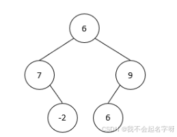
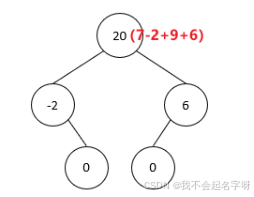

# 2024年E卷200分题

[TOC]

# 二叉树的计算

题目描述
给出一个二叉树如下图所示：



请由该二叉树生成一个新的二叉树，它满足其树中的每个节点将包含原始树中的左子树和右子树的和。



左子树表示该节点左侧叶子节点为根节点的一颗新树；右子树表示该节点右侧叶子节点为根节点的一颗新树。

```go
输入描述
2行整数，第1行表示二叉树的中序遍历，第2行表示二叉树的前序遍历，以空格分割
例如：
7 -2 6 6 9
6 7 -2 9 6

输出描述
1行整数，表示求和树的中序遍历，以空格分割
例如：
-2 0 20 0 6
```

用例

```go
输入
-3 12 6 8 9 -10 -7
8 12 -3 6 -10 9 -7
输出 
0 3 0 7 0 2 0
说明 无
```

思路1：

- 从前序数组里开始遍历根节点，找到对应中序数组里的位置idx，并将此节点记为访问。
- 左右计算该idx两边元素的和，直到左右两边都碰到访问过的元素，或者边界。
- 将计算的值存在ans[idx]，左右相邻两边都被访问过，该节点为叶子节点，值为0.

代码：

```go

```

但是这个代码有个严重的bug，就是默认节点的值是唯一的，不含有重复项！

还是老老实实构建二叉树吧

代码

```go
package main

import "fmt"

// 定义二叉树节点
type TreeNode struct {
	Val   int
	Left  *TreeNode
	Right *TreeNode
}

// 递归函数，构建二叉树
func buildTree(preorder []int, inorder []int) *TreeNode {
	// 使用辅助函数，明确左右子树的范围
	return helper(preorder, inorder, 0, len(preorder)-1, 0, len(inorder)-1)
}

// 辅助递归函数，增加索引范围参数，确保处理重复值
func helper(preorder []int, inorder []int, preStart, preEnd, inStart, inEnd int) *TreeNode {
	if preStart > preEnd || inStart > inEnd {
		return nil
	}

	// 前序遍历的第一个值是当前子树的根节点
	rootVal := preorder[preStart]
	root := &TreeNode{Val: rootVal}

	// 在中序遍历的指定范围内找到根节点的位置
	rootIndex := -1
	for i := inStart; i <= inEnd; i++ {
		if inorder[i] == rootVal {
			rootIndex = i
			break
		}
	}

	if rootIndex == -1 {
		return nil // 错误处理：没有找到对应的根节点
	}

	// 计算左子树的大小
	leftSize := rootIndex - inStart

	// 递归构建左右子树
	root.Left = helper(preorder, inorder, preStart+1, preStart+leftSize, inStart, rootIndex-1)
	root.Right = helper(preorder, inorder, preStart+leftSize+1, preEnd, rootIndex+1, inEnd)

	return root
}

// 打印二叉树的中序遍历，验证结果
func printInOrder(node *TreeNode) {
	if node == nil {
		return
	}
	printInOrder(node.Left)
	fmt.Printf("%d ", node.Val)
	printInOrder(node.Right)
}

func main() {

	preorder := []int{6,7,-2,9,6}
	inorder := []int{7,-2,6,6,9}

	root := buildTree(preorder, inorder)
	fmt.Println("构建的二叉树的中序遍历:")
	printInOrder(root) // 应该输出与原来的中序遍历相同
	fmt.Println()
	levelOrder(root)
}
```

