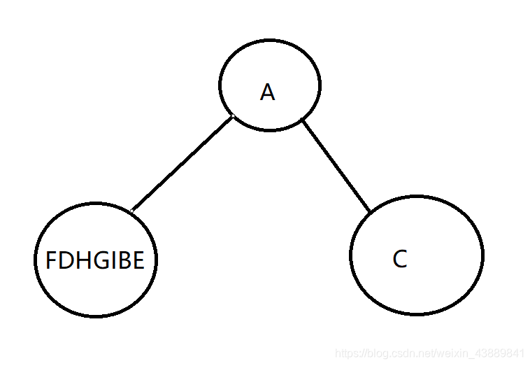
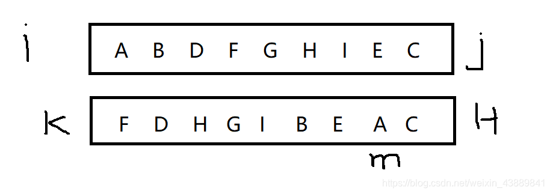
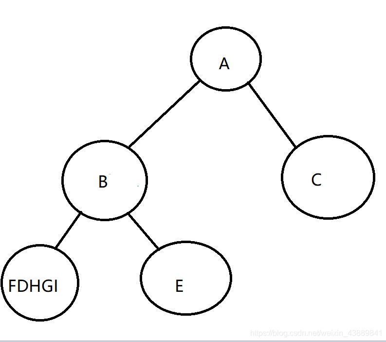

# 二叉树定义

```go
type TreeNode struct{
    Val int
    Left *TreeNode
    Right *TreeNode
}
```

# 递归三部曲

1. 确定递归函数的参数和返回值
2. 确定终止条件
3. 确定单层递归的逻辑

# 二叉树遍历


## 深度优先遍历

### 1. 递归法

```go
type TreeNode struct{
    Val int
    Left *TreeNode
    Right *TreeNode
}

// 前序遍历
func preOrderTraversal(root *TreeNode) (res []int){
    var travelsal func(node *TreeNode)
    travelsal = func (node *TreeNode)  {
        if node == nil{
            return
        }
        res = append(res, node.Val)
        travelsal(node.Left)
        travelsal(node.Right)
    }
    travelsal(root)
    return res
}

// 中序遍历
func midOrderTraversal(root *TreeNode) (res []int){
    var travelsal func(node *TreeNode)
    travelsal = func (node *TreeNode)  {
        if node == nil{
            return
        }
        travelsal(node.Left)
        res = append(res, node.Val)
        travelsal(node.Right)
    }
    travelsal(root)
    return res
}

// 后序遍历
func postOrderTraversal(root *TreeNode) (res []int){
    var travelsal func(node *TreeNode)
    travelsal = func (node *TreeNode)  {
        if node == nil{
            return
        }
        travelsal(node.Left)
        travelsal(node.Right)
        res = append(res, node.Val)
    }
    travelsal(root)
    return res
}
```

### 2. 迭代法

### [144. 二叉树的前序遍历](https://leetcode.cn/problems/binary-tree-preorder-traversal/)

```Go
func preorderTraversal(root *TreeNode) []int {
    // 利用栈，先出栈顶节点，访问节点值，再依次将其右节点左节点入栈
    st := []*TreeNode{}
    res := make([]int, 0)
    if root == nil{
        return res
    }
    st = append(st, root)
    for len(st) > 0{
        node := st[len(st)-1]
        res = append(res, node.Val)
        st = st[:len(st)-1]
        if node.Right != nil{
            st = append(st, node.Right)
        }
        if node.Left != nil{
            st = append(st, node.Left)
        }
    }
    return res
}
```

### [94. 二叉树的中序遍历](https://leetcode.cn/problems/binary-tree-inorder-traversal/)

```Go
func inorderTraversal(root *TreeNode) []int {
    // 利用栈，先将根节点入栈，再将此节点的左节点入栈，直到为叶子结点
    // 弹出栈顶节点，访问，并将其右节点入栈
    st := []*TreeNode{}
    res := make([]int, 0)
    curNode := root
    for curNode != nil || len(st) > 0{
        if curNode != nil{
            st = append(st, curNode)
            curNode = curNode.Left  // 左
        }else {
            curNode = st[len(st)-1]
            st = st[:len(st)-1]
            res = append(res,curNode.Val)       // 中
            curNode = curNode.Right // 右
        }
    }
    return res
}
```

### [145. 二叉树的后序遍历](https://leetcode.cn/problems/binary-tree-postorder-traversal/)

## 层序遍历

### [102. 二叉树的层序遍历](https://leetcode.cn/problems/binary-tree-level-order-traversal/)

###  1、迭代法

```Go
func levelOrder(root *TreeNode) [][]int {
    // 借助一个队列，先压入根节点，出队头节点，将出队节点的左右孩子分别压入
    queue := []*TreeNode{}
    res := make([][]int, 0)
    if root == nil{
        return res
    }
    queue = append(queue, root)
    var tmpArr []int
    for len(queue) > 0{
        levelLen := len(queue)  // 计算本层长度
        for levelLen > 0{
            node := queue[0]
            queue = queue[1:]   // 出队
            if node.Left != nil{
                queue = append(queue, node.Left)
            }
            if node.Right != nil{
                queue = append(queue, node.Right)
            }
            tmpArr = append(tmpArr, node.Val)   //存储本层节点值
            levelLen -= 1
        }
        res = append(res, tmpArr)
        tmpArr = []int{}    // 清空当前层
    }
    return res
}
```

###  2、递归法

```Go
func levelOrder(root *TreeNode) [][]int {
    // 递归遍历
    res := [][]int{}
    depth := 0

    var bfs func(root *TreeNode , depth int)
    bfs = func(root *TreeNode , depth int){
        if root == nil{
            return
        }
        if len(res) == depth{
            // res子集存储每一层，跟depth是同步的
            res = append(res, []int{})
        }
        // res[depth]为当前层遍历结果
        res[depth] = append(res[depth], root.Val)
        bfs(root.Left,depth+1)
        bfs(root.Right,depth+1)
    }
    bfs(root,depth)
}
```

# 二叉树构建

二叉树的构建一定要保留中序遍历，否则构建不了二叉树。

## 先序+中序遍历

- 先序遍历二叉树结果的第一个节点是根节点
- 中序遍历二叉树结果中左子树右子树又以根节点隔开

假定:

```go
先序遍历结果为: A B D F G H I E C
中序遍历结果为: F D H G I B E A C
```

### 第一次考虑

毫无疑问通过先序遍历可以知道A是最开始的根节点，所以中序遍历中我们可以知道它的结构是这样的



再进一步对上图中的左子树进行考虑，现在就变成了
`先序遍历结果B D F G H I E`
`中序遍历结果F D H G I B E`
在这里我们先求出来新的先序遍历结果在原来先序遍历结果中的位置
如图



i表示先序遍历结果的初始位置，j表示末尾
k表示中序遍历结果的初始位置，H表示末尾
m标识中序结果中的根节点
我们先看左子树的先序遍历结果位置：
我们可以看到先序遍历结果中B-E是分离后的左子树先序遍历结果，B的位置很好求就是i+1,
E的位置我们不妨设x,则有上下对齐m-k=x-i,得x=m-k+i
所以这次分离后的先序结果位置范围是[i+1,m-k+i]
再看左子树的中序遍历位置
我们可以看到上图中序遍历结果中F-E是分离后的左子树中序遍历结果，我们也可以通过设x的方式来求，得这次分离后的中序结果位置范围是[k,m-1]
接下来再看右子树的先序遍历结果位置：
同样是设x，最后范围是[m+j-h+1,j]
右子树的中序遍历结果位置：
[m+1,H]

### 第二次考虑

同理，由先序可知B为根节点，再去中序遍历结果中以B分离左子树FDHGI，右子树E，就变成了下图



再往下我就不列了，这样我们就可以还原二叉树，如果想要输出后序结果，直接后序遍历就行，如果需要求二叉树的高度，直接求就行

### 代码

```go
package main

import "fmt"

// 定义二叉树节点
type TreeNode struct {
	Val   int
	Left  *TreeNode
	Right *TreeNode
}

// 递归函数，构建二叉树
func buildTree(preorder []int, inorder []int) *TreeNode {
	// 使用辅助函数，明确左右子树的范围
	return helper(preorder, inorder, 0, len(preorder)-1, 0, len(inorder)-1)
}

// 辅助递归函数，增加索引范围参数，确保处理重复值
func helper(preorder []int, inorder []int, preStart, preEnd, inStart, inEnd int) *TreeNode {
	if preStart > preEnd || inStart > inEnd {
		return nil
	}

	// 前序遍历的第一个值是当前子树的根节点
	rootVal := preorder[preStart]
	root := &TreeNode{Val: rootVal}

	// 在中序遍历的指定范围内找到根节点的位置
	rootIndex := -1
	for i := inStart; i <= inEnd; i++ {
		if inorder[i] == rootVal {
			rootIndex = i
			break
		}
	}

	if rootIndex == -1 {
		return nil // 错误处理：没有找到对应的根节点
	}

	// 计算左子树的大小
	leftSize := rootIndex - inStart

	// 递归构建左右子树
	root.Left = helper(preorder, inorder, preStart+1, preStart+leftSize, inStart, rootIndex-1)
	root.Right = helper(preorder, inorder, preStart+leftSize+1, preEnd, rootIndex+1, inEnd)

	return root
}

// 打印二叉树的中序遍历，验证结果
func printInOrder(node *TreeNode) {
	if node == nil {
		return
	}
	printInOrder(node.Left)
	fmt.Printf("%d ", node.Val)
	printInOrder(node.Right)
}

func main() {

	preorder := []int{6, 7, -2, 9, 6}
	inorder := []int{7, -2, 6, 6, 9}

	root := buildTree(preorder, inorder)
	fmt.Println("构建的二叉树的中序遍历:")
	printInOrder(root) // 应该输出与原来的中序遍历相同
}

```

## 中序+后续遍历

后序遍历之不够是根在最后面而已

### 思想：

1. 后序遍历的最后一位即是二叉树的根节点。
2. 然后再中序遍历找到根结点，根节点左边的所有序列便是左子树的中序遍历结果，右边的所有序列便是右子树中序遍历结果。
3. 在后序遍历中找到对应的左子树，右子树。
4. 在左右子树的先序和中序结果中继续重复1 ， 2 ，3步骤，便可还原二叉树。

### 代码：

```go
package main

import "fmt"

// 定义二叉树节点
type TreeNode struct {
	Val   int
	Left  *TreeNode
	Right *TreeNode
}

// 递归函数，构建二叉树
func buildTree(postorder []int, inorder []int) *TreeNode {
	// 使用辅助函数，明确左右子树的范围
	return helper(postorder, inorder, 0, len(postorder)-1, 0, len(inorder)-1)
}

// 辅助递归函数，增加索引范围参数，确保处理重复值
func helper(postorder []int, inorder []int, postStart, postEnd, inStart, inEnd int) *TreeNode {
	if postStart > postEnd || inStart > inEnd {
		return nil
	}

	// 后序遍历的最后值是当前子树的根节点
	rootVal := postorder[postEnd]
	root := &TreeNode{Val: rootVal}

	// 在中序遍历的指定范围内找到根节点的位置
	rootIndex := -1
	for i := inStart; i <= inEnd; i++ {
		if inorder[i] == rootVal {
			rootIndex = i
			break
		}
	}

	if rootIndex == -1 {
		return nil // 错误处理：没有找到对应的根节点
	}

	// 计算左子树的大小
	leftSize := rootIndex - inStart

	// 递归构建左右子树
	root.Left = helper(postorder, inorder, postStart, postStart+leftSize-1, inStart, rootIndex-1)
	root.Right = helper(postorder, inorder, postStart+leftSize, postEnd-1, rootIndex+1, inEnd)

	return root
}

// 打印二叉树的前序遍历，验证结果
func printInOrder(node *TreeNode) {
	if node == nil {
		return
	}
	fmt.Printf("%d ", node.Val)
	printInOrder(node.Left)
	printInOrder(node.Right)
}

func main() {
	// preorder := []int{6, 7, -2, 9, 6}
	postorder := []int{-2, 7, 6, 9, 6}
	inorder := []int{7, -2, 6, 6, 9}

	root := buildTree(postorder, inorder)
	fmt.Println("构建的二叉树的前序遍历:")
	printInOrder(root) // 应该输出与原来的中序遍历相同
}
```

## 中序+层次遍历

层次遍历

# 题目：

## [226. 翻转二叉树](https://leetcode.cn/problems/invert-binary-tree/)

递归法

```Go
func invertTree(root *TreeNode) *TreeNode {
    if root == nil{
        return nil
    }
    root.Left , root.Right = root.Right , root.Left //左右节点交换
    invertTree(root.Left)
    invertTree(root.Right)
    return root
}
```

迭代法

- ####  DFS

```Go
func invertTree(root *TreeNode) *TreeNode {
    // 前序遍历
    if root == nil{
        return root
    }
    stack := []*TreeNode{}
    node := root
    stack = append(stack, node)
    for len(stack) > 0{
        node = stack[len(stack)-1]  // 根
        stack = stack[:len(stack)-1]
        node.Left , node.Right = node.Right , node.Left  //交换
        if node.Right != nil{
            stack = append(stack, node.Right) // 右
        }
        if node.Left != nil{
            stack = append(stack, node.Left) // 左
        }
    }
    return root
}
```

- ####  BFS

```Go
// 广度优先遍历，层次遍历
func invertTree(root *TreeNode) *TreeNode {
    if root == nil{
        return root
    }
    queue := []*TreeNode{}
    node := root
    queue = append(queue, node)
    for len(queue) > 0{
        curLen := len(queue) // 当前层长度
        for curLen > 0 {
            node = queue[0]
            queue = queue[1:] // 出队
            curLen -= 1
            node.Left , node.Right = node.Right , node.Left  //交换
            if node.Left != nil{
                queue = append(queue, node.Left)
            }
            if node.Right != nil{
                queue = append(queue, node.Right)
            }
        }
    }
    return root
}
```

## [101. 对称二叉树](https://leetcode.cn/problems/symmetric-tree/description/)

```Go
func isSymmetric(root *TreeNode) bool {
  /* 递归 */
  var compare func(Left,Right *TreeNode) bool
  compare = func(l, r *TreeNode) bool {
    // 递归终止条件
    if l == nil && r != nil{
      return false
    }else if l != nil && r == nil{
      return false
    }else if l == nil && r == nil{
      return true
    }else if l.Val != r.Val{
      return false
    }
    outside := compare(l.Left,r.Right)  // 左：l  右：r
    inside := compare(l.Right,r.Left)   // 左：r  右：l
    isSame := outside && inside     // 左：中  右：中
    return isSame
  }
  if root == nil{
    return true
  }
  return compare(root.Left,root.Right)
}
```

## [104. 二叉树的最大深度](https://leetcode.cn/problems/maximum-depth-of-binary-tree/description/)

```Go
func maxDepth(root *TreeNode) int {
  var getDepth func(node *TreeNode) int
  getDepth = func(node *TreeNode) int{
    if node == nil{
      return 0
    }
    leftDepth := getDepth(node.Left)
    rightDepth := getDepth(node.Right)
    return max(leftDepth,rightDepth) + 1
  }
  return getDepth(root)
}

func max(x,y int) int{
  if x > y{
    return x
  }
  return y
}
func maxDepth2(root *TreeNode) (result int) {
    // 前序遍历思想
    var getDepth func(root *TreeNode,depth int)
    getDepth = func (root *TreeNode,depth int) {
        if depth > result{      // 中
            result = depth
        }
        if root.Left == nil && root.Right == nil{
            return
        }
        if root.Left != nil{    // 左
            getDepth(root.Left,depth+1)
        }
        if root.Right != nil{   // 右
            getDepth(root.Right,depth+1)
        }
        return
    }
    getDepth(root,1)
    return 
}
```

## [111. 二叉树的最小深度](https://leetcode.cn/problems/minimum-depth-of-binary-tree/)

遍历的顺序为后序（左右中），求二叉树的最小深度和求二叉树的最大深度的差别主要在于处理左右孩子不为空的逻辑。

```Go
func minDepth(root *TreeNode) int {
    var getMinDepth func (root *TreeNode) int
    getMinDepth = func(root *TreeNode) int {
        if root == nil{
            return 0
        }
        leftDepth := getMinDepth(root.Left)  // 左
        rightDepth := getMinDepth(root.Right) // 右
                                            // 中
        // 左子树不为空，右子树为空，不是最低点
        if root.Left != nil && root.Right == nil{
            return leftDepth + 1
        }
        // 左子树为空，右子树不为空，不是最低点
        if root.Left == nil && root.Right != nil{
            return rightDepth + 1
        }
        return 1 + min(leftDepth,rightDepth)
    }
    return getMinDepth(root)
}

func min(x,y int)int{
    if x < y {
        return x
    }
    return y
}
```

## [222. 完全二叉树的节点个数](https://leetcode.cn/problems/count-complete-tree-nodes/)

```Go
func countNodes(root *TreeNode) int {
    var getNodeNum func(root *TreeNode) int
    getNodeNum = func(root *TreeNode) int {
        if root == nil{
            return 0
        }
        leftNodeNum := getNodeNum(root.Left) // 左
        rightNodeNum := getNodeNum(root.Right) // 右
        return leftNodeNum + rightNodeNum + 1  // 中
    }
    return getNodeNum(root)
}
```

## [110. 平衡二叉树](https://leetcode.cn/problems/balanced-binary-tree/)

```Go
// 给定一个二叉树，判断它是否是高度平衡的二叉树。
func isBalanced(root *TreeNode) bool {
    var getHigh func(root *TreeNode) int
    getHigh = func(root *TreeNode) int {
        // 用-1标记是否左右子树是否是平衡
        if root == nil{
            return 0
        }
        leftHigh := getHigh(root.Left)  // 左
        if leftHigh == -1{
            return -1
        }
        rightHigh := getHigh(root.Right) // 右
        if rightHigh == -1{
            return -1
        }
        if math.Abs(float64(leftHigh - rightHigh)) > 1{
            return -1
        }
        return 1 + max(leftHigh,rightHigh)  // 中
    }
    if getHigh(root) == -1{
        return false
    }
    return true
}

func max(x,y int) int{
  if x > y{
    return x
  }
  return y
}
```

## 小结1：

1. 遍历的顺序为后序（左右中），求二叉树的最小深度和求二叉树的最大深度的差别主要在于处理左右孩子不为空的逻辑。
2. 深度与高度
   1. **深度**：指从根节点到该节点的最长简单路径边的条数。采用**前序遍历思想。**
   2. **高度**：指从该节点到叶子节点的最长简单路径边的条数。采用**后序遍历思想。**
3. 找叶子结点逻辑
   1. ```Go
      node.left == nil && node.right == nil
      ```

## [257. 二叉树的所有路径](https://leetcode.cn/problems/binary-tree-paths/)

```Go
var (
    path   []string
    result []string
)

func binaryTreePaths(root *TreeNode) []string {
    //利用回溯，前序遍历思想
    var preTravel func(root *TreeNode)
    preTravel = func(root *TreeNode) {
        // 到叶子结点回溯
        if root.Left == nil && root.Right == nil {
            path = append(path,strconv.Itoa(root.Val))  // 叶子结点也要加入
            tmp := strings.Join(path,"->")
            path = path[:len(path)-1]                   // 记得出栈
            result = append(result,tmp)
            return
        }
        //前序遍历逻辑
        path = append(path, strconv.Itoa(root.Val))     // 根
        if root.Left != nil{
            preTravel(root.Left)                        // 左
        }
        if root.Right != nil{
            preTravel(root.Right)                       // 右
        }
        path = path[:len(path)-1]
    }
    result = make([]string, 0)
    preTravel(root)
    return result
}
```

## [404. 左叶子之和](https://leetcode.cn/problems/sum-of-left-leaves/)

```Go
func sumOfLeftLeaves(root *TreeNode) int {
    // 根节点左叶子和 = 左子树的左叶子和 + 右子树的左叶子和
    // 左叶子：通过父节点判断，左孩子不为空，且左孩子为叶子结点
    var sumLeftValue func(root *TreeNode) int
    sumLeftValue = func(root *TreeNode) int {
        if root == nil{
            return 0
        }
        leftValue := sumLeftValue(root.Left)    // 左
        if root.Left != nil && root.Left.Left == nil && root.Left.Right == nil{
            leftValue += root.Left.Val  // 左叶子和 
        }
        rightValue := sumLeftValue(root.Right)
        return leftValue + rightValue
    }
    return sumLeftValue(root)
}
```

## [513. 找树左下角的值](https://leetcode.cn/problems/find-bottom-left-tree-value/description/)

```Go
func findBottomLeftValue(root *TreeNode) int {
  // 迭代法，用层次遍历，左后一行的第一个元素
  que := []*TreeNode{}
  var ans int
  if root != nil {
    que = append(que, root)
  }
  for len(que) > 0 {
    qLen := len(que)
    for i := 0; i < qLen; i++ {
      node := que[0]
      que = que[1:]
      if i == 0 {
        // 记录最后一行第一个元素
        ans = node.Val
      }
      if node.Left != nil{
        que = append(que, node.Left)
      }
      if node.Right != nil{
        que = append(que, node.Right)
      }
    }
  }
  return ans
}
```

也可以用递归，找到深度最大的叶子结点，并用前序遍历找到最左叶子结点

```Go
func findBottomLeftValue(root *TreeNode) int {
    // 递归法
    var ans int      // 结果
    var maxDepth int // 最大深度
    var preTravel func(root *TreeNode, depth int)
    preTravel = func(root *TreeNode, depth int) {
        // 递归终止条件
        if root == nil {
            return
        }
        // 记录当前深度最左叶子节点
        if root.Left == nil && root.Right == nil && depth > maxDepth {
            // 因为先遍历左边，所以左边如果有值，右边的同层不会更新结果
            maxDepth = depth
            ans = root.Val
        }
        preTravel(root.Left, depth+1)
        preTravel(root.Right, depth+1)
    }
    preTravel(root, 1)
    return ans
}
```

## [112. 路径总和](https://leetcode.cn/problems/path-sum/)

这里一定要想清楚，回溯为什么要有返回值比较好，

```Go
func hasPathSum(root *TreeNode, targetSum int) bool {
    // 递归，用前序遍历
    var travel func(root *TreeNode, pathSum int) bool
    travel = func(root *TreeNode, pathSum int) bool {
       if root.Left == nil && root.Right == nil {
          if pathSum == targetSum {
             return true
          }
          return false
       }
       if root.Left != nil {
          pathSum += root.Left.Val
          // 用返回值，找到一条路径就返回
          if travel(root.Left, pathSum) == true {
             return true // 回溯
          }
          pathSum -= root.Left.Val
       }
       if root.Right != nil {
          pathSum += root.Right.Val
          if travel(root.Right, pathSum) == true {
             return true
          }
          pathSum -= root.Right.Val
       }
       return false
    }
    if root == nil {
       return false
    }
    return travel(root, root.Val)
}
```

## [113. 路径总和 II](https://leetcode.cn/problems/path-sum-ii/)

```Go
func pathSum(root *TreeNode, targetSum int) [][]int {
  var path = make([]int, 0)
  var ans = make([][]int, 0)

  var travel func(root *TreeNode, pathSum int)
  travel = func(root *TreeNode, pathSum int) {
    // 递归出口
    if root == nil {
      return
    }
    // 单层遍历逻辑：为叶子结点且路径和为目标值
    pathSum += root.Val
    path = append(path, root.Val)
    if root.Left == nil && root.Right == nil && pathSum == targetSum {
      // 要先拷贝，因为path是整个变化的
      copyPath := make([]int, len(path))
      copy(copyPath, path)
      ans = append(ans, copyPath)
    }
    travel(root.Left, pathSum)
    travel(root.Right, pathSum)
    path = path[:len(path)-1]
    return
  }
  if root == nil {
    return ans
  }
  travel(root, 0)
  return ans
}
```

## [106. 从中序与后序遍历序列构造二叉树](https://leetcode.cn/problems/construct-binary-tree-from-inorder-and-postorder-traversal/description/)

```Go
var (
    inorderMap map[int]int
)

func buildTree(inorder []int, postorder []int) *TreeNode {
    inorderMap = make(map[int]int)
    // 用map保存中序数组的数值对应的Index
    for i, v := range inorder {
       inorderMap[v] = i
    }
    root := rebuild(inorder, postorder, len(postorder)-1, 0, len(inorder)-1)
    return root
}

func rebuild(inorder []int, postorder []int, rootIndex, l, r int) *TreeNode {
    // rootIndex为当前根节点index，l，r分别为中序数组的左右index
    // 1、没有元素，返回空
    if l > r {
       return nil
    }
    // 只有一个元素，直接返回
    if l == r {
       return &TreeNode{Val: inorder[l]}
    }

    rootVal := postorder[rootIndex]
    InIdx := inorderMap[rootVal]    // 找到中序的切割点
    root := &TreeNode{Val: rootVal} // 构建根节点
    // 根节点
    // 切割中序数组
    // 左边[l,InIdx] , 右边[InIdx+1,r]

    // 切割后序数组
    // 左边[postBegin,postBegin+(InIdx-l)]
    // 右边[postBegin+(InIdx-l),postEnd-1]

    // 6、重构左、右节点
    root.Left = rebuild(inorder, postorder, rootIndex-(r-InIdx)-1, l, InIdx-1)
    root.Right = rebuild(inorder, postorder, rootIndex-1, InIdx+1, r)
}
```

## [105. 从前序与中序遍历序列构造二叉树](https://leetcode.cn/problems/construct-binary-tree-from-preorder-and-inorder-traversal/)

```Go
var (
    inOrderMap map[int]int
)

func buildTree(preorder []int, inorder []int) *TreeNode {
    inOrderMap = make(map[int]int, len(inorder))
    for i, v := range inorder {
       inOrderMap[v] = i
    }
    root := rebuild2(preorder, inorder, 0, 0, len(inorder)-1)
    return root
}

func rebuild2(preorder []int, inorder []int, rootIndex, l, r int) *TreeNode {
    if l > r {
       return nil
    }
    if l == r {
       return &TreeNode{Val: inorder[l]}
    }

    rootVal := preorder[rootIndex]
    rootInIdx := inOrderMap[rootVal]
    root := &TreeNode{Val: rootVal}

    root.Left = rebuild2(preorder, inorder, rootIndex+1, l, rootInIdx-1)
    root.Right = rebuild2(preorder, inorder, rootIndex+(rootInIdx-l)+1, rootInIdx+1, r)
    return root
}
```

## [654. 最大二叉树](https://leetcode.cn/problems/maximum-binary-tree/description/)

```Go
func constructMaximumBinaryTree(nums []int) *TreeNode {
    if len(nums) == 0 {
       return nil
    }
    // root为当前数组的最大值节点,每次以root为切割点
    rootIdx := findMax(nums) // 当前root在nums中的下标
    root := &TreeNode{Val: nums[rootIdx]}
    root.Left = constructMaximumBinaryTree(nums[:rootIdx])
    root.Right = constructMaximumBinaryTree(nums[rootIdx+1:])
    return root
}

func findMax(nums []int) (maxIdx int) {
    var maxVal int
    for i, v := range nums {
       if v > maxVal {
          maxVal = v
          maxIdx = i
       }
    }
    return
}
```