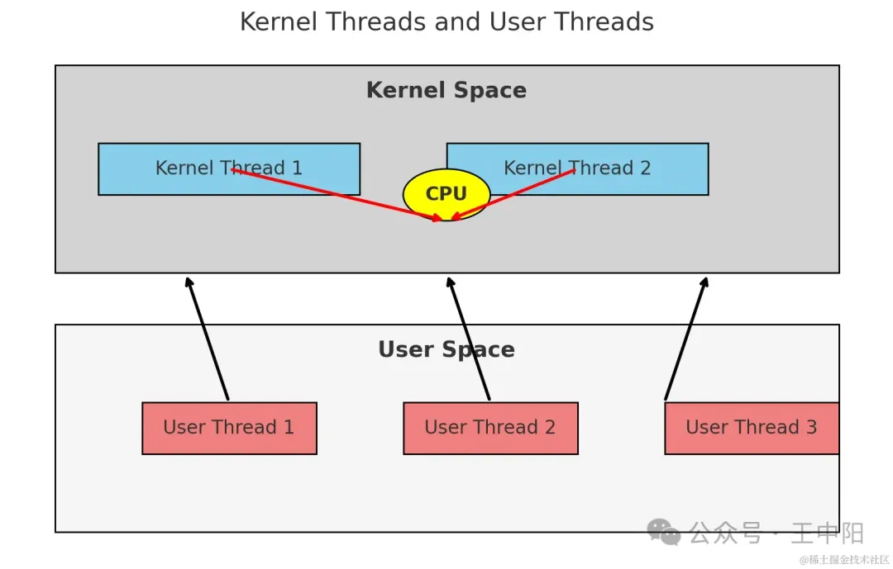
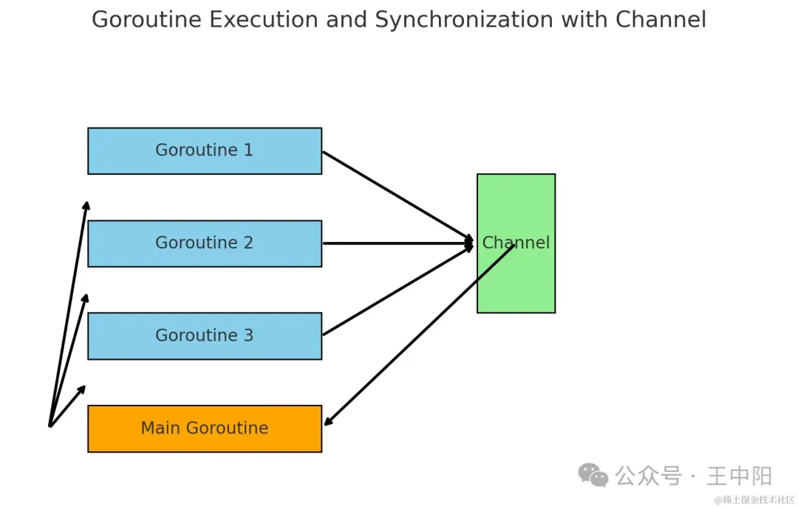
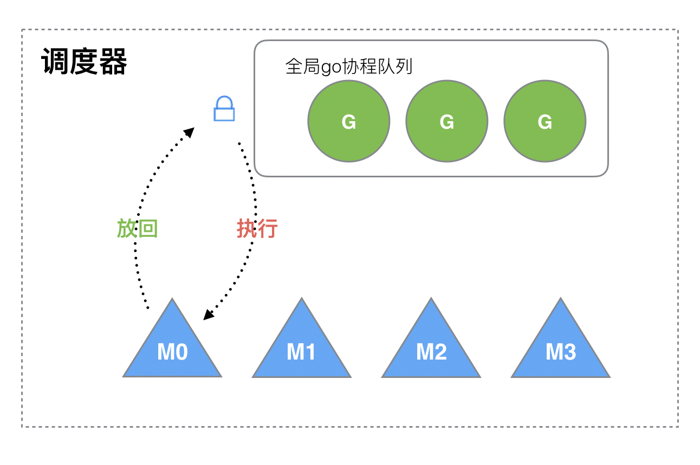

## 深入解析 Go 语言 GMP 模型：并发编程的核心机制

---

## 问题要点：

在阅读本文前，先带着以下几个关于GMP模型的面试题目进行思考，以加深理解和掌握：

**什么是GMP模型？请解释其基本概念。**

- 回答要点：解释G、M、P的概念及其在调度模型中的角色。

**如何理解GMP模型中线程的内核态和用户态？**

- 回答要点：区分内核态线程和用户态线程，并说明它们在GMP模型中的作用。

**Go语言中的Goroutine与线程的映射关系是怎样的？为什么选择这种映射方式？**

- 回答要点：解释Goroutine与线程的多对多映射关系及其优点。

**GMP模型如何解决线程调度中的锁竞争问题？**

- 回答要点：介绍全局队列和本地队列的使用，以及G的分配机制。

**GMP模型中的Stealing机制是什么？它如何工作？**

- 回答要点：描述Stealing机制的原理及其在Goroutine调度中的应用。

**什么是Hand off机制？在什么情况下会使用该机制？**

- 回答要点：解释Hand off机制及其在阻塞和系统调用中的应用。

**如何理解GMP模型中的抢占式调度？它解决了哪些问题？**

- 回答要点：说明抢占式调度的原理及其在防止协程饿死中的作用。

**什么是G0和M0？它们在GMP模型中扮演什么角色？**

- 回答要点：描述G0和M0的定义及其在Goroutine调度中的功能。

**请详细说明GMP模型中的调度策略。**

- 回答要点：逐步解释Goroutine的创建、唤醒、偷取、切换、自旋、系统调用和阻塞处理策略。

**如何在实际项目中调优GMP调度模型？**

- 回答要点：讨论如何通过调整GOMAXPROCS等参数来优化调度性能

## **单进程时代**

### **基本概念**

在单进程时代，一个进程就是一个运行中的程序。计算机系统在执行程序时，会从头到尾依次执行完一个程序，然后再执行下一个程序。在这种模型中，不需要复杂的调度机制，因为只有一个执行流程。

### **面临的两个问题**

1. **单一执行流程**：由于只能一个个执行程序，无法同时处理多个任务，这大大限制了CPU的利用率。
2. **进程阻塞**：当一个进程遇到I/O操作等阻塞情况时，CPU资源会被浪费，等待进程完成阻塞操作后再继续执行，导致效率低下。

## **多进程/线程并发时代**

### **基本概念**

为了解决单进程时代的效率问题，引入了多进程和多线程并发模型。在这种模型中，当一个进程阻塞时，CPU可以切换到另一个准备好的进程继续执行。这样可以充分利用CPU资源，提高系统的并发处理能力。

### **两个问题**

1. **高开销**：进程拥有大量资源，进程的创建、切换和销毁都需要消耗大量的时间和资源。这导致CPU很大一部分时间都在处理进程调度，而不是实际的任务执行。
2. **高内存占用**：在32位机器下，进程的虚拟内存占用为4GB，线程占用为4MB。大量的线程和进程会导致高内存消耗，限制了系统的扩展性。

### **协程的引入**

为了解决多进程和多线程带来的高开销和高内存占用问题，引入了协程（Coroutine）。协程是一种比线程更轻量级的执行单元。协程在用户态进行调度，避免了频繁的上下文切换带来的开销。Go语言的GMP模型正是基于协程的设计。

## **协程的基本概念**

在深入了解Goroutine之前，先来了解一下协程（Coroutine）的基本概念。

### **内核态和用户态**

- **内核态线程**：由操作系统管理和调度，CPU只负责处理内核态线程。
- **用户态线程**：由用户程序管理，需绑定到内核态线程上执行，协程即为用户态线程的一种。

##  线程和协程的映射关系

### 一对多：

- **问题1**：无法利用多核CPU的能力。
- **问题2**：如果某个协程阻塞，整个线程和进程都将阻塞，导致其他协程无法执行，丧失并发能力。

### 一对一：

- 将每个协程绑定到一个线程上，退回到多进程/线程的模式，协程的创建、切换、销毁均需CPU完成，效率低下。

### 多对多：

- 允许多个协程绑定到多个线程上，形成M:N的关系。这样可以充分利用多核CPU，并通过协程调度器高效管理协程的执行。

## **Goroutine**

Goroutine是Go语言中的协程，它是 Go 语言中并发编程的基本单位，实现了轻量级并发。与传统的线程相比，Goroutine具有以下显著特点：

### **轻量级**

**Goroutine非常轻量，初始化时仅占用几KB的栈内存**，并且栈内存可以根据需要动态伸缩。这使得我们可以在Go程序中创建成千上万个Goroutine，而不会消耗过多的系统资源。

### **高效调度**

Goroutine的调度由Go语言的运行时（runtime）负责，而不是操作系统。Go运行时在用户态进行调度，避免了频繁的上下文切换带来的开销，使得调度更加高效。

### **需要注意的事项**

1. **主Goroutine的结束**：在Go程序中，main函数本身也是一个Goroutine，称为主Goroutine。当主Goroutine结束时，所有其他Goroutine也会随之终止。因此，**需要确保主Goroutine等待所有子Goroutine执行完毕。**
2. **同步和共享数据**：**虽然Goroutine之间共享内存空间，但需要通过同步机制（如通道和锁）来避免竞争条件**。**Go语言推荐使用通道（channel）进行Goroutine之间的通信**，以保证数据的安全性和同步性。

### **执行流程**

1. 主Goroutine启动多个子Goroutine（Goroutine 1、2、3）。
2. 各个Goroutine并发执行它们的任务。
3. 每个Goroutine在完成任务后，向通道发送信号表示已完成。
4. 主Goroutine通过通道接收所有子Goroutine的完成信号，然后继续执行。

##  **Goroutine调度器**

### **基本概念**

**在Go中，****线程是运行Goroutine的实体，**而**调度器的功能是将可运行的Goroutine分配到工作线程上。Go语言采用了一种高效的Goroutine调度机制，使得程序能够在多核处理器上高效运行。**

### **被废弃的调度器**（1.0版本前）

早期的调度器采用了简单的设计，存在多个缺陷：

- **概念**：用大写的G表示协程，用大写的M表示线程。

- 问题：

- - **锁竞争**：每个M（线程）想要执行、放回G（协程）都必须访问一个全局G队列，因此对G的访问需要加锁以保证并发安全。当有很多线程时，锁竞争激烈，影响系统性能。
  - **局部性破坏**：M转移G会造成延迟和额外的系统负载。例如，当一个G内创建另一个G'时，为了继续执行G，需要将G'交给另一个M'执行，这会破坏程序的局部性。
  - **系统开销**：CPU在线程之间频繁切换导致频繁的系统调用，增加了系统开销。

## **GMP模型的设计思想**

为了克服上述问题，Go引入了GMP模型：

### **基本概念**：

Go语言使用GMP模型来管理并发执行。GMP模型由三个核心组件组成：G（Goroutine）、M（Machine）、P（Processor）。

#### G（Goroutine）

**Goroutine是Go语言中的协程，代表一个独立的执行单元**。Goroutine比线程更加轻量级，启动一个Goroutine的开销非常小。**Goroutine的调度由Go运行时在用户态进行。**

#### **M（Machine）**

**M代表操作系统的线程。M负责实际执行Go代码。**一个M可以执行多个Goroutine，但同一时间只能执行一个Goroutine。M**与操作系统的线程直接对应，Go运行时通过M来利用多核CPU的并行计算能力。**

#### **P（Processor）**

**P代表处理器（Processor）。P管理着可运行的Goroutine队列，并负责与M进行绑定。P的数量决定了可以并行执行的Goroutine的数量。Go运行时会根据系统的CPU核数设置P的数量。**

### **GMP模型的组成**：

- **全局G队列**：存放等待运行的G。
- **P的本地G队列**：**当新建协程时优先将G存放到本地队列，本地队列满了后将一半的G移动到全局队列。**存放不超过256个G。
- **M**：内核态线程，M想要运行G需要先获取一个P，从P的本地G队列中获取G。当本地队列为空时，会尝试从全局队列或其他P的本地G列表中偷取G。
- **P列表**：程序启动时创建GOMAXPROCS个P，并保存在数组中。

- **调度器与OS调度器结合**：Go的Goroutine调度器与操作系统调度器结合，OS调度器负责将线程分配给CPU执行。

### 设计策略

- **复用线程的两个策略**：

- - **Work Stealing机制**：当本线程没有可执行的G时，**优先从全局G队列中获取一批G。如果全局队列中没有，则尝试从其他P的G队列中偷取G。**
  - **Hand Off机制**：当本线程因G进行系统调用等阻塞时，线程会释放绑定的P，把P转移给其他空闲的M执行。

- **利用并行**：有GOMAXPROCS个P，则可以有同样数量的线程并行执行。

- **抢占式调度**：Coroutine是协作式的，一个协程只有让出CPU才能让下一个协程执行，GC需要暂停整个程序（Stop-the-world，STW），最长可能需要几分钟的时间，导致整个程序无法工作。而Goroutine执行超过10ms就会强制让出CPU，防止其他协程饿死。

- **特殊的G0和M0**：

- - **G0**：每次启动一个M都会创建的第一个G0，仅用于调度，不指向任何可执行的函数。每个M都有一个自己的G0，在调度或系统调用时使用G0的栈空间。
  - **M0**：启动程序后的第一个主线程，负责执行初始化操作和启动第一个Goroutine，此后与其他M一样。

### **调度策略**

- **创建两步**：

- - 通过`go func()`创建一个协程。

  - 新创建的协程优先保存在P的本地G队列，如果本地队列满了，会将P本地队列中的一半G打乱顺序（避免局部性）移入全局队列。

    （如果不打乱，那么在全局队列中的G可能长时间得不到执行，因为优先执行本地队列中的）

- **唤醒获取**：

- - 创建G时运行的G会尝试唤醒其他的P-M组合去执行。假设G2唤醒了M2，M2绑定了P2，但P2本地队列没有G，此时M2为自旋线程。M2便会尝试从全局队列中获取G。

- **偷取**：

- - 假设P的本地队列和全局队列都空了，会从其他P偷取一半G（局部性）到自己的本地队列执行。

- **切换逻辑**：

- - G1运行完后，M上运行的协程切换回G0，G0负责调度时协程的切换。先从P的本地队列获取G2，从G0切换到G2，从而实现M的复用。

- **自旋**：

- - 自旋线程会占用CPU时间，但创建销毁线程也会消耗CPU时间，系统最多有GOMAXPROCS个自旋线程，其余的线程会在**休眠M队列**里。

- **系统调用**：

- - 当G进行系统调用时会进入内核态被阻塞，G-M会绑定在一起进行系统调用。M会释放绑定的P，把P转移给其他空闲的M执行。当系统调用结束时，G-M会尝试获取一个空闲的P。

- **阻塞处理**：

- - 当G因**channel**或**network I/O**阻塞时，不会阻塞M，当超过10ms时M会寻找其他可运行的G。

- **公平性**：

- - 调度器（负责调度G）每调度61次时，会尝试从全局队列里取出待运行的Goroutine来运行，如果没有找到，就去其他P偷一些Goroutine来执行。

## **GMP模型的优势**

1. **高效的资源利用**：通过在**用户态进行调度，避免了频繁的上下文切换带来的开销，充分利用CPU资源。**
2. **轻量级并发**：Goroutine比线程更加轻量级，可以启动大量的Goroutine而不会消耗大量内存。
3. **自动调度**：**Go运行时自动管理Goroutine的调度，无需程序员手动干预，简化了并发编程的复杂度。**

## 补充概念

### 自旋线程

**自旋线程即线程会持续检查某个条件是否满足，而不是通过阻塞线程来等待条件的满足。**