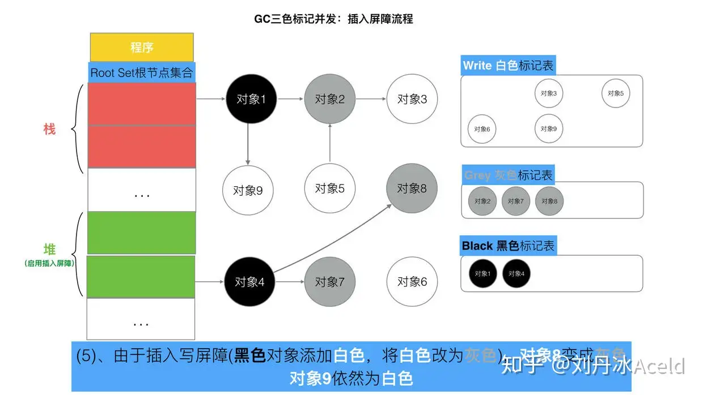
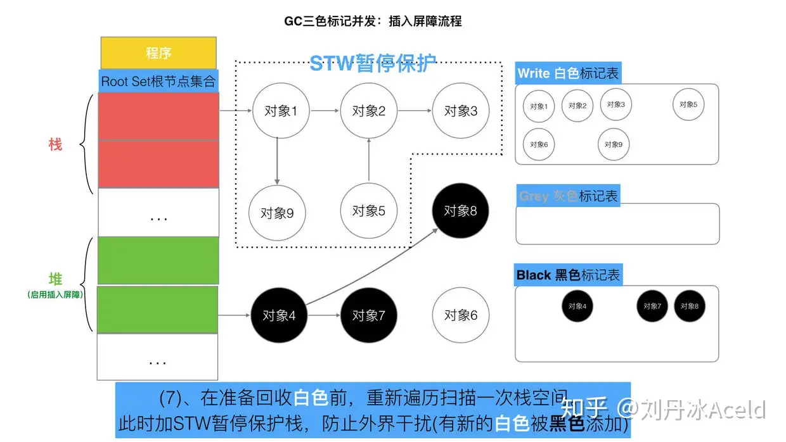

# 什么是GC？有什么作用？

`GC`是垃圾回收，全称`Garbage Collection`，**是一种自动的内存管理机制。**

**当程序向操作系统申请的内存不需要时，`GC`主动将其回收归还给操作系统，或者提供其他程序进行内存申请时复用。**

**`GC`对程序员透明，程序员不需要对内存进行手动的申请和释放。**

# Go中的GC垃圾回收机制

## （1）Go v1.3 之前的标记清除（mark and sweep）

- 启动STW（stop the world），暂停程序逻辑，找出可达对象和不可达对象。

- 开始标记，给可达对象做上标记。

- 清除未标记的对象。

- 停止STW，让程序继续运行，循环这个过程，直至程序生命周期结束。

  

缺点：

- **STW：程序暂停，程序出现卡顿。（最严重）**
- **标记需要扫描整个heap。**
- **清除数据会产生heap碎片。**

## （2）Go v1.5 三色标记法（白-灰-黑）

三种颜色含义：

白色：没有遍历的；灰色：临时状态（最后应为空）；黑色：彻底遍历的

- 程序起初创建时，全部标记为白色，将其放入白色集合中。
- 将程序的根节点集合展开，遍历Root Set，往下走一层，得到灰色节点（对象1、4）。
- 遍历灰色标记表，将可达对象从白色—>灰色，遍历后的灰色，标记为黑色。
- 循环上一步，直至灰色标记表中无对象。
- 清除所有的白色对象（垃圾）。

**三色标记法特点：动态逐层遍历，而不是之前的一次性遍历。**

   如果没有STW保护，此时程序不会暂停，可能会出现下面的情况。

最简单的方式就是添加STW，但是STW有明显的资源浪费，对所有的用户程序都有较大影响。

如何能保证**对象不丢失**的情况下尽可能**提高GC效率**，**减少STW时间**呢？

## （3）Go v1.8 三色标记法+ 混合写屏障机制（**）

### 前言：强弱三色不等式

​	目的是为了破坏前面的两个条件：

- 黑色引用了白的。
- 灰色同时丢失了白色。

如果满足强/弱之一，即可保证对象不丢失，Go采用了一种屏障机制来实现。所谓屏障，就是在正常的程序运行过程中，增加一种额外的判断机制。

**强三色不等式：不允许黑色对象引用白色对象。**

**弱三色不等式：黑色对象可以引用白色对象，但是白色对象存在其他灰色对象对他的引用，或者说它的上层可达链路上存在灰色对象。**

### 插入写与删除写屏障机制：

#### **插入写屏障：对象被引用时触发。**

- **当A对象引用B对象时，B被强制标记为灰色。（满足强三色不等式，不存在黑色对象引用白色对象。）**
- **为了保证栈的效率，Go中栈的对象不触发插入屏障，分配在堆的对象才会触发。**
- **但是在准备回收白色前，会重新遍历扫描一次栈空间，加STW保护栈，并进行一次三色标记，直到没有灰色节点。**
- **再停止STW，回收白色。**

但是如果栈不添加，当全部三色标记扫描之后,栈上有可能依然存在白色对象被引用的情况(如上图的对象9). 所以要对栈重新进行三色标记扫描, 但这次为了对象不丢失, 要对本次标记扫描启动STW暂停. 直到栈空间的三色标记结束.

最后将栈和堆空间 扫描剩余的全部 白色节点清除. 这次STW大约的时间在10~100ms间.

#### **删除写屏障：对象被删除时触发。**

- **被删除的对象，如果是灰色或者白色，都会被标记为灰色。（满足弱三色不等式，保证灰的到白的路径不会断。）**
- **回收精度较低，一个应该被删除的对象会活过这一轮，在下一轮GC中被回收掉。**

这种方式的回收精度低，一个对象（对象5）即使被删除了最后一个指向它的指针也依旧可以活过这一轮，在下一轮GC中被清理掉。

**插入写屏障和删除写屏障的短板：**

- **插入写屏障：结束时需要STW来重新扫描栈，标记栈上引用的白色对象的存活；**
- **删除写屏障：回收精度低，GC开始时STW[扫描堆栈]来记录初始快照，这个过程会保护开始时刻的所有存活对象。**

### 混合写屏障操作流程：

- **GC刚开始时，全部默认为白色。**
- **三色标记法，优先扫描全部栈的对象，将所有可达对象标记为黑色。（这样做的好处是不需要再进行二次扫描，无需STW。）**
- **GC期间，任何在栈上创建的新对象，都标记为黑色。**
- **堆上被删除的对象标记为灰色。被添加（引用）的对象标记为灰色。**（栈不触发写屏障）

混合写屏障满足了**变形的弱三色不等式**，结合了插入、删除屏障的优点。

#### 场景一：对象被一个堆对象删除引用，成为栈对象的下游

#### 场景二：对象被一个栈对象删除引用，成为另一个栈对象的下游

#### 场景三：对象被一个堆对象删除引用，成为另一个堆对象的下游

#### 场景四：对象从一个栈对象删除引用，成为另一个堆对象的下游

# GC触发时机？

- 主动触发：调用`runtime.GC`
- 被动触发：
  1. 使用系统监控，由`runtime`中的一个变量控制，默认为两分钟，超过两分钟没有GC时会强制触发GC。
  2. 使用步调（Pacing）算法，核心思想时控制内存增长的比例。

# Go中的GC流程？

当前版本的 Go 以 STW 为界限，可以将 GC 划分为五个阶段：

|       阶段       |                            说明                            | 赋值器状态 |
| :--------------: | :--------------------------------------------------------: | :--------: |
| SweepTermination | 清扫终止阶段，为下一个阶段的并发标记做准备工作，启动写屏障 |    STW     |
|       Mark       |         扫描标记阶段，与赋值器并发执行，写屏障开启         |    并发    |
| MarkTermination  |    标记终止阶段，保证一个周期内标记任务完成，停止写屏障    |    STW     |
|      GCoff       |    内存清扫阶段，将需要回收的内存归还到堆中，写屏障关闭    |    并发    |
|      GCoff       |    内存归还阶段，将过多的内存归还给操作系统，写屏障关闭    |    并发    |

# 如何观察GC?

- ### `GODEBUG=gctrace=1`

- ### `go tool trace`

- ### `debug.ReadGCStats`

- ### `runtime.ReadMemStats`

# GC调优？

## （1）GC关注的指标

- CPU 利用率：回收算法会在多大程度上拖慢程序？有时候，这个是通过回收占用的 CPU 时间与其它 CPU 时间的百分比来描述的。

- GC 停顿时间：回收器会造成多长时间的停顿？目前的 GC 中需要考虑 STW 和 Mark Assist 两个部分可能造成的停顿。
- GC 停顿频率：回收器造成的停顿频率是怎样的？目前的 GC 中需要考虑 STW 和 Mark Assist 两个部分可能造成的停顿。
- GC 可扩展性：当堆内存变大时，垃圾回收器的性能如何？但大部分的程序可能并不一定关心这个问题。

## （2）GC如何调优？

**通过 go tool pprof 和 go tool trace 等工具** 

- **控制内存分配的速度，限制 Goroutine 的数量**，从而提高赋值器对 CPU  的利用率。 
- **减少并复用内存**，例如使用 sync.Pool 来复用需要频繁创建临时对象，例 如提前分配足够的内存来降低多余的拷贝。 
- **需要时，增大 GOGC 的值，**降低 GC 的运行频率。

