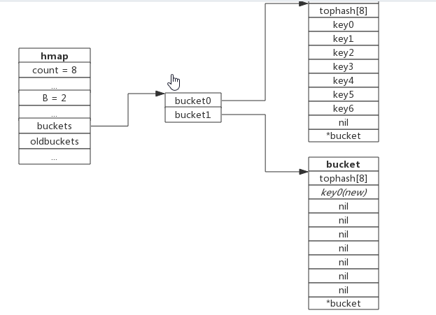
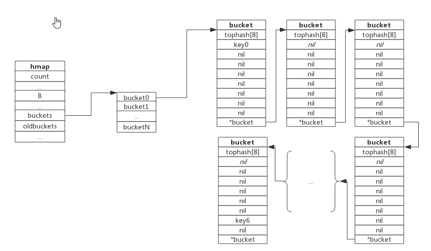

[TOC]

# Go基础

# 1、Golang相较于其他语言的优势？**

**优点：**

1. **并发支持**。Go语言内置了轻量级的协程（goroutine）和通道（channel）机制，使并发编程变得简单而高效。
2. **快速编译：** Go语言的编译速度非常快，可以快速生成可执行文件，这有助于提高开发效率。
3. **静态类型和运行时安全性：** Go是静态类型语言，编译器在编译时会进行类型检查，有助于提前捕捉一些错误。此外，Go的运行时系统提供了内存安全性和垃圾回收，减少了常见的内存管理错误。
4. **简洁优雅的语法：** Go语言设计简洁，语法清晰易读，使得代码更易于维护和阅读。
5. **跨平台支持：** 可以轻松编写跨平台应用程序。
6. **高性能：** Go的性能很高，得益于它优秀的编译器等，使得它适合于构建高性能的网络服务和分布式系统。
7. **容易部署：** 编译生成的可执行文件不依赖于外部库，可以简单地部署到目标环境中，而无需安装额外运行时环境。

**缺点：**

1. **缺乏泛型支持：** 1.21版本前Go没有原生的泛型支持，这在某些情况下编写通用代码可能会变得复杂或冗长。
2. **错误处理：** Go语言的错误处理机制使用了返回错误值的方式，这导致我在代码编写中存在大量的错误检查代码，使得代码变得冗长并且影响可读性。
3. **包管理：** 在Go语言早期版本中，包管理方面存在一些问题，缺乏官方的强大包管理工具。尽管后来引入了模块化支持，但在包管理方面仍有改进的空间。
4. **生态系统相对不成熟：** 尽管Go语言的生态系统在不断发展，但相对于Java、Python或JavaScript，Go语言的生态系统还不那么成熟。

# 2、Go有哪些数据类型？

|            基本数据类型            |               复合数据类型                |
| :--------------------------------: | :---------------------------------------: |
|                int                 |                   array                   |
|      float：float32、float64       |                   slice                   |
|   complex：complex64和complex128   |                    map                    |
|                bool                |      struct：表示不同类型字段的集合       |
|               string               | interface：定义对象的行为，由一组方法组成 |
|  byte（uint8）：用于表示ASCII字符  |                 function                  |
| rune（int32）：用于表示Unicode字符 |   channel：Go协程之间传递数据的数据结构   |

# 3、Go程序中的包是什么？

**包（pkg）是用于组织和管理Go程序的基本单元；包用于将相关的代码组织在一起，形成逻辑上的单元，有利于模块化开发和代码复用。**Go源文件中的每个函数、变量和类型都存储在链接包中，**每个 Go 源文件都属于一个包。一个包通常包含多个Go源文件，这些源文件应该在同一个目录下，并且属于同一个包。**

包的声明：

```go
package <packagename>
```

包的导入：

```
import <packagename>
```

# 4、什么是Goroutine？原理是什么？如何停止它？**

## （1）定义：

**Goroutine 是 Go 语言中的轻量级线程，由 Go 运行时管理。每个 Goroutine 都是一个函数或方法的并发执行体，可以看作是在同一程序中同时运行的函数。它是 Go 并发模型的基本组成部分，允许在程序中并发执行代码而无需显式管理线程**。

## （2）原理和特性：

**原理：**

- 每个 Goroutine 都是一个函数执行的独立并发体，由 Go 运行时调度器在逻辑处理器上执行。
- Go 运行时会在一个或多个 OS 线程上多路复用 Goroutine，使得多个 Goroutine 可以在同一时间并发执行。
- Goroutine 的切换是由 Go 运行时自动管理的，程序员无需关心线程的创建和销毁。

**它具有以下特性**：

1. **轻量级：** Goroutine 比传统的线程更轻量级，Go 运行时会在少量的 OS 线程上多路复用多个 Goroutine。
2. **并发执行：** 通过 Goroutine，可以很容易地实现并发编程，将任务分解为多个 Goroutine 并行执行。
3. **通信通过channel：** Goroutine 之间的通信通常通过通道（channel）进行，是 Go 语言并发模型的核心。
4. **资源管理：** Go 运行时会自动管理 Goroutine 的调度和资源分配，无需手动管理线程。
5. **数千个 Goroutine：** 由于 Goroutine 的轻量级特性，一个 Go 程序通常可以同时运行数千个 Goroutine，而不会消耗太多系统资源。

## （3）Goroutine 的启动和停止：

- **启动 Goroutine：** 使用 `go` 关键字加上要执行的函数即可启动一个 Goroutine。例如：`go myFunction()`
- **停止 Goroutine：** Go 语言中没有提供显式停止 Goroutine 的机制。通常是通过通道（channel）来通知 Goroutine 应该停止运行。

示例：

```go
package main

import (
	"fmt"
	"time"
)

func goSleep(stop chan bool) {
	for {
		select {
		case <-stop:
			fmt.Println("stop goroutine")
			return
		default:
			fmt.Println("goruntine is running")
			time.Sleep(1 * time.Second)
		}
	}
}

func main() {
	stop := make(chan bool)
	go goSleep(stop)

	time.Sleep(5 * time.Second)
	stop <- true

	time.Sleep(2 * time.Second)
	fmt.Println("main goruntine")
}
```

## （4）两个go程交替打印奇偶数

```go
package main

import (
	"fmt"
	"sync"
)

// 使用两个缓冲为1的chan+sync.WaitGroup
func printNumbers(n int) {
	ch1 := make(chan bool, 1)
	ch2 := make(chan bool, 1)

	wg := sync.WaitGroup{}
	wg.Add(2)

	// 打印奇数
	go func(n int) {
		defer wg.Done()
		for i := 1; i <= n; i += 2 {
			<-ch1 // 接受ch1消息，打印
			fmt.Printf("go1: %d\n", i)
			ch2 <- true // 向ch2传递消息
		}
	}(n)
    
	// 打印偶数
	go func(n int) {
		defer wg.Done()
		for i := 2; i <= n; i += 2 {
			<-ch2 // 接受ch2消息，打印
			fmt.Printf("go2: %d\n", i)
			ch1 <- true // 向ch1传递消息
		}
	}(n)

	ch1 <- true // 启动第一个go1，打印奇数

	wg.Wait() // 阻塞，直到所有go完成
}

func main() {
	printNumbers(10)
}
```

# 5、如何在运行的时候检查变量的类型？

## 	（1）类型开关：`Type Switch`

​	 `Type Switch`是在运行时检查变量类型的最佳方式。类型开关按类型而不是值来评估变量。每个 Switch 至少包含一个 case 用作条件语句，如果没有一个 case 为真，则执行` default`，注意，在 Type Switch 语句的 case 子句中不能使用`fallthrough`。

```go
switch x.(type) {
case Type1:
    doSomeThingWithType1()
case Type2:
    doSomeThingWithType2()
default:
    doSomeDefaultThing()
}
```

## 	（2）反射：reflect.TypeOf()

```go
package main

import (
	"fmt"
	"reflect"
)

func checkType(val interface{}) {
	t := reflect.TypeOf(val)
	fmt.Printf("Type: %v\n", t)

// Check if the type is a specific type
if t == reflect.TypeOf(42) {
	fmt.Println("The variable is an integer")
} else if t == reflect.TypeOf("hello") {
	fmt.Println("The variable is a string")
} else {
	fmt.Println("The variable is of an unknown type")
}
}

func main() {
var a = 42
var b = "hello"
var c = 3.14

checkType(a)
checkType(b)
checkType(c)
}
```

# 6、Go 两个接口之间可以存在什么关系？

- 如果两个接口有相同的方法列表，那么他们就是等价的，可以相互赋值。

- 如果 接口 A 的方法列表是接口 B 的方法列表的自己，那么接口 B 可以赋值给接口 A。

- 接口查询是否成功，要在运行期才能够确定。

# 7、Go 当中同步锁有什么特点？作用是什么？

​		**同步锁（sync.Mutex）**是用于实现互斥锁的一种机制，**用于控制对共享资源的访问，确保在同一时间只有一个 goroutine 可以访问共享资源，从而避免并发访问导致的数据竞争问题。**

### 特点：

1. **互斥性**：同一时刻只允许一个 goroutine 持有锁，其他 go程需要等待锁释放后才能获取锁。
2. **阻塞等待**：当一个 goroutine尝试获取锁但锁已被其他 goroutine 持有时，该 goroutine 将被阻塞，直到锁被释放。
3. **解锁**：同步锁必须在临界区代码执行完毕后手动释放，以便其他 goroutine 能够获取锁。
4. **效率**：同步锁对于大量读操作和少量写操作的场景并不高效，因为它会导致读操作也需要互斥执行。**这时可以考虑使用读写锁（sync.RWMutex）来提高性能。读写锁允许多个 goroutine 同时读取共享数据，但只允许一个 goroutine 可以进行写入操作。**

### 作用：

1. **数据竞争**：同步锁用于解决多个 goroutine 并发访问共享资源时可能出现的数据竞争问题，确保数据的一致性和正确性。
2. **临界区保护**：通过同步锁可以将对共享资源的访问限制在临界区。
3. **协程同步**：同步锁也可以用于协程间的同步，例如在生产者消费者模型中，可以使用同步锁来控制生产者和消费者对共享数据的访问。

# 8、cap函数可以作用于那些内容?

- array
- slice
- channel

# 9、Go Convey 是什么？一般用来做什么？

- go convey 是一个支持 Golang 的单元测试框架 
- go convey 能够自动监控文件修改并启动测试，并可以将测试结果实时输出 到 Web 界面 
-  go convey 提供了丰富的断言简化测试用例的编写

# 10、Go中new和make的区别？

**共同点**：给变量分配内存。

**不同点**：

1. **作用变量类型不同**，new 给 string， int和数组分配内存， make给切片，map，channel 分配内存；
2. 返回类型不一样，**new 返回类型的指针， make 返回类型的实例化；**
3. new 分配的空间被清零。make 分配空间后，会进行初始化。
4. 字节的面试官还说了一个区别，就是分配的位置，在堆上还是栈上？

只要代码逻辑允许，编译器总是倾向于把变量分配在栈上，比分配在堆上更高效。编译器倾向于让变量不逃逸。（逃逸分析是指当函数局部变量的生命周期超过函数栈帧的生命周期时，编译器把该局部变量由栈分配改为堆分配，即变量从栈上逃逸到堆上）。

下面两个函数，返回值都是在堆上动态分配的int型变量的地址，编译器进行了逃逸分析。

```go
// go:noinline
func newInt1() *int{
    var a int
    return &a
}

// go:noinline
func newInt2() *int{
    return new(int)
}

func main(){
    println(*newInt1())
}
```

newInt1() 函数如果被分配在栈上，在函数返回后，栈帧被销毁，返回的变量a的地址会变成悬挂指针，对改地址所有读写都是不合法的，会造成程序逻辑错误或崩溃。

new() 与堆分配无必然联系，代码如下：

```
func New() int{
  p := new(int)
  return *p
}
```

这个函数的 new()进行栈分配，因为变量的生命周期没有超过函数栈帧的生命周期。

**把逻辑上没有逃逸的变量分配到堆上不会造成错误，只是效率低一些，但是把逻辑上逃逸了的变量分配到栈上就会造成悬挂指针等问题，**因此编译器只有在能够确定变量没有逃逸的情况下才会把变量分配到栈上，在能够确定变量已经逃逸或者无法确定是否逃逸的情况，都要按照已经逃逸处理。

# 11、Printf()，Sprintf()，FprintF() 都是格式化输出，有什么不 同？

输出的目标不一样：

- Printf 是标准输出，一般是屏幕，也可以重定向。 
- Sprintf()是把格式化字符串输出到指定的字符串中。 
- Fprintf()是把格式化字符串输出到文件中。

# 12、Go 语言当中array和slice的区别是什么？

**数组：**

- **数组固定长度**。数组长度是数组类型的一部分，所以[3]int 和[4]int 是两种不同的数组类型，数组需要指定大小，不指定也会根据初始化，自动推算出大小，大小不可改变。
- **数组是通过值传递的**

**切片：**

- 切片可以改变长度。切片是轻量级的数据结构，三个属性：指针、长度、容量。不需要指定大小。
- 切片是地址传递（引用传递），可以通过数组来初始化，也可以通过make()来初始化，初始化的时候 len=cap，然后进行扩容。
- **切片看上去是引用传递，但其实是值传递**。当你传递一个切片时，实际上传递的是这个切片结构的副本，**包括指向底层数组的指针、长度和容量。**

**简洁的回答**：

1. 定义方式不一样。
2. 初始化方式不一样，数组需要指定大小，大小不改变。
3. 在函数传递中，数组切片都是值传递。

# 13、Go 语言是如何实现slice扩容的？扩容策略是什么？

切片扩容通常是在进行切片的 append 操作时触发的。在进行 append 操作时，如果切片容量不足以容纳新的元素，就需要对切片进行扩容，此时就会调用 growslice 函数进行扩容。
切片扩容分两个阶段，分为 go1.18 之前和之后：

（1）go1.18 之前：

- 首先判断，如果期望容量大于当前容量的两倍，新容量则为期望容量；

- 否则判断，如果当前切片的长度小于 1024，新容量是旧容量的两倍；

- 否则判断，如果当前切片的长度大于 1024 ，每次增加 25% 的容量，直到新容量大于期望容量；

**（2）go1.18 之后：使底层数组扩容系数增长的更加平滑。**

- **首先判断，如果期望容量大于当前容量的两倍，新容量就是期望容量；**
- **否则判断，如果当前切片的长度小于阈值（默认 256），新容量是旧容量翻倍；**
- **否则判断，如果当前切片的长度大于等于阈值（默认 256），就会每次增加基准值25% 的容量，基准是 newcap + 3*threshold（256），直到新容量大于期望容量；**


总的来说，Go的设计者不断优化切片扩容的机制，其目的只有一个：**就是控制让小的切片容量增长速度快一点，减少内存分配次数，而让大切片容量增长率小一点，更好地节省内存。**

# 14、扩容前后的slice是否相同？

这要分情况来看，主要看底层数组有没有改变：

- 如果原数组还有容量是可以进行扩容的，那么扩容以后的数组还是会指向原来的数组，对一个slice的操作可能会影响多个指针指向相同地址的slice。

- 如果原来数组的容量已经不足以扩容，那么Go默认先开一片内存区域，再把原来的值先拷贝过来，然后再执行`append()`操作。此时由于底层数组变了，不会影响原数组。
- 复制一个slice，最好使用`Copy`（浅拷贝）函数

# 15、slice的底层实现？

- **slice 是基于数组实现的，**他的底层是数组，它本身非常小，主要由指针、长度、容量三个字段组成，**是对底层数组的一个抽象。**
- 由于slice基于数组实现，所以它的**底层内存是连续分配的，可以通过索引获得数据**，效率很高。
- slice 本身并不是动态数组或者数组指针，其**内部的数据结构是通过指针引用底层数组，**将数据读写操作限定在指定区域内。

# 16、深浅拷贝的区别？

1. 深浅拷贝区别

   - 深拷贝：光拷贝值，地址不想关。拷贝结束两变量互不影响。
   - 浅拷贝：拷贝地址。两变量结果指向同一地址。拷贝结束相互影响。

2. 会产生深拷贝还是浅拷贝取决于被拷贝数据的数据类型：

   - 如果是值类型，就会产生深拷贝。
   - 如果是引用类型，就会产生浅拷贝。
   - Go的所有参数传递都是值传递，都是一个拷贝。

3. 对于引用类型，想实现深拷贝，就不能直接 := ，而是要先 new ，再赋值。

4. 对于slice实现深拷贝

   - make一个新的，再append赋值。

     ```go
     s1 := []int{1, 2, 3}
     s2 := make([]int, 0)
     s2 = append(s2, s1[:]...)
     fmt.Println(s1, s2)
     s1[0] = 100
     fmt.Println(s1, s2)
     fmt.Printf("%p %p", s1, s2)
     ```

     ```
     [1 2 3] [1 2 3]
     [100 2 3] [1 2 3]
     0xc000016150 0xc000016168
     ```

   - 通过内置的copy()函数进行复制
   
     [copy函数](https://so.csdn.net/so/search?q=copy函数&spm=1001.2101.3001.7020)不会扩容，也就是要复制的 slice 比原 slice 要大的时候，只会移除多余的。

# 17、Map的底层实现？

map 是由 `key-value` 对组成的；`key` 只会出现一次。

Go中的map基于`Hash表`实现，并且使用的是`链表法`解决冲突。

主要由两个结构体，一个hmap（A header for a Go map），另一个是bmap（a bucket for a Go map，通常叫其 bucket，桶）。

每个 bucket 设计成最多只能放 8 个 key-value 对，如果有第 9 个 key-value 落入当前的 bucket，那就需要再构建一个 bucket ，通过 `overflow` 指针连接起来。


# 18、Map的扩容过程？

​	首先是map的扩容时机，在向map插入新的key的时候，会进行以下两个条件检测

- 转载因子（6.5）超过阈值。也即平均每个bucket存储的键值对达到6.5个
- overflow的bucket （溢出桶）数量过多（2^15）。

## 增量扩容

当负载因子过大时，就新建一个bucket，新的bucket长度是原来的2倍，然后旧bucket数据搬迁到新的bucket。 考虑到如果map存储了数以亿计的key-value，**一次性搬迁将会造成比较大的延时，Go采用分批渐进搬迁策略，即每次访问map时都会触发一次搬迁，每次搬迁2个键值对***

**如果Map正在扩容，那么在删除、插入或更新元素时都会执行一次迁移操作，仅针对要变更的bucket进行扩容。这样可以确保扩容过程的平滑进行，而不会因为其他操作的干扰而中断。**

下图展示了包含一个bucket满载的map(为了描述方便，图中bucket省略了value区域):

[](https://github.com/crazyjums/learning-notes/blob/master/18-golang_面试题/images/10.png)

当前map存储了7个键值对，只有1个bucket。此地负载因子为7。再次插入数据时将会触发扩容操作，扩容之后再将新插入键写入新的bucket。

当第8个键值对插入时，将会触发扩容，扩容后示意图如下：

[](https://github.com/crazyjums/learning-notes/blob/master/18-golang_面试题/images/11.png)

hmap 数据结构中 oldbuckets成员bucket0，而buckets指向了新申请的bucket。新的键值对被插入新的bucket中。后续对map的访问操作会触发迁移，将oldbuckets中的键值对逐步的搬迁过来。当 oldbuckets的键值对全部搬迁完毕之后，删除oldbuckets。

搬迁完成后的示意图如下：

[](https://github.com/crazyjums/learning-notes/blob/master/18-golang_面试题/images/image-20230119085310175.png)

数据搬迁过程中原bucket中的键值对将存在于新bucket的前面，新插入的键值对将存在于新bucket的后面。实际搬迁过程中比较复杂.

## 等量扩容

所谓等量扩容，实际上并不是扩大容量，而是buckets数量不变，**重新做一遍类似增量扩容的搬迁动作，把松散的键值对重新排列一次，以便bucket的使用率更高，进而保证更快的存取**。在极端场景下，比如不断地增删，而键值对正好集中在一小部分的bucket，这样会造成overflow的bucket数量增多，但负载因又不高，从而无法执行增量搬迁的情况，如下图所示：

[](https://github.com/crazyjums/learning-notes/blob/master/18-golang_面试题/images/image-20230119090224467.png)

上图课件，overflow的bucket中大部分是空的，访问效率会很差。此时进行一次等量扩容，即buckets数量不变，经过重新组织后overflow的bucket数量会减少，即节省了空间又提高访问效率。

# 29、Map的查找？

- 当key经过hash函数计算后得到hash值，共64bit，先用到最后B个bit位（这个B是hmap结构体里面的，B决定了bucket的数量（$2^B$)），找到对应的bucket；
- 再利用hash值的高8位在tophash数组中查询，如果哈希值相等且key值相等，则找到。
- 当前bmap的bucket未找到，则查询对应的overflow bucket，有数据再对比完整的hash值；
- 如果当前map处于数据迁移状态，则优先从oldbuckets中找。

注：如果查找不到，也不会返回空值，而是返回相应类型的 0 值。

# Map 插入过程

新元素插入过程如下：

1. 根据key值计算哈希值。
2. 取哈希值低位与 hmap.B取模确定 bucket 位置。
3. 查找该 key 是否已经存在，如果存在则直接更新值。
4. 如果没有找到将key，将key插入。

# golang那些类型可以作为 map key ？

**不能作为 map key 的类型包括：**

- slices
- maps
- functions

因为这些类型都不适合作为比较

# 20、map是并发安全的吗？为什么？怎么解决？

​		**`map` 不是并发安全的。当多个 goroutines 并发地对一个 `map` 进行读写操作时，会产生数据竞争（data race），导致程序出现意料之外的行为。**

**主要原因**：

- **非原子性操作：** `map` 的操作不是原子的，即使是读取操作也可能由于数据的并发修改而导致不一致性。
- **无锁机制：** `map` 在实现上并没有提供内置的锁机制来保护并发访问，这意味着多个 goroutines 同时对一个 `map` 进行读写可能导致数据错乱。

**解决方案：**

- **使用互斥锁（Mutex）：** 可以通过在对 `map` 进行读写操作前使用互斥锁来保护 `map`，确保同一时间只有一个 goroutine 可以对 `map` 进行操作。

- **使用读写锁（RWMutex）：** 如果对 `map` 的读操作比写操作频繁，可以考虑使用读写锁来提高并发性能，允许多个 goroutines 同时读取 `map`，但只有一个 goroutine 可以进行写操作。

- **使用并发安全的数据结构：** 也可以考虑使用 Go 标准库中提供的并发安全的数据结构，如 `sync.Map`，它内部实现了并发安全的访问机制。

  ```go
  sync.Map主要方法
  Store 方法：存储键值对，
  Load 方法：加载值，
  Delete 方法：删除键，
  Range 方法：遍历整个 sync.Map。
  ```

# 21、slice 、map、chan 分别作为函数参数时有什么区别？

当 map 和 slice 作为函数参数时，都会引用传递，在函数参数内部对 map 的操作会影响自身。

但是，makemap 、makechan 和 makeslice 的区别，在与传递的是地址还是对象：

- makemap()返回的是一个hmap类型的指针*hmap。也就是说：因此，在golang中，当map作为[形参]时，虽然是值传递，但是由于make()返回的是一个指针类型，所以我们可以在函数哪修改map的数值并影响到函数外。
- make() chan的返回值为一个hchan类型的指针，因此当我们的业务代码在函数内对channel操作的同时，也会影响到函数外的数值。
- sclie的make函数返回的是一个内建结构体类型slice的对象，包括`ptr、len、cap`，但是传递的时候ptr并没有改变，因此底层数组并没有改变。

# 22、介绍一下channel？

​	Go 语言中，不要**通过共享内存来通信，而要通过通信来实现内存共享**。Go 的 CSP(Communicating Sequential Process)并发模型，中文可以叫做**通信顺序进程**，是通过 goroutine 和 channel 来实现的。 channel 收发遵循先进先出 FIFO 的原则，它是并发安全的。

## **channel可以分为两类：**

- 无缓冲channel：可以看作**同步模式**，收发放两者都ready的情况下，数据才能传输，否则将会阻塞。
- 有缓冲channel：可以分为**异步模式**。

也可以分为单向通道可双向通道，其中 单向通道使其只能发送或只能接收数据。这种单向通道可以增加程序的安全性。

## **channel的基本用法**：

- 读取 <- chan
- 写入 chan <-
- 关闭 close(chan)：接收方可以通过第二个返回值来判断通道是否被关闭。
- 获取channel长度 len(chan)
- 获取channel容量 cap(chan)
- select非阻塞访问方式，从所有的case中挑选一个不会阻塞的channel进行读写操作，或是default执行。

但是在使用时有一些**要注意的点：**

- **如果向一个`nil`（未初始化）的channel发送或者接收数据会造成永久阻塞。**
- **给一个已经关闭的channel发送数据，会引起panic。**
- **从一个已经关闭的channel接收数据，如果缓冲区为空，会返回一个 0 值。**

## **底层结构**：

## channel的底层结构是hchan，维护底层的一个循环队列（ring buffer）

```go
buf      unsafe.Pointer       // 指向循环队列的指针
sendx    uint                 // 已发送元素在循环队列中的位置
recvx    uint                 // 已接收元素在循环队列中的位置
recvq    waitq                // 等待接收的goroutine的等待队列
sendq    waitq                // 等待发送的goroutine的等待队列
lock mutex                    // 控制chan并发访问的互斥锁
```

当 channel 因为缓冲区不足而阻塞了队列，则使用双向链表存储。

# 23、defer延迟调用特性

由于`defer`语句延迟调用的特性，所以`defer`语句能非常方便的处理资源释放问题。比如：资源清理、文件关闭、解锁及记录时间等。

## （1）多个defer的执行顺序

多个defer出现的时候，**它是一个“栈”的关系，也就是先进后出**。一个函数中，写在前面的defer会比写在后面的defer调用的晚。

## （2）defer与return执行顺序

在Go语言的函数中`return`语句在底层并不是原子操作，它分为给返回值赋值和RET指令两步。而`defer`语句执行为：return 赋值—>defer—>RET指令，所以使用defer可以达到修改返回值的目的。

**关键点在于`具名返回值`（也就是返回的参数列表中的变量）是否参与`defer` 运算，参与运算则返回值会受到`defer`的处理影响，不参与则与之无关。**

### 经典案例1：

```go
func f1() int {
	x := 5
	defer func() {
		x++
	}()
    return x  // 1、返回值=x=5；2、defer：x=6；3、RET：返回值=5
}

func f2() (x int) {
	defer func() {
		x++
	}()
	return 5 // 1、返回值x=5；2、defer：x=6；3、RET：返回值x=6
}

func f3() (y int) {
	x := 5
	defer func() {
		x++
	}()
	return x // 1、返回值y=x=5；2、defer：x=6；3、RET：返回值y=5
}
func f4() (x int) {
	defer func(x int) {
		x++
	}(x)
	return 5 // 1、返回值x=5；2、defer：x当做形参传入，不会改变返回值，x=6；3、RET：返回值x=5
}
func main() {
	fmt.Println(f1()) // 5
	fmt.Println(f2()) // 6
	fmt.Println(f3()) // 5
	fmt.Println(f4()) // 5
}
```

## （3）defer 后的函数形参在声明时确认

**defer注册要延迟执行的函数时该函数所有的参数都需要确定其值（预计算参数）**

```go
func calc(index string, a, b int) int {
	ret := a + b
	fmt.Println(index, a, b, ret)
	return ret
}

func main() {
	x := 1
	y := 2
	defer calc("AA", x, calc("A", x, y))
	x = 10
	defer calc("BB", x, calc("B", x, y))
	y = 20
}
```

结果：

```
A 1 2 3
B 10 2 12
BB 10 12 22
AA 1 3 4
```

分析：

```
1、第一个defer注册时，先要都确定参数，所以参数calc("A", x, y)要执行
  输出：'A', 1, 2, 3 且 defer1 calc("AA", 1, 3)
2、x=10
3、注册第二个defer，
  输出：'B', 10, 2, 12 且 defer2 calc("BB", 10, 12)
4、y=20
5、执行defer2：输出：'BB', 10, 12, 22
6、执行defer1：输出：'AA', 1, 3, 4
```

## （4）defer作用域

defer 作用域仅为当前函数，在当前函数最后执行，所以不同函数下拥有不同的 defer 栈。

## （5）发生 panic 时，已声明的 defer 会出栈执行

当出现 panic 时，会触发已经声明的 defer 出栈执行，随后在再 panic，而在 panic 之后声明的 defer 将得不到执行。

```go
func demo5_1() {
 defer fmt.Println(1)
 defer fmt.Println(2)
 defer fmt.Println(3)

 panic("没点赞异常") // 触发defer出栈执行

 defer fmt.Println(4) // 得不到执行
}
```

正是利用这个特性，在 defer 中可以通过 recover 捕获 panic，防止程序崩溃。

```go
func demo5_2() {
 defer func() {
     if err := recover(); err != nil {
         fmt.Println(err, "问题不大")
     }
 }()

 panic("没点赞异常") // 触发defer出栈执行

 // ...
}
```

# 24、逃逸分析？变量何时栈？何时堆？

 go语言编译器会自动决定把一个变量放在栈还是放在堆，编译器会做**逃逸分析(escape analysis)**，**当发现变量的作用域没有跑出函数范围，就可以在栈上，反之则必须分配在堆**。 go语言声称这样可以释放程序员关于内存的使用限制，更多的让程序员关注于程序功能逻辑本身。

# 25、什么是闭包？有什么作用？

**闭包（closure）**是**一个函数以及其捆绑的周边环境状态（lexical environment，词法环境）的引用的组合**。 换而言之，闭包让开发者可以从内部函数访问外部函数的作用域。 闭包会随着函数的创建而被同时创建。即：
$$
\mathbf{闭包}=\mathbf{函数}+\mathbf{引用环境}
$$

### 举例1

```go
package main

import "fmt"

func main() {
	sumFunc := sumInt([]int{1, 2, 3, 4})
	fmt.Println("waiting...")
	fmt.Println("result:", sumFunc())
}

func sumInt(s1 []int) func() int {
	fmt.Println("先获取函数，不求结果")
	var sum = func() int {
		fmt.Println("求结果...")
		res := 0
		// 这里函数内部访问了外部变量s1
		for _, v := range s1 {
			res += v
		}
		return res
	}
	return sum
}
```

输出：

```go
先获取函数，不求结果
waiting...
求结果...
result: 10
```

说明：

- 在调用 `sumInt` 函数时，会先定义并返回一个闭包函数 `sum`，而不会立即执行它。因此，在 `sumInt` 函数中打印的信息会在返回闭包函数后立即输出，而不会等到闭包函数被调用时才输出。
- 在 `main` 函数中，首先调用 `sumInt` 函数并传入一个整型切片作为参数。`sumInt` 函数会返回一个闭包函数 `sum`，它会计算整型切片中所有元素的和。**由于 `sum` 是一个闭包函数，它可以访问 `sumInt` 函数中定义的变量 `s1`，即传入的整型切片。**
- 在 `main` 函数中，调用 `sumFunc()` 来计算整型切片中所有元素的和。**由于闭包函数 `sum` 已经被定义并捕获了变量 `s1`，因此 `sumFunc()` 的执行不会再调用 `sumInt` 函数。**因此，在调用 `sumFunc()` 之前，会先输出 "waiting..."。然后，`sumFunc()` 被调用，闭包函数 `sum` 开始执行计算整型切片中所有元素的和，并返回计算结果。由于在闭包函数 `sum` 中打印了信息，因此在计算结果之前会先输出 "求结果..."。最后，`main` 函数输出计算结果。

### 举例2

```go
package main

import (
	"fmt"
)

func main() {
	sumFunc := sumInt([]int{1, 2, 3, 4})
	fmt.Println("waiting...")
	fmt.Println("result:", sumFunc())
	fmt.Println("result:", sumFunc())
	fmt.Println("result:", sumFunc())
}

func sumInt(s1 []int) func() int {
	fmt.Println("先获取函数，不求结果")
	count := 0  // 加了一个函数外变量count
	var sum = func() int {
		fmt.Println("求结果...")
		res := 0
		// 这里函数内部访问了外部变量s1
		for _, v := range s1 {
			res += v
		}
		fmt.Printf("第%d次求结果...\n", count)
		count++
		return res
	}
	return sum
}
```


输出：

```
先获取函数，不求结果
waiting...
求结果...
第0次求结果...
result: 10
求结果...
第1次求结果...
result: 10
求结果...
第2次求结果...
result: 10
```

## 闭包引用

### 举例1：

```go
func main() {
	x := 1
	f := func ()  {
		fmt.Println(x)
	}
	x = 2
	x = 3
	f() // 3
}
```

因为闭包对外层词法域变量是**引用**的，所以这段代码会输出 **3**。

可以想象 `f` 中保存着 `x` 的地址，它使用 `x` 时会直接解引用，所以 `x` 的值改变了会导致 `f` 解引用得到的值也会改变。

## 循环闭包引用

### 举例1

```go
var dummy [3]int
var f func()
for i := 0; i < len(dummy); i++ {
	f = func() {
		println(i)
	}
}
f() // 3
```

f 中保留了对 i 的引用 ，i 最后的值是 3。

### 举例2

```go
var funcSlice []func()
for i := 0; i < 3; i++ {
	funcSlice = append(funcSlice, func() {
		fmt.Println(i)
	})

}
for j := 0; j < 3; j++ {
	funcSlice[j]() // 3, 3, 3
}
```

每个新append的func，即funcSlice[j]都保留了对 i 的引用，引用的都是同一个变量（i）的地址。

如果改成：

```go
var funcSlice []func()
for i := 0; i < 3; i++{
	// 声明新的匿名函数并传参立即执行
	func(i int){
		funcSlice = append(funcSlice,func(){
			fmt.Println(i)
		})
	}(i)
}

for j := 0; j < 3; j++ {
	funcSlice[j]() // 0, 1, 2
}
```

现在 `println(i)` 使用的 `i` 是通过函数参数传递进来的，并且 Go 语言的函数参数是按值传递的。

所以相当于在这个新的匿名函数内声明了三个变量，被三个闭包函数独立引用。原理跟第一种方法是一样的。

# 26、for range 的时候它的地址会发生变化么？

答：在 for a,b := range c 遍历中，a 和 b 在内存中只会存在一份，即之后每次循环时遍历到的数据都是以值覆盖的方式赋给a和 b，a，b的内存地址始终不变。由于这个特性，**for 循环里面如果开协诚，不要直接把 a 或者 b 的指针传给协程。解决办法：在每次循环时，创建一个临时变量。**

# 27、能介绍下 rune 类型吗和byte？

rune 相当于 int32

golang 中的字符串底层实现是通过byte数组的，中文字符在unicode 下占2个字节，在 utf-8 编码下占3个字节，而golang默认编码正好是 utf-8。

byte 等同于 uint8 ，常用来处理 ascii 字符（1字节）或者二进制。

rune 等同于 int32，常用来处理 unicode 或 utf-8 字符。

# goroutine 什么情况下会阻塞？

在 Go里面阻塞主要分为一下 4 种场景：

1. 由于原子，互斥量或chanel操作调用导致 Goroutine 阻塞，调度器将把当前阻塞的 Goroutine 切换出去，重新调度 LRQ 上的其它 Goroutine；
2. 由于网络请求和 IO 操作导致 Goroutine 阻塞。Go程序提供了网络轮询器（NetPoller）来处理网络请求和 IO 操作的问题，其后台通过kqueue（MacOS），epoll（Linux）或 iocp（Windows）来实现 IO 多路复用。通过使用 NetPoller 进行网络系统调用，调度器可以防止 Goroutine 在进行这些系统调用时阻塞M。这可以让 M 执行 P 的LRQ中其他的 Goroutine，而不需要创建新的 M。执行网络系统调用不需要额外的 M，网络轮询器使用系统线程，它时刻处理一个有效的事件循环，有助于减少操作系统上的调度负载。用户层严重看到的 Goroutine 中的 ”block socket” ，实现 goroutine-per-connection 简单的网络编程模式。实际上是通过 Go runtime 中的netpoller 通过Non-block socket + IO 多路复用机制 “模拟”出来的。
3. 当调用一些系统方法的时候（如文件IO），如果系统方法调用的时候发生阻塞，这种情况下，网络轮询（NetPoller）无法使用，而进行系统调用的 G1 将阻塞当前 M1.调度器引入其它 M 来服务 M1 的P。
4. 如果在 Goroutine 去执行一个 sleep 操作，导致 M 被阻塞了。Go 程序后台有一个监控线程 sysmon，它监控那些长时间运行的 G 任务然后设置可以强占的标识符，别的 Goroutine 就可以抢先进来执行。
