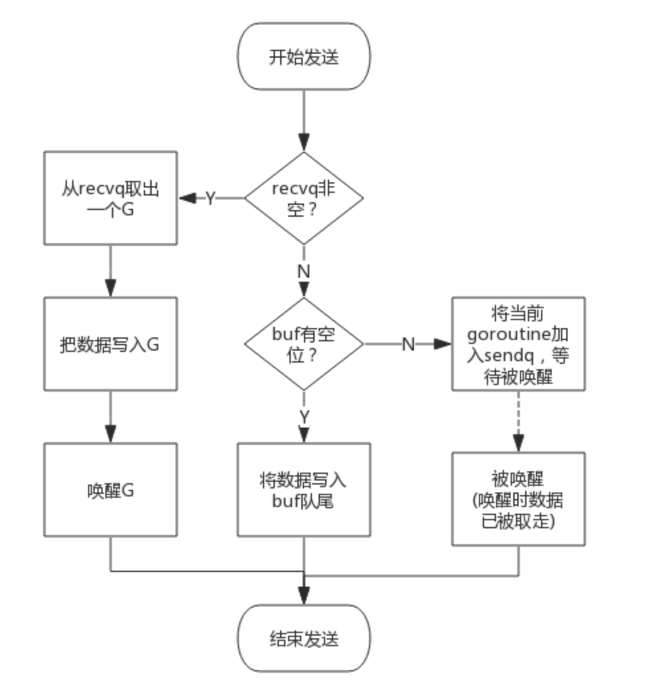
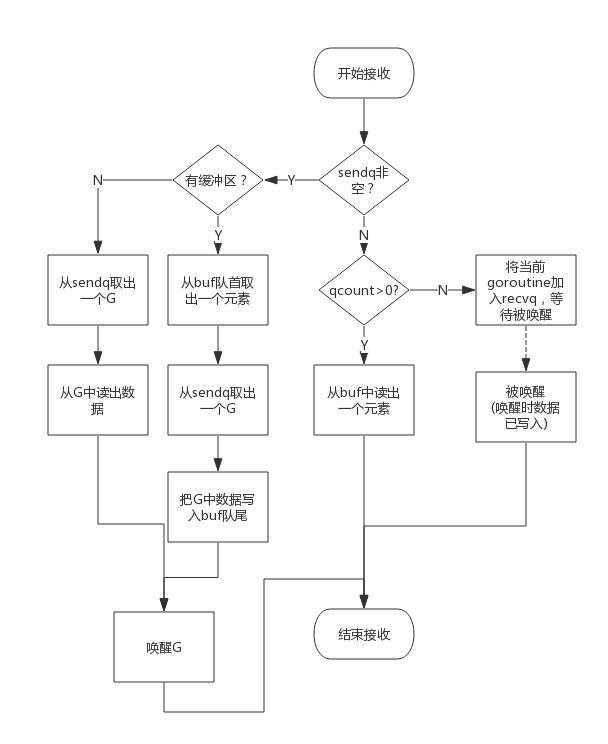

## Go类型：channel通道

---

## 简介：

>Don’t communicate by sharing memory; share memory by communicating. （不要通过共享内存来通信，而应该通过通信来共享内存。）

这是作为 Go 语言的主要创造者之一的 Rob Pike 的至理名言，这也充分体现了 Go 语言最重要的编程理念。我们可以利用通道在多个 goroutine 之间传递数据。Go 的 CSP(Communicating Sequential Process)并发模型，中文可以叫做**通信顺序进程**，是通过 goroutine 和 channel 来实现的。 channel 收发遵循先进先出 FIFO 的原则，**它是并发安全的。这也是 Go 语言自带的、唯一一个可以满足并发安全性的类型。**

## **channel分类：**

- 无缓冲channel：可以看作**同步模式**，收发放两者都ready的情况下，数据才能传输，否则将会阻塞。
- 有缓冲channel：可以分为**异步模式**。

也可以分为**单向通道**可**双向通道**，其中 单向通道使其只能发送或只能接收数据。这种单向通道可以增加程序的安全性。

## channel的特性：

基本特性：

- **给一个 nil channel 发送/接收数据，造成永远阻塞。**
- **给一个已经关闭的 channel 发送数据，引起 panic ，**
- **关闭已经关闭或者为`nil`的`channel`也会`panic`。**
- **从一个已经关闭的 channel 仍然可以读取数据， 如果缓冲区中为空，则返回一个零值。**

以上 几个特性是死东西，也可以通过口诀来记忆："空读写阻塞，写关闭异常，读关闭空零"

- 
  对于同一个通道，发送操作之间是互斥的，接收操作之间也是互斥的。
- 发送操作和接收操作中对元素值的处理都是不可分割的。
- 发送操作在完全完成之前会被阻塞。接收操作也是如此。

## **channel的基本用法**：

- 声明关键字：`chan`
- 使用`make`函数进行初始化
- 读取 <- chan
- 写入 chan <-
- 关闭 close(chan)：接收方可以通过第二个返回值来判断通道是否被关闭。
- 获取channel长度 len(chan)
- 获取channel容量 cap(chan)
- **select非阻塞访问方式，从所有的case中挑选一个不会阻塞的channel进行读写操作，或是default执行。**

## **底层结构**：

**channel的底层结构是hchan，维护底层的一个循环队列（ring buffer）**

```go
type hchan struct {
    //channel分为无缓冲和有缓冲两种。
    //对于有缓冲的channel存储数据，借助的是如下循环数组的结构
    qcount   uint           // 循环数组中的元素数量
    dataqsiz uint           // 循环数组的长度
    buf      unsafe.Pointer // 指向底层循环数组的指针
    elemsize uint16 //能够收发元素的大小
    
    
    closed   uint32   //channel是否关闭的标志
    elemtype *_type //channel中的元素类型
    
    //有缓冲channel内的缓冲数组会被作为一个“环型”来使用。
    //当下标超过数组容量后会回到第一个位置，所以需要有两个字段记录当前读和写的下标位置
    sendx    uint   // 下一次发送数据的下标位置
    recvx    uint   // 下一次读取数据的下标位置
    
    //当循环数组中没有数据时，收到了接收请求，那么接收数据的变量地址将会写入读等待队列
    //当循环数组中数据已满时，收到了发送请求，那么发送数据的变量地址将写入写等待队列
    recvq    waitq  // 读等待队列
    sendq    waitq  // 写等待队列
    
    lock mutex //互斥锁，保证读写channel时不存在并发竞争问题
}
```

**当 channel 因为缓冲区不足而阻塞了队列，则使用双向链表存储。**


总结hchan结构体的主要组成部分有四个：

- 用来保存 goroutine 之间传递数据的循环链表。 ====> buf 。
- 用来记录下次循环链表当前发送或接收数据的下标值。 ====> sendx 和 recvx 。
- 用于保存向该chan发送和从改chan接受数据的 goroutine 的队列。 ====> sendq 和 recvq 。
- 保证 channel 写入和读取数据时线程安全的锁。====> lock。

```go
buf      unsafe.Pointer       // 指向循环队列的指针
sendx    uint                 // 已发送元素在循环队列中的位置
recvx    uint                 // 已接收元素在循环队列中的位置
recvq    waitq                // 等待接收的goroutine的等待队列
sendq    waitq                // 等待发送的goroutine的等待队列
lock mutex                    // 控制chan并发访问的互斥锁
```

## `channel`读写流程

### **发送流程**：

向一个 channel 中写数据简单过程如下：

1. 如果等待接受队列 recvq 不为空，说明缓冲区中没有数据或者没有缓冲区，此时直接从 recvq 取出 G，并把数据写入，最后把该 G 唤醒，结束发送过程；
2. 如果缓冲区有空余位置，将数据写入缓冲区，结束发送过程。
3. 如果缓冲区中没有空余位置，将待发送数据写入 G，将当前 G 加入 sendq，进入睡眠，等待被读 goroutine唤醒。
4. 

### **接收流程**：

从一个channel读数据简单过程如下：

1. 如果等待发送队列sendq不为空，且没有缓冲区，直接从sendq中取出 G，把G中数据读出，最后把G唤醒，结束读取过程。
2. 如果等待发送队列sendq为空，此时说明缓冲区已满，从缓冲区中首部读出数据，把G中数据写入缓冲区尾部，把G唤醒，结束读取过程；
3. 如果缓冲区中有数据，则从缓冲区取出数据，结束读取过程；
4. 将当前 Goroutine 加入 recvq，进入睡眠，等待被写 goroutine 唤醒。



## 场景

消息传递，消息过滤，信号广播，事件订阅与广播，请求，响应转发，任务分发，结果汇总，并发控制，限流，同步与异步。