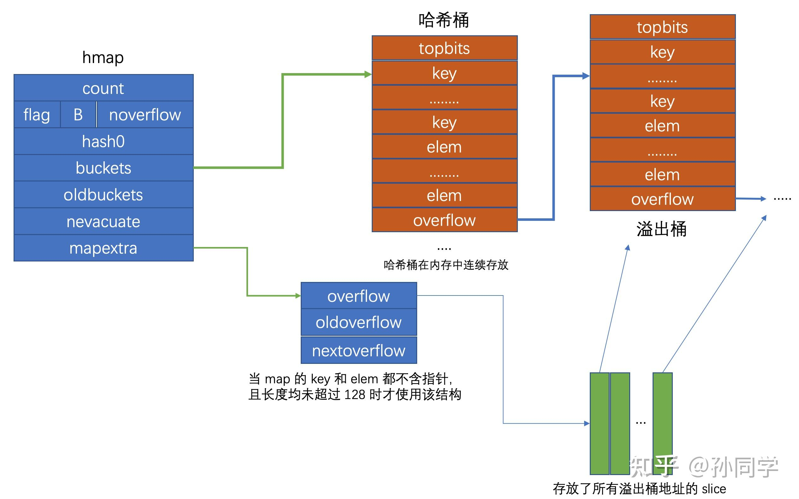
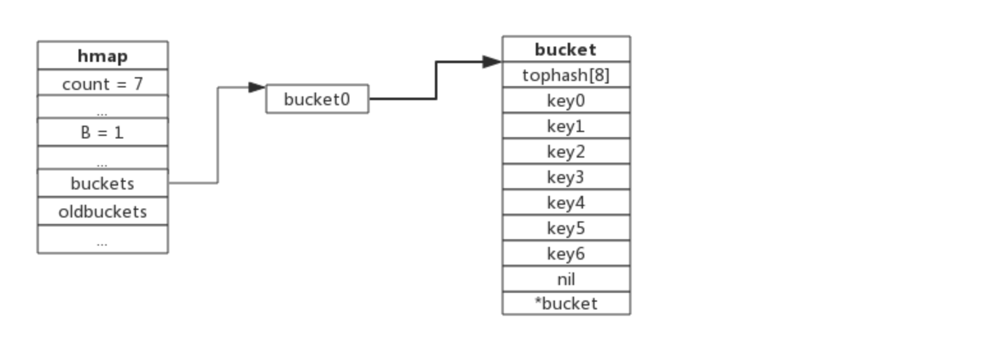
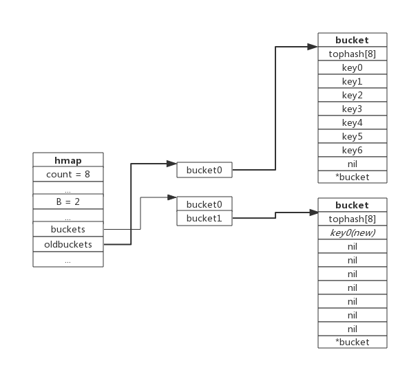
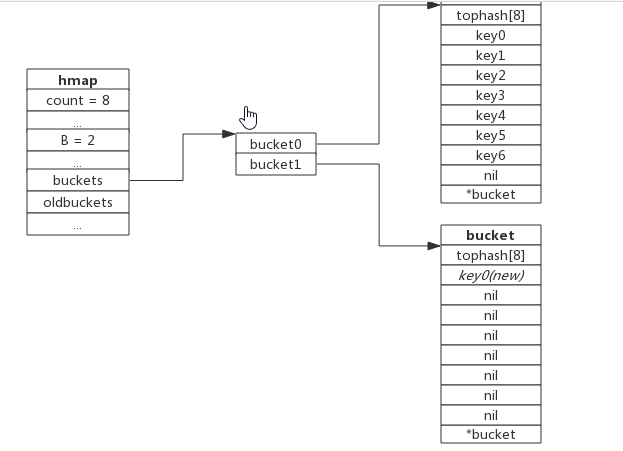
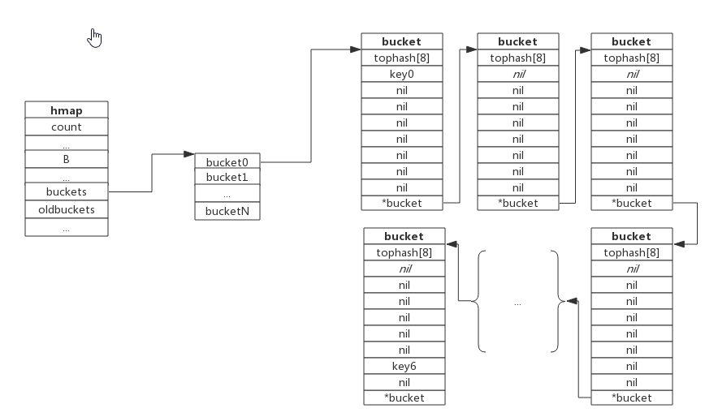

## Go类型：map的深入解析

---

## Map的底层实现

map 是由 `key-value` 对组成的；`key` 只会出现一次。

Go中的map基于`Hash表`实现，并且使用的是`链表法`解决冲突。

主要由两个结构体，一个hmap（A header for a Go map），另一个是bmap（a bucket for a Go map，通常叫其 bucket，桶）。

每个 bucket 设计成最多只能放 8 个 key-value 对，如果有第 9 个 key-value 落入当前的 bucket，那就需要再构建一个 bucket ，通过 `overflow` 指针连接起来。



## Map的扩容过程？

​	首先是map的扩容时机，在向map插入新的key的时候，会进行以下两个条件检测

- 转载因子（6.5）超过阈值。也即平均每个bucket存储的键值对达到6.5个
- overflow的bucket （溢出桶）数量过多（2^15）。

### 增量扩容

当负载因子过大时，就新建一个bucket，新的bucket长度是原来的2倍，然后旧bucket数据搬迁到新的bucket。 考虑到如果map存储了数以亿计的key-value，**一次性搬迁将会造成比较大的延时，Go采用分批渐进搬迁策略，即每次访问map时都会触发一次搬迁，每次搬迁2个键值对***

**如果Map正在扩容，那么在删除、插入或更新元素时都会执行一次迁移操作，仅针对要变更的bucket进行扩容。这样可以确保扩容过程的平滑进行，而不会因为其他操作的干扰而中断。**

下图展示了包含一个bucket满载的map(为了描述方便，图中bucket省略了value区域):

[](https://github.com/crazyjums/learning-notes/blob/master/18-golang_面试题/images/10.png)

当前map存储了7个键值对，只有1个bucket。此地负载因子为7。再次插入数据时将会触发扩容操作，扩容之后再将新插入键写入新的bucket。

当第8个键值对插入时，将会触发扩容，扩容后示意图如下：

[](https://github.com/crazyjums/learning-notes/blob/master/18-golang_面试题/images/11.png)

hmap 数据结构中 oldbuckets成员bucket0，而buckets指向了新申请的bucket。新的键值对被插入新的bucket中。后续对map的访问操作会触发迁移，将oldbuckets中的键值对逐步的搬迁过来。当 oldbuckets的键值对全部搬迁完毕之后，删除oldbuckets。

搬迁完成后的示意图如下：

[](https://github.com/crazyjums/learning-notes/blob/master/18-golang_面试题/images/image-20230119085310175.png)

数据搬迁过程中原bucket中的键值对将存在于新bucket的前面，新插入的键值对将存在于新bucket的后面。实际搬迁过程中比较复杂.

### 等量扩容

所谓等量扩容，实际上并不是扩大容量，而是buckets数量不变，**重新做一遍类似增量扩容的搬迁动作，把松散的键值对重新排列一次，以便bucket的使用率更高，进而保证更快的存取**。在极端场景下，比如不断地增删，而键值对正好集中在一小部分的bucket，这样会造成overflow的bucket数量增多，但负载因又不高，从而无法执行增量搬迁的情况，如下图所示：

[](https://github.com/crazyjums/learning-notes/blob/master/18-golang_面试题/images/image-20230119090224467.png)

上图课件，overflow的bucket中大部分是空的，访问效率会很差。此时进行一次等量扩容，即buckets数量不变，经过重新组织后overflow的bucket数量会减少，即节省了空间又提高访问效率。

## Map的查找？

- 当key经过hash函数计算后得到hash值，共64bit，先用到最后B个bit位（这个B是hmap结构体里面的，B决定了bucket的数量（$2^B$)），找到对应的bucket；
- 再利用hash值的高8位在tophash数组中查询，如果哈希值相等且key值相等，则找到。
- 当前bmap的bucket未找到，则查询对应的overflow bucket，有数据再对比完整的hash值；
- 如果当前map处于数据迁移状态，则优先从oldbuckets中找。

注：如果查找不到，也不会返回空值，而是返回相应类型的 0 值。

## Map 插入过程

新元素插入过程如下：

1. 根据key值计算哈希值。
2. 取哈希值低位与 hmap.B取模确定 bucket 位置。
3. 查找该 key 是否已经存在，如果存在则直接更新值。
4. 如果没有找到将key，将key插入。

## golang那些类型可以作为 map key ？

**不能作为 map key 的类型包括：**

- slices
- maps
- functions

因为这些类型都不适合作为比较

## map是并发安全的吗？为什么？怎么解决？

​		**`map` 不是并发安全的。当多个 goroutines 并发地对一个 `map` 进行读写操作时，会产生数据竞争（data race），导致程序出现意料之外的行为。**

**主要原因**：

- **非原子性操作：** `map` 的操作不是原子的，即使是读取操作也可能由于数据的并发修改而导致不一致性。
- **无锁机制：** `map` 在实现上并没有提供内置的锁机制来保护并发访问，这意味着多个 goroutines 同时对一个 `map` 进行读写可能导致数据错乱。

**解决方案：**

- **使用互斥锁（Mutex）：** 可以通过在对 `map` 进行读写操作前使用互斥锁来保护 `map`，确保同一时间只有一个 goroutine 可以对 `map` 进行操作。

- **使用读写锁（RWMutex）：** 如果对 `map` 的读操作比写操作频繁，可以考虑使用读写锁来提高并发性能，允许多个 goroutines 同时读取 `map`，但只有一个 goroutine 可以进行写操作。

- **使用并发安全的数据结构：** 也可以考虑使用 Go 标准库中提供的并发安全的数据结构，如 `sync.Map`，它内部实现了并发安全的访问机制。

  ```go
  sync.Map主要方法
  Store 方法：存储键值对，
  Load 方法：加载值，
  Delete 方法：删除键，
  Range 方法：遍历整个 sync.Map。
  ```

# 
