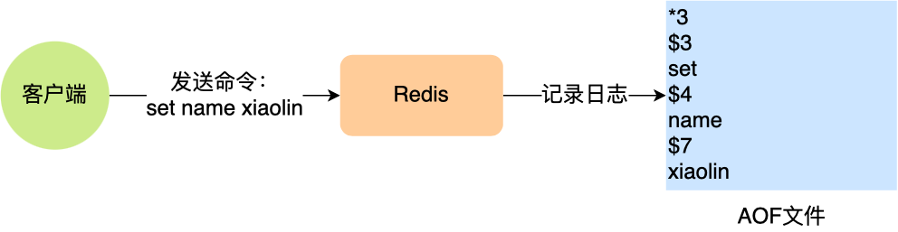

## Redis

---

## redis简介

### redis是什么？

Rdis是一种基于内存的数据库，对数据的读写操作都是在内存中完成，因此**读写速度非常快，常用于缓存，消息队列、分布式锁**等场景。

Redis提供了多种数据类型来支持不同的业务场景，比如**String字符串)、Hash(哈希)、List(列表)、Set(集合)、Zset(有序集合、Bitmaps(位图)、HyperLogLog(基数统计)、GEO(地理信息)、Stream(流)，并且对数据类型的操作都是原子性的，因为执行命令由单线程负责的，不存在并发竞争的问题。**

除此之外，Redis还支持事务、特久化、Lua脚本、多种集群方案（主从复制模式，
哨兵模式、切片机群模式)、发布/订阅模式，内存淘汰机制、过期删除机制等等。

### 为什么使用redis作为MySQL缓存？

- 高性能，redis缓存直接操作内存。
- 高并发，QPS能轻松破10w。

## 数据类型

Redis提供了丰富的数据类型，常见的有五种数据类型：**String(字符串)，Hash(哈希)，List(链表)，Set(集合)、Zset(有序集合)**

**五种数据类型的应用场景：**

- String类型的应用场景：缓存对象、常规计数、分布式锁、共享session信息等。
- Lst类型的应用场景：消息队列（但是有两个问题：1.生产者需要自行实现全局唯一ID;2.不能以消费组形式消费数据)
- Hash类型：缓存对像、购物车等。
- Set类型：聚合计算（并集、交集、差集）场景，比如点赞、共同关注、抽奖活动
- Zset类型：排序场景，比如排行榜、电话和姓名排序等。

Redis后续版本又支持四种数据类型，它们的应用场景如下：

- BitMap（2.2版新增)：二值状态统计的场景，比如签到、判断用户登陆状态、连续签到用户总数等；
- HyperLogLog(2.8版新增)：海量数据基数统计的场景，比如百万级网页UV计数等；
- GE0(3.2版新增)：存储地理位置信息的场景，比如滴滴叫车；
- Stream(5.0版新增)：消息队列，相比于基于List类型实现的消息队列，有这两个特有的特性：自动生成全局唯一消息ID,支持以消费组形式消费数据。

## 持久化

### Redis 如何实现数据不丢失？

Redis的读写操作都是在内存中，所以Redis性能才会高，但是当Redis重启后，内存中的数据就会丢失，那为了保证内存中的数据不会丢失，Rdis实现了数据持久化的机制，这个机制会把数据存储到磁盘，这样在Rdis重启就能够从磁盘中恢复原有的数据。

**Redis共有三种数据持久化的方式：**

- **AOF日志**：每执行一条写操作命令，就把该命令以追加的方式写入到一个文件里；
- **RDB快照**：将某一时刻的内存数据，以二进制的方式写入磁盘；
- **混合持久化方式**：Redis4.0新增的方式，集成了AOF和RBD的优点；

### AOF日志

#### AOF日志实现？

Rdis在执行完一条写操作命令后，就会把该命令以追加的方式写入到一个文件里，然后Reds重启时，会读取该文件记录的命令，然后逐一执行命令的方式来进行数据恢复。

#### 为什么先执行命令，再把数据写入日志呢？

好处：

- 避免额外的检查开销。只有成功执行的命令才会记录。
- 不会阻塞当前写操作命令的执行。

风险：

- 数据可能丢失。执行写命令和日志记录是两个过程，如果写的时候服务器宕机，数据可能丢失。
- 可能阻塞其他操作。AOF日志是在主线程执行，可能会阻塞后面的操作。

#### AOF写回策略几种？

- Always：每次执行命令都写回。
- Everysec：每秒写回一次。
- No：不由redis控制，而是由操作系统决定写回的时机。

#### AOF日志过大会促发什么机制？

启动AOF重写机制

### RDB快照

#### RDB快照实现？

**因为AOF日志记录的是操作命令，不是实际的数据，**所以用AOF方法做故障恢复时，需要全量日志都执行一遍，一旦AOF日志非常多，势必会造成Redis的恢复操作缓慢。

为了解决这个问题，Reds增加了RDB快照。所谓的快照，就是记录某一个瞬间东西，比如当我们给风景拍照时，那一个瞬间的画面和信息就记录到了一张照片。

**所以，RDB快照就是记录某一个瞬间的内存数据，记录的是实际数据，而AOF文件记录的是命令操作的日志，而不是实际的数据。**

**因此在Redis恢复数据时，RDB恢复数据的效率会比AOF高些，因为直接将RDB文件读入内存就可以，不需要像AOF「那样还需要额外执行操作命令的步骤才能恢复数据。**

#### RDB快照会阻塞进程吗？

Redis提供了两个命令来生成RDB文件，分别是`save`和`bgsave`，他们的区别就在于是否在「主线程」里执行：

- 执行了`save`命令，就会**在主线程生成RDB文件**，由于和执行操作命令在同一个线程，所以如果写入RDB文件的时间太长，**会阻塞主线程，**
- 执行了`bgsave`命令，会**创建一个子进程来生成RDB文件，这样可以避免主线程的阻塞**；

### AOF日志与RDB快照优缺点

AOF优点在于丢失数据少，缺点是数据回复不快。

RDB快照优点是数据恢复速度快，但是快照的频率不好把握，频率太低，数据容易丢失，频率太高，容易影响性能。

### 混合持久化

#### 混合持久化的实现？

混合持久化继承了AOF与RDB的优点，降低了数据丢失的风险，也降低了redis的重启速度。

**混合持久化工作在AOF日志重写过程，当开启了混合持久化时，在AOF重写日志时，fork出来的重写子进程会先将与主线程共享的内存数据以RDB方式写入到AOF文件，然后主线程处理的操作命令会被记录在重写缓冲区里，重写缓冲区里的增量命令会以AOF方式写入到AOF文件，写入完成后通知主进程将新的含有RDB格式和AOF格式的AOF文件替换I旧的的AOF文件。也就是说，使用了混合持久化，AOF文件的前半部分是RDB格式的全量数据，后半部分是AOF格式的增量数据。**

这样的好处在于，重启Reds加载数据的时候，由于前半部分是RDB内容，这样加载的时候速度会很快。

加载完RDB的内容后，才会加载后半部分的AOF内容，这里的内容是Redis后台子进程重写AOF期间，主线程处理的操作命令，可以使得数据更少的丢失。

#### 混合持久化的优缺点？

**混合持久化优点：**

- 混合持久化结合了RDB和AOF持久化的优点，**开头为RDB的格式，使得Redis可以更快的启动，同时结合AOF的优点，有减低了大量数据丢失的风险。**

**混合持久化缺点：**

- AOF文件中添加了RDB格式的内容，使得**AOF文件的可读性变得很差；**
- **兼容性差**，如果开启混合持久化，那此混合持久化AOF文件，不能用在Redis4.0之前版本。

## 功能篇

### 过期删除策略

#### 1、介绍

Reds是可以对key设置过期时间的，因此需要有相应的机制将已过期的键值对删除，而做这个工作的就是过期键值删除策略。

每当我们对一个key设置了过期时间时，Redis会把该key带上过期时间存储到一个**过期字典(expiresdict)中，也就是说「过期字典」保存了数据库中所有key的过期时间。**

当我们查询一个key时，Redis首先检查该key是否存在于过期字典中：

- 如果不在，则正常读取键值；
- 如果存在，则会获取该ky的过期时间，然后与当前系统时间进行比对，如果比系统时间大，那就没有过期，否则判定该key已过期。

#### 2、过期删除略有哪些？

- 定时删除
- 惰性删除
- 定期删除

##### （1）定时删除

定时删除策略的做法是，**在设置key的过期时间时，同时创建一个定时事件，当时间到达时，由事件处理器自动执行key的删除操作。**
定时删除策略优缺点：可以保证内存尽快释放，但是在过期 key 比较多的情况下，会占用一部分cpu时间。

##### （2）惰性删除

惰性删除策略的做法是，**不主动删除过期键，每次从数据库访问key时，都检测key是否过期，如果过期则删除该key。**

惰性删除策略的优点：

- 因为每次访问时，才会检查key是否过期，所以此策略只会使用很少的系统资源，因此，惰性删除策略**对CPU时间最友好。**

惰性删除策略的缺点：

- 如果一个key已经过期，而这个key又仍然保留在数据库中，那么只要这个过期key一直没有被访问，它所占用的内存就不会释放，造成了一定的内存空间浪费。所以，惰性删除策略**对内存不友好。**

##### （3）定期删除

定期删除策略的做法是，**每隔一段时间「随机」从数据库中取出一定数量的key进行检查，并删除其中的过期key。**

定期删除策略的优点：

- 通过限制删除操作行的时长和频率，来减少删除操作对CPU的影响，同时也能删除一部分过期的数据减少了过期键对空间的无效占用。

定期删除策略的缺点：

- 内存清理方面没有定时删除效果好，同时没有惰性删除使用的系统资源少。难以确定删除操作执行的时长和频率。如果执行的太频繁，定期删除策略变得和定时删除策略一样，对CPU不友好；如果执行的太少，那又和惰性删除一样了，过期k©y占用的内存不会及时得到释放。

#### 3、redis的过期删除策略

**Redis选择「惰性删除+定期删除】这两种策略配和使用，以求在合理使用CPU时间和避免内存浪**
**费之间取得平衡。**

##### （1）惰性删除

Redis在访问或者修改key之前，都会调用`expirelfNeeded`函数对其进行检查，检查key是否过期：

- 如果过期，则删除该key，至于选择异步删除，还是选择同步删除，根据`lazyfree_lazy_expire参数`配置决定(Redis4.0版本开始提供参数)，然后返回null客户端；
- 如果没有过期，不做任何处理，然后返回正常的键值对给客户端：

惰性删除的流程图：

（2）定期删除

接下来，详细说说Redis的定期删除的流程：

1. 从过期字典中随机抽取20个key;
2. 检查这20个key是否过期，并删除已过期的key;
3. 如果本轮检查的已过期key的数量，超过5个(20/4)，也就是「已过期key的数量」占比「随机抽取key的数量」大于25%，则继续重复步骤1；如果已过期的key比例小于25%，则停止继续删除过期key,然后等待下一轮再检查。

可以看到，定期删除是一个循环的流程。

### 缓存淘汰策略

#### 类别

##### 1、不进厅数据淘汰的策略

**noeviction**(Redis3.0之后，默认的内存海淘汰策略)：它表示当运行内存超过最大设置内存时，不淘汰任何数据，这时如果有新的数据写入，会报错通知禁止写入，不淘汰任何数据，但是如果没用数据写入的话，只是单纯的查询或者删除操作的话，还是可以正常工作。

##### 2、进厅数据淘汰的策略

针对「进行数据淘汰」这一类策略，又可以细分为「在设置了过期时间的数据中进行淘汰」和「在所有数据范围内进行淘汰」这两类策略。

在设置了过期时间的数据中进行淘汰：

- `volatile-random`:随机淘汰设置了过期时间的任意键值，
- `volatile-ttl`:优先淘汰更早过期的键值。
- `volatile-lru`(Redis3.0之前，默认的内存淘汰策略)：淘汰所有设置了过期时间的键值中，最久未使用的键值；
- `volatile-lfu`(Redis4.0后新增的内存淘汰策略)：淘汰所有设置了过期时间的键值中，最少使用的键值；

在所有数据范围内进行淘汰：

- `allkeys-random`：随机淘汰任意键值；
- `allkeys-lru`：淘汰整个键值中最久未使用的键值；
- `allkeys-lfu`(Redis4.0后新增的内存淘汰策略)：淘汰整个键值中最少使用的键值。

#### LRU实现（最近最少使用）

传统的LRU算法问题

- 需要用链表管理所有的缓存数据，这会带来额外的空间开销；
- 当有数据被访问时，需要在链表上把该数据移动到头端，如果有大量数据被访问，就会带来很多链表移动操作，会很耗时，进而会降低Redis缓存性能。

**`redis`的`LRU`算法实现**

Redis实现的是一种近似LRU算法，目的是为了更好的节约内存，**它的实现方式是在Redis的对象结构体中添加一个额外的字段，用于记录此数据的最后一次访问时间。当Reds进行内存淘汰时，会使用随机采样的方式来淘汰数据，它是随机取5个值（此值可配置），然后淘汰最久没有使用的那个。**

Redis实现的LRU算法的优点：

- 不用为所有的数据维护一个大链表，节省了空间占用；
- 不用在每次数据访问时都移动链表项，提升了缓存的性能：

但是LRU算法有一个问题，**无法解决缓存污染问题**，比如应用一次读取了大量的数据，而这些数据只会被读取这一次，那么这些数据会留存在Redis缓存中很长一段时间，造成缓存污染。

因此，在 redis4.0 之后引入了LFU算法来解决这个问题。

#### LFU实现（最近最少使用）

LFU根据访问频次来淘汰数据。LFU算法会记录每个数据的访问次数。当一个数据被再次访问时，就会增加该数据的访问次数。这样就解决了偶尔被访问一次之后，数据留存在缓存中很长一段时间的问题，相比于LRU算法也更合理一些。

在LRU算法中，Redis对象头的24bts的Iru字段是用来记录key的访问时间戳，因此在LRU模式下，
Redis可以根据对象头中的Iu字段记录的值，来比较最后一次key的访问时间长，从而淘汰最久未被使用的key。

在LFU算法中，Redis)对象头的24bits的Iru字段被分成两段来存储，高16bit存储Idt(Last DecrementTime)，低8bit存储logc(Logistic Counter)。

- ldt是用来记录key的访问时间戳；
- Iogc是用来记录key的访问频次，它的值越小表示使用频率越低，越容易淘汰，每个新加入的key的1ogc初始值为5。

注意，**Iogc并不是单纯的访问次数，而是访问频次（访问频率），因为logc会随时间推移而衰减的。**

### 总结

过期删除策略

缓存淘汰策略

## 集群篇（高可用）

## 缓存篇（雪崩、击穿、穿透）

### 缓存雪崩

缓存雪崩：**当大量缓存数据在同一时间过期（失效）或者Rdis故障岩机时**，如果此时有大量的用户请求，都无法在Reds中处理，于是全部请求都直接访问数据库，从而导致数据库的压力骤增，严重的会造成数据库宕机，从而形成一系列连锁反应，造成整个系统崩溃。

- 大量`key`同时过期
- redis 服务器宕机

不同的原因，有不同的解决方案。

#### 大量`key`同时过期

- **均匀设置过期时间**；在设置过期的同时，给过期时间加上一个随机数。
- **互斥锁**；如果发现访问的`key`不在`redis`，可以加个互斥锁，保证同一时间内只有一个请求来构建缓存（从数据库加载到缓存）。但是要加个超时时间，否则可能会死锁。
- **使用缓存预热或者多级缓存。**

#### `redis`故障宕机

- **服务熔断或者请求限流。****服务熔断**即暂停业务堆缓存服务的访问，直接返回错误，从而不再访问数据库。**请求限流**只将少部分请求发送到数据库处理，再多的请求就在入口直接拒绝服务。
- **构建redis缓存缓存高可靠集群。**通过主从节点的方式构建redis缓存高可靠集群，当主节点宕机，从节点可以切换为主节点提供缓存服务。

### 缓存击穿

缓存击穿：**如果缓存中的某个热点数据过期或者突然有大量的请求访问某个缓存不存在的key，此时无法从缓存中获取，将访问数据库，数据库很容易被高并发请求击穿。**

两种方案：

- **互斥锁。保证同一时间只有一个业务线程更新缓存，**未能获取互斥锁的请求，要么等待锁释放后重新获取数据库，要么就返回空值或者默认值。
- **不给热点数据设置过期时间。**
- **使用缓存预热。**

### 缓存穿透

缓存穿透：**当访问的数据，既不在缓存，也不在数据库。**此时无法构建数据缓存来服务后续请求，当有大量的请求到来时，数据库的压力倍增。

#### 原因：

- 业务误操作。错误删除了缓存和数据库的数据。
- 黑客攻击。故意大量访问某些不存在的数据。

#### 解决方案：

##### （1）限制非法请求

在API入口处判断请求参数是否合理，是否有非法值，请求字段是否存在。

##### （2）缓存空值或者默认值

发现有缓存穿透时，可以针对查询的数据，设置一个缓存空值或者默认值。

#### （3）布隆过滤器

通过「布隆过滤器」判断数据是否存在，避免通过查询数据库判断数据是否存在。

### 布隆过滤器工作原理

「布隆过滤器」由「初始值都为0的位图数组」+「N四个哈希函数」两部分组成。

当我们在写入数据库数据时，在布隆过滤器里做个标记，这样瑕疵查询数据是否存在时，之炫耀查询布隆过滤器是否存在此标记。

布隆过滤器通过三个操作完成标记：

- 使用N个哈希函数分别对数据进行哈希计算，得到N个哈希值。
- 将N个哈希值对位图数组的长度进行取模，得到每个哈希值在位图数组上的对应位置。
- 将对应位置上的值设置为1。

因此，当有数据库数据请求时，只需要查询对应的位图数组的位置是否为全1，有一个为0则代表树不存在。

**使用「布隆过滤器」，并不能保证数据库中存在这个数据，但是能保证只要查询不在在，那么数据库中一定不存在这个数据。**

## 一致性篇

由于数据库和缓存是两个独立的存储系统，更新数据时会涉及多步操作，因此可能出现数据不一致的情况。例如，数据库更新了数据，但缓存中的旧数据仍然存在，或者缓存更新了而数据库更新失败。

**问题来源**

- **读取缓存时不一致**：从缓存读取的数据可能已经过期，而数据库中的数据是最新的。
- **写操作顺序问题**：数据先写入缓存再写入数据库或反过来，在并发情况下可能出现先后顺序问题。
- **缓存失效**：数据库更新了，但是没有及时刷新或删除缓存，导致缓存数据变旧。

