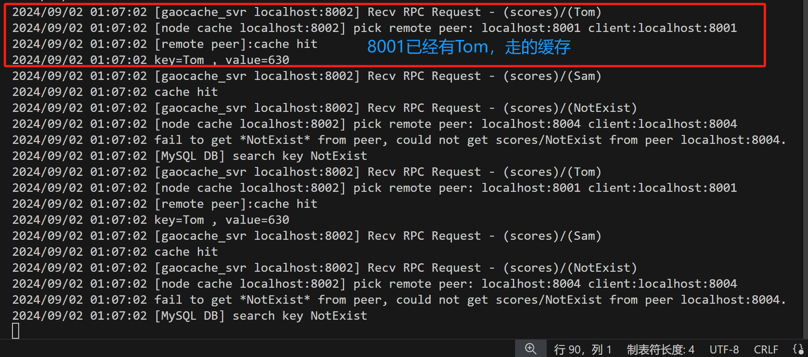

## 6、分布式节点

---

回顾一下获取`key`的流程，之前已经实现了（1）和（3），今天实现（2）的功能，即从其他节点上获取缓存。


## （1）抽象 `Picker`与`Fetcher`

`gaocache/peers.go`

```go
// Picker 定义了获取分布式节点的能力
type Picker interface {
	PickPeer(key string) (Fetcher, bool)
}

// Fetcher 定义了从远端获取缓存的能力
// 所以每个Peer应实现这个接口
type Fetcher interface {
	Fetch(group string, key string) ([]byte, error)
}
```

- 在这里，抽象出 2 个接口，Picker 的 `PickPeer()` 方法用于根据传入的 key 选择相应节点 Fetcher。
- 接口`Fetcher` 的 `Fetch()` 方法用于从对应 group 查找缓存值。Fetcher 就对应于上述流程中的 gRPC 客户端。

## （2）节点选择与 `gRPC`客户端

客户端的`fetch()`方法我们前面写`grpc`的时候其实已经写过了，只是在`client`端加一个验证`client`是否实现了`Fetcher`接口即可。

`gaocache/client.go`

```go
// 测试Client是否实现了Fetcher接口
var _ Fetcher = (*client)(nil)
```

为 `server`添加选择节点的功能。

```go
const (
	defaultAddr     = "127.0.0.1:8080"
	defaultReplicas = 50
)

// server 和 Group 是解耦合的 所以server要自己实现并发控制
type Server struct {
	pb.UnimplementedGaocacheServer
    addr     string				// format:ip:port
	mu       sync.Mutex
	consHash *consistenthash.Consistency
	clients  map[string]*client // 每个remotePeer 对应一个client
}
```

- 新增成员变量 `consHash`，类型是一致性哈希算法的 `Consistency`，用来根据具体的 key 选择节点。
- 新增成员变量 `clients`，映射远程节点与对应的 `client`。每一个远程节点对应一个 client，因为 client 与远程节点的地址 `defaultAddr` 有关。

实现`Picker`接口

```go
// SetPeers 将各个远端主机IP配置到Server里
// 这样Server就可以Pick他们了
// 注意: 此操作是*覆写*操作！
// 注意: peersIP必须满足 x.x.x.x:port的格式
func (s *server) SetPeers(peersAddr ...string) {
	s.mu.Lock()
	defer s.mu.Unlock()

	s.consHash = consistenthash.New(defaultReplicas, nil)
	s.consHash.Register(peersAddr...)
	s.clients = make(map[string]*client)
	for _, peerAddr := range peersAddr {
		if !validPeerAddr(peerAddr) {
			panic(fmt.Sprintf("[peer %s] invalid address format, it should be x.x.x.x:port", peerAddr))
		}
		// 服务名：gaocache/ip:port
		service := fmt.Sprintf("gaocache/%s", peerAddr)
		// peerAddr : client
		s.clients[peerAddr] = NewClient(service)
	}
}

// Pick 根据一致性哈希选举出key应存放在的cache
// return false 代表从本地获取cache
func (s *server) PickPeer(key string) (Fetcher, bool) {
	s.mu.Lock()
	defer s.mu.Unlock()

	peerAddr := s.consHash.GetPeer(key)
	// Pick itself
	if peerAddr == s.addr {
		log.Printf("ooh! pick myself, I am %s\n", s.addr)
		return nil, false
	}
	log.Printf("[node cache %s] pick remote peer: %s\n", s.addr, peerAddr)
	return s.clients[peerAddr], true
}

// 测试Server是否实现了Picker接口
var _ Picker = (*server)(nil)
```

- `SetPeers()` 方法实例化了一致性哈希算法，并且添加了传入的节点。
- 并为每一个节点创建了一个 `gRPC` 客户端 `client`。
- `PickPeer()` 包装了一致性哈希算法的 `Get()` 方法，根据具体的 key，选择节点，返回节点对应的 `gRPC client` 客户端。

至此，`server`既具备了提供 `gRPC` 服务的能力，也具备了根据具体的 key，创建 `client` 客户端从远程节点服务获取缓存值的能力。

## （3）主流程

最后，我们需要将上述新增的功能集成在主流程(gaocache.go)中。

```go
// Group 提供命名管理缓存/填充缓存的能力
type Group struct {
	name      string    // 缓存空间名
	mainCache *cache    // 主缓存
	server    Picker    // 获取分布式节点能力
	retriever Retriever // 回调函数
}

// RegisterSvr 为 Group 注册 Server
func (g *Group) RegisterSvr(p Picker) {
	if g.server != nil {
		panic("group had been registered server")
	}
	g.server = p
}

// 流程2（待实现）本地缓存获取失败，从远程节点获取
func (g *Group) load(key string) (ByteView, error) {
	if g.server != nil {
		// 从远程节点获取
		if fetcher, ok := g.server.PickPeer(key); ok {
			bytes, err := fetcher.Fetch(g.name, key)
			if err == nil {
				return ByteView{b: cloneBytes(bytes)}, nil
			}
			log.Printf("fail to get *%s* from peer, %s.\n", key, err.Error())
		}
	}
	// 远程节点获取失败，启用回调函数
	return g.getLocally(key)
}
```

- 为`Group`添加获取远程节点服务功能，`RegisterSvr()`为`Group`注册`server`。
- 修改`load`方法，使用`PickPerr()`选择节点，如果不是本节点，调用实现了`Fetcher`接口（`client`）的`Fetch()`方法，从远程节点获取；如果获取失败，本地调用回调函数。

## 测试

这里为了测试的方便，我还是将`server`端与发送请求的`client`端进行了分离。

### 服务端

组织架构

```go
E:.
│  go.mod
│  go.sum
│  main.go
│  run.sh
│  test.exe
│  
└─gaocache
    │  byteview.go
    │  cache.go
    │  client.go
    │  gaocache.go
    │  gaocache_test.go
    │  go.mod
    │  go.sum
    │  peers.go
    │  server.go
    │  server_test.go
    │  utils.go
    │  
    ├─consistenthash
    │      consistenthash.go
    │      
    ├─gaocachepb
    │      gaocache.pb.go
    │      gaocache.proto
    │      gaocache_grpc.pb.go
    │
    └─models
        ├─lfu
        └─lru
                lru.go
```

接的，在gaocache目录下也要进行以来初始化

```go
go mod init gaocache
go mod tidy
```

另外，需要注意

>main.go 和 geecache/ 在同级目录，但 go modules 不再支持 import <相对路径>，相对路径需要在main主目录的 go.mod 中声明：
>require gaocache v0.0.0
>replace gaocache => ./gaocache

`main.go`

```go
package main

import (
	"flag"
	"fmt"
	"gaocache/gaocachepb"
	"log"
	"net"

	"gaocache"

	"google.golang.org/grpc"
)

// 模仿数据库
var db = map[string]string{
	"Tom":  "630",
	"Jack": "589",
	"Sam":  "567",
}

func createGroup(groupName string) *gaocache.Group {
	return gaocache.NewGroup(groupName, 2<<10, gaocache.RetrieverFunc(
		func(key string) ([]byte, error) {
			log.Println("[MySQL DB] search key", key)
			if v, ok := db[key]; ok {
				return []byte(v), nil
			}
			return nil, fmt.Errorf("%s not exist", key)
		}))
}

func startCacheServer(addr string, addrs []string, gao *gaocache.Group) {
	svr, err := gaocache.NewServer(addr)
	if err != nil {
		log.Println("NewServer failed at", addr)
		return
	}
	svr.SetPeers(addrs...)
	gao.RegisterSvr(svr)
	log.Println("geecache is running at", addr)
	// 监听本地端口是否有请求
	lis, err := net.Listen("tcp", addr)
	if err != nil {
		fmt.Printf("failed to listen: %v", err)
		return
	}
	s := grpc.NewServer()                     // 创建一个新的 gRPC 服务器实例
	gaocachepb.RegisterGaocacheServer(s, svr) // 注册服务至grpc
	err = s.Serve(lis)                        // 启动服务
	if err != nil {
		log.Fatal(err)
	}
}

func main() {
	// 解析终端命令
	var port int
	var api bool
	var name string
	flag.StringVar(&name,"name","scores","gaocache group name")
	flag.IntVar(&port, "port", 8001, "gaocache server port")
	flag.BoolVar(&api, "api", false, "Start a api server?")
	flag.Parse()

	// 节点服务端接口 => x.x.x.x:port
	addrMap := map[int]string{
		8001: "localhost:8001",
		8002: "localhost:8002",
		8003: "localhost:8003",
		8004: "localhost:8004",
	}
	// 节点信息
	var addrs []string
	for _, v := range addrMap {
		addrs = append(addrs, v)
	}
	// 创建一个 Group为name的缓存空间
	gao := createGroup(name)
	// if api {
	// 	go startClient(addrMap[port], name)
	// }
	// 启动服务
	startCacheServer(addrMap[port], []string(addrs), gao)
}
```

我们在`server`端用三个终端分别启用`8001、8002、8003`三个端口进行服务。`8004`端口不启动。

### 客户端

在另一个`Client`项目中，组织结构如下：

```go
│  go.mod
│  go.sum
│  main.go
│
├─.vscode
│      launch.json
│
├─gaocache
│      client.go
│      go.mod
│      go.sum
│      peers.go
│
└─gaocachepb
        gaocache.pb.go
        gaocache.proto
        gaocache_grpc.pb.go
```

同样的，`client`端的依赖管理跟`server`一样。

`main.go`

```go
package main

import (
	"flag"
	"fmt"

	"gaocache"
)

// 模仿数据库
var (
	db = map[string]string{
		"Tom":  "630",
		"Jack": "589",
		"Sam":  "567",
	}
	keys = []string{"Tom", "Sam", "NotExist"}
)

func startClient(apiAddr string, groupName string) {
	cli := gaocache.NewClient(apiAddr)
	// 第一次查询不在缓存中，回调函数会从数据库中查
	for i := range keys {
		value, err := cli.Fetch(groupName, keys[i])
		if err != nil {
			fmt.Printf("err:%v\n", err)

		}
		fmt.Printf("key:%v,value:%v\n", keys[i], string(value))
	}
	// 第二次查询，此时应该已经加入到了上个节点缓存中
	for i := range keys {
		value, err := cli.Fetch(groupName, keys[i])
		if err != nil {
			fmt.Printf("err:%v\n", err)

		}
		fmt.Printf("key:%v,value:%v\n", keys[i], string(value))
	}
}

func main() {
	// 解析终端命令
	var port int
	var api bool
	var name string
	flag.StringVar(&name, "name", "scores", "gaocache group name")
	flag.IntVar(&port, "port", 8001, "gaocache server port")
	flag.BoolVar(&api, "api", false, "Start a api server?")
	flag.Parse()

	// 节点服务端接口 => x.x.x.x:port
	addrMap := map[int]string{
		8001: "localhost:8001",
		8002: "localhost:8002",
		8003: "localhost:8003",
		8004: "localhost:8004",
	}

	if api {
		go startClient(addrMap[port], name)
	}
}
```

客户端我们页分别用三个终端启用`8001、8002、8004`来获取请求。

注意，`8004`端口并没有对应启动的`gRPC`服务端，因此它将获取不到服务。

### 结果

**首先三个服务端将分别显示启动信息**

`server 8001：`

```go
2024/09/01 22:24:28 geecache is running at localhost:8001
```

`server 8002：`

```go
2024/09/01 22:24:28 geecache is running at localhost:8002
```

`server 8003：`

```go
2024/09/01 22:24:28 geecache is running at localhost:8003
```

**接着三个客户端分别向自己的服务发送两轮`keys`请求用来验证**

`client 8001：`

```go
value:"630"
key:Tom,value:630
value:"567"
key:Sam,value:567
<nil>
err:could not get scores/NotExist from peer localhost:8001
key:NotExist,value:
value:"630"
key:Tom,value:630
value:"567"
key:Sam,value:567
<nil>
err:could not get scores/NotExist from peer localhost:8001
key:NotExist,value:
```

`client 8002：`

```go
value:"630"
key:Tom,value:630
value:"567"
key:Sam,value:567
<nil>
err:could not get scores/NotExist from peer localhost:8002
key:NotExist,value:
value:"630"
key:Tom,value:630
value:"567"
key:Sam,value:567
<nil>
err:could not get scores/NotExist from peer localhost:8002
key:NotExist,value:
```

`client 8004：`

```go
<nil>
err:could not get scores/Tom from peer localhost:8004
key:Tom,value:
<nil>
err:could not get scores/Sam from peer localhost:8004
key:Sam,value:
<nil>
err:could not get scores/NotExist from peer localhost:8004
key:NotExist,value:
<nil>
err:could not get scores/Tom from peer localhost:8004
key:Tom,value:
<nil>
err:could not get scores/Sam from peer localhost:8004
key:Sam,value:
<nil>
err:could not get scores/NotExist from peer localhost:8004
key:NotExist,value:
```

均不能获取服务。

**三个`server`端的输出信息如下**

`server 8001：`

```go
2024/09/01 22:49:30 geecache is running at localhost:8001
2024/09/01 22:50:06 [gaocache_svr localhost:8001] Recv RPC Request - (scores)/(Tom)
2024/09/01 22:50:06 ooh! pick myself, I am localhost:8001		// 选取了自己
2024/09/01 22:50:06 [MySQL DB] search key Tom
2024/09/01 22:50:06 [gaocache_svr localhost:8001] Recv RPC Request - (scores)/(Sam)
2024/09/01 22:50:06 [node cache localhost:8001] pick remote peer: localhost:8002
<nil>			// 选择从8002获取，但此时8002也没有缓存
2024/09/01 22:50:06 fail to get *Sam* from peer, could not get scores/Sam from peer gaocache/localhost:8002.
2024/09/01 22:50:06 [MySQL DB] search key Sam
2024/09/01 22:50:06 [gaocache_svr localhost:8001] Recv RPC Request - (scores)/(NotExist)
2024/09/01 22:50:06 [node cache localhost:8001] pick remote peer: localhost:8004
<nil>
2024/09/01 22:50:06 fail to get *NotExist* from peer, could not get scores/NotExist from peer gaocache/localhost:8004.
2024/09/01 22:50:06 [MySQL DB] search key NotExist
2024/09/01 22:50:06 [gaocache_svr localhost:8001] Recv RPC Request - (scores)/(Tom)
2024/09/01 22:50:06 cache hit		// 先查自己缓存，已经缓存命中
2024/09/01 22:50:06 [gaocache_svr localhost:8001] Recv RPC Request - (scores)/(Sam)
2024/09/01 22:50:06 cache hit
2024/09/01 22:50:06 [gaocache_svr localhost:8001] Recv RPC Request - (scores)/(NotExist)
2024/09/01 22:50:06 [node cache localhost:8001] pick remote peer: localhost:8004
<nil>
2024/09/01 22:50:06 fail to get *NotExist* from peer, could not get scores/NotExist from peer gaocache/localhost:8004.
2024/09/01 22:50:06 [MySQL DB] search key NotExist
```

`server 8002：`

```go
2024/09/01 22:49:35 geecache is running at localhost:8002
2024/09/01 22:50:13 [gaocache_svr localhost:8002] Recv RPC Request - (scores)/(Tom)
2024/09/01 22:50:13 [node cache localhost:8002] pick remote peer: localhost:8001
<nil>		// 案例来说前面 8001服务其已经把Tom加入自己缓存了，这里应该cache hit
2024/09/01 22:50:13 fail to get *Tom* from peer, could not get scores/Tom from peer gaocache/localhost:8001.	// 是否因为我是在三个终端上测试，底层空间不同步？
// 我知道了，因为我client是向server 8002端口发的grpc请求，只能对接到server8002?要想对接server 8001，必须先转化为将获取的请求转化为server 80001，因此需要重新改一下group.Get()方法。
2024/09/01 22:50:13 [MySQL DB] search key Tom
2024/09/01 22:50:13 [gaocache_svr localhost:8002] Recv RPC Request - (scores)/(Sam)
2024/09/01 22:50:13 ooh! pick myself, I am localhost:8002
2024/09/01 22:50:13 [MySQL DB] search key Sam
2024/09/01 22:50:13 [gaocache_svr localhost:8002] Recv RPC Request - (scores)/(NotExist)
2024/09/01 22:50:13 [node cache localhost:8002] pick remote peer: localhost:8004
<nil>
2024/09/01 22:50:13 fail to get *NotExist* from peer, could not get scores/NotExist from peer gaocache/localhost:8004.
2024/09/01 22:50:13 [MySQL DB] search key NotExist
2024/09/01 22:50:13 [gaocache_svr localhost:8002] Recv RPC Request - (scores)/(Tom)
2024/09/01 22:50:13 cache hit
2024/09/01 22:50:13 [gaocache_svr localhost:8002] Recv RPC Request - (scores)/(Sam)
2024/09/01 22:50:13 cache hit
2024/09/01 22:50:13 [gaocache_svr localhost:8002] Recv RPC Request - (scores)/(NotExist)
2024/09/01 22:50:13 [node cache localhost:8002] pick remote peer: localhost:8004
<nil>
2024/09/01 22:50:13 fail to get *NotExist* from peer, could not get scores/NotExist from peer gaocache/localhost:8004.
2024/09/01 22:50:13 [MySQL DB] search key NotExist
```

`server 8003：`

```go
2024/09/01 22:49:38 geecache is running at localhost:8003
```

没有任何请求接入，所以没有日志

## 问题记录

到了这里，有一些问题记录一下

### （1）gRPC 节点之间通信问题


如图所示，server 8001当中已经有Tom缓存，但是当server 8002 选择从server 8001出获取时，显示获取失败，然后又从数据库中获取去了。

```go
2024/09/01 22:50:13 [gaocache_svr localhost:8002] Recv RPC Request - (scores)/(Tom)
2024/09/01 22:50:13 [node cache localhost:8002] pick remote peer: localhost:8001
<nil>		// 按理来说前面 8001服务其已经把Tom加入自己缓存了，这里应该cache hit
2024/09/01 22:50:13 fail to get *Tom* from peer, could not get scores/Tom from peer gaocache/localhost:8001.	// 是否因为我是在三个终端上测试，底层空间不同步？
// 我知道了，因为我client是向server 8002端口发的grpc请求，只能对接到server8002?要想对接server 8001，必须先转化为将获取的请求转化为server 80001，因此需要重新改一下group.Get()方法。
2024/09/01 22:50:13 [MySQL DB] search key Tom
```

原因：

排查了挺久，原因在于选择节点映射时出错了！！我的`client`的`name`规则有错！

之前给`client`加了一个``"gaocache/"``，`client`的`Fetch()`连接`grpc server`时用的是这个，当然连接不上！！

```go
// 连接到server端
conn, err := grpc.NewClient(c.name, grpc.WithTransportCredentials(insecure.NewCredentials()))
```

修改一下`SetPeers()`函数就好了

```go
// SetPeers 实例化了一致性哈希算法，将各个远端主机IP配置到server里
// 这样Server就可以Pick他们了
// 注意: 此操作是*覆写*操作！
// 注意: peersIP必须满足 x.x.x.x:port的格式
func (s *server) SetPeers(peersAddr ...string) {
	s.mu.Lock()
	defer s.mu.Unlock()

	s.consHash = consistenthash.New(defaultReplicas, nil)
	s.consHash.Register(peersAddr...)
	s.clients = make(map[string]*client)
	for _, peerAddr := range peersAddr {
		if !validPeerAddr(peerAddr) {
			panic(fmt.Sprintf("[peer %s] invalid address format, it should be x.x.x.x:port", peerAddr))
		}
		// 服务名：ip:port
		// service := fmt.Sprintf("gaocache/%s", peerAddr)
		service := peerAddr
		// peerAddr : client
		s.clients[peerAddr] = NewClient(service)
		fmt.Printf("peerAddr:%v  client:%v \n", peerAddr, service)
	}
}
```

结果：

首先`server 8001`端口接收请求查询了`Tom、Sam、NotExist`两遍，也就是说，一遍过后，`server 8001`有`Tom、Sam`的缓存，那么第二遍的时候，这两个应该`cache hit`。

而且，这里有个特殊情况，那就是如果第一遍的时候`server 8001`选择了远程节点`server 8002`，而`server 8002`又刚好`pick`了自己，而`server 8002`此时还没有，那么`server 8002`会从数据库中获取。

然后`server 8002`接收请求又查询了`Tom、Sam、NotExist`两遍，此时，第一遍，本地缓存没有，会选择远程节点查询，那么如果选择了`server 8001`，将会`[remote peer cache hit]`。当然选择其他节点，则也查询不到，然后会查数据库。那么第二遍时，第一遍通过查数据库得到的，就应该查`server 8002`自己的缓存，并缓存命中！

**`server 8001 结果`**


**`server 8002 结果`**

`server 8001`在查的时候


自己查的时候



### （2）请求格式的问题

这里在做`client`端模拟测试的时候，我是直接定义的`keys slice`，但是实际过程中，一般发的`HTTP`请求，而采用`grpc`通信的无法直接解析`HTTP`请求，这是由于`grpc`的局限性：

gRPC 自身的局限性：

> **浏览器支持有限**
>
> 当下，不可能直接从浏览器调用 gRPC 服务。gRPC 大量使用 HTTP/2 功能，没有浏览器提供支持 gRPC 客户机的 Web 请求所需的控制级别。例如，浏览器不允许调用者要求使用的 HTTP/2，或者提供对底层 HTTP/2 框架的访问。
>
> **不是人类可读的**
>
> HTTP API 请求以文本形式发送，可以由人读取和创建。默认情况下，gRPC 消息使用 protobuf 编码。虽然 protobuf 的发送和接收效率很高，但它的二进制格式是不可读的。protobuf 需要在 *.proto 文件中指定的消息接口描述才能正确反序列化。需要额外的工具来分析线路上的 Protobuf 有效负载，并手工编写请求。

若需要将内部 gRPC 作为接口开放给外部用户或浏览器调用，则需要有第三方代理解决 HTTP 协议转换成 gRPC 协议的问题。

比如这样：


### （3）缓存击穿

试想，在并发量大的情况下，如果突然有大量的请求同时访问某个节点中的`key`，比如同时10万个请求同时访问`Tom`，那么就会向`server 8001`同时发起10W次请求，如果`server 8001`缓存中没有`Tom`，那么又会向数据库同时发起`10W`个请求，很容易导致**缓存击穿**。

10W 次的请求结果是一样的，对于相同的`key`，能不能指向`server 8001`发送一次请求呢？接下来我们将实现这个机制。


